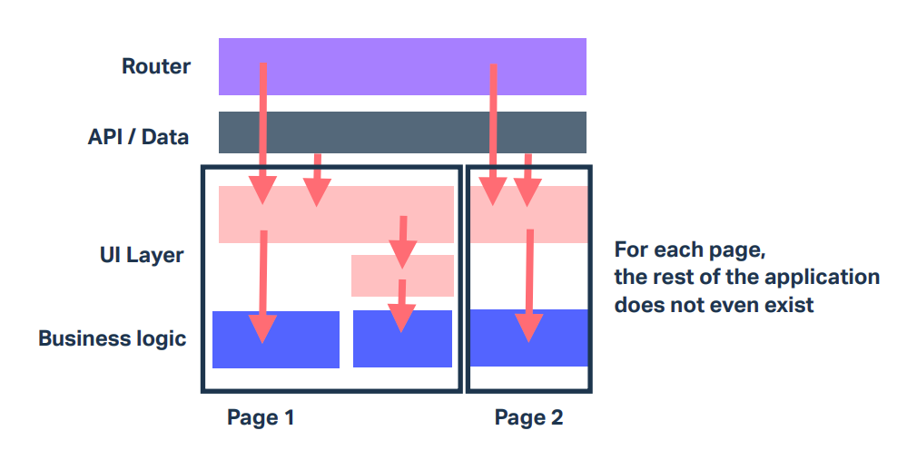

# Front-end Architecture

Front-end architecture is not as established and well-defined as back-end architecture. It's probably not applicable for a large number of front-end applications.

A really good talk: https://www.youtube.com/watch?v=brMZLmZ1HR0

## Why do we need architecture?

The real reason is to make applications maintainable and decreasing the cost of adding new features over time. In a large scale application with no architectural constraints, adding a new feature after a long time can break a lot of dependent code thus requiring more effort to add that feature and in some cases making it impossible even.

## Approaches to organizing dependencies

1. **Big Ball of Mud:** The most commonly implemented architecture where dependencies don't matter and you import/export everything within the app. The old jQuery applications worked more or less like this. Of course, this approach is not easily scalable because making a change in one part of the application affects a large part of it.
2. **Layered:** If we divide our architecture in multiple layers from top to down and make each layer responsible for a specific functionality, we limit the dependency between parts of code. Only a limited number of layers get affected by a change.  
  
3. **Modular:** Having completely independent modules with single directional dependencies. For example, a components module can be created completely independent to an application and used within that application as a dependency making components purely presentational for the most part. Something like a monorepo.

## Resilient architecture

A resilient architecture can be one where constraints exist and are enforced on the program level through pipelines. We can decide and create documentation for our architecture but developers do not follow them, so having rules that programmatically check the architecture is very important.

1. **Dependencies must be unidirectional:** Dependencies should only come from the top. For example, in a layered architecture, a layer above should not depend on a layer below it. Similarly, in a modular architecture, the components module should not depend on the application using it. **Easier to isolate impact of changes**.
2. **Think twice before making code reusable:** A generic and abstract implementation isn't necessarily proportional to scalability. When two independent parts of code use a generic functionality, think about if that functionality is going to scale differently for each part. Most of the times, as a goal of making code reusable, we end up adding conditions inside a generic functionality. In such a case, it's good to decouple the generalized functionality and have some repetition in the code in order to make it more scalable and easier to maintain for two independent parts of the code. That is, **Decoupled > Dry (reusable) — avoid coupling code that diverges over time**.
3. **Enforce constraints and boundaries:** Use a tool to enforce the architectural constraints in practice. `dependency-cruiser` is a popular dependency that lets us set up tests for forbidden dependencies. We can then make it part of our pipeline to make sure that the architectural constraints are being followed. **Preserve your architecture over time**.

Use practices from other parts of the software world (like Java) to enforce architecture when possible.
