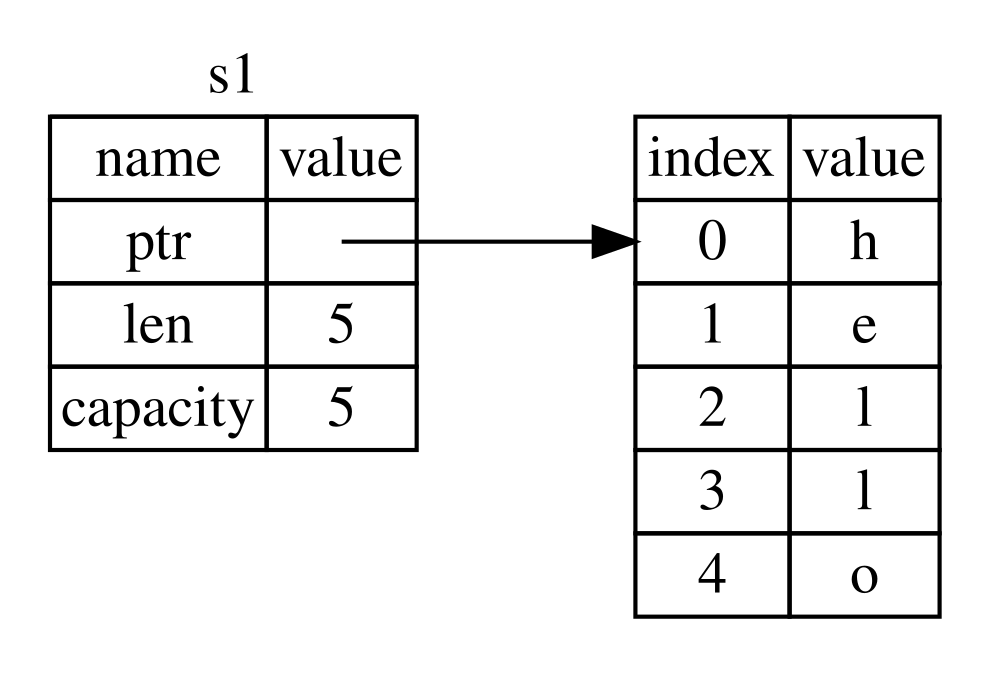
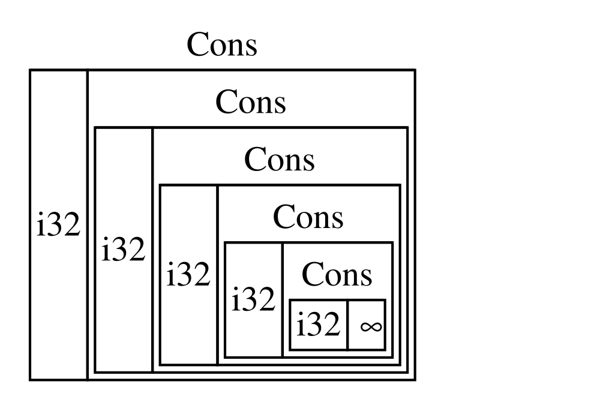
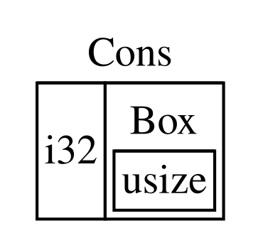

# Rust Notes

- [Resources](#resources)
- [Install Rust](#install-rust)
- [Cargo](#cargo)
- [Crates](#crates)
- [Data Types](#data-types)
  - [Integer](#integer)
  - [Floats](#floats)
  - [Compound Data Types](#compound-data-types)
    - [Tuples](#tuples)
    - [Arrays](#arrays)
- [Functions](#functions)
  - [Statements and Expressions](#statements-and-expressions)
- [Ownership](#ownership)
  - [Stack and Heap](#stack-and-heap)
  - [Ownership Rules](#ownership-rules)
  - [String Type](#string-type)
  - [Memory and Allocation](#memory-and-allocation)
    - [Stack and Heap](#stack-and-heap-1)
  - [Stack Only Data (Copy)](#stack-only-data-copy)
  - [References](#references)
    - [Dangling References](#dangling-references)
  - [Ownership in Functions](#ownership-in-functions)
  - [Slice Type](#slice-type)
- [Structs](#structs)
  - [Derived Traits](#derived-traits)
  - [Struct Methods](#struct-methods)
  - [Associated Functions](#associated-functions)
  - [Multiple `impl` Blocks](#multiple-impl-blocks)
- [Enums](#enums)
  - [Option Enum](#option-enum)
- [Control Flow with `match`](#control-flow-with-match)
  - [Concise Control Flow with `if let`](#concise-control-flow-with-if-let)
- [Packages, Crates and Modules](#packages-crates-and-modules)
  - [Crates](#crates-1)
  - [Packages](#packages)
  - [Modules](#modules)
  - [Referencing Modules](#referencing-modules)
  - [Bringing Paths into Scope with `use`](#bringing-paths-into-scope-with-use)
  - [Re-exporting Names with `pub use`](#re-exporting-names-with-pub-use)
  - [Nested Paths for Cleaner `use`](#nested-paths-for-cleaner-use)
- [Strings](#strings)
- [Error Handling](#error-handling)
  - [The `Result` Type](#the-result-type)
  - [Printing to Standard Error](#printing-to-standard-error)
- [Generic Types](#generic-types)
- [Traits](#traits)
  - [Traits as Parameters](#traits-as-parameters)
  - [Multiple Trait Bounds](#multiple-trait-bounds)
  - [Returning Types that Implement Traits](#returning-types-that-implement-traits)
  - [Conditionally Implement Methods with Trait Bounds](#conditionally-implement-methods-with-trait-bounds)
- [Generic Lifetimes](#generic-lifetimes)
  - [Generic Lifetimes Relationships](#generic-lifetimes-relationships)
  - [In Struct Generic Lifetimes](#in-struct-generic-lifetimes)
  - [Lifetime Elision Rules](#lifetime-elision-rules)
  - [In Method Generic Lifetime Definitions](#in-method-generic-lifetime-definitions)
  - [The Static Lifetime](#the-static-lifetime)
- [Tests](#tests)
  - [Controlling Test Runs](#controlling-test-runs)
  - [Tests Organization](#tests-organization)
    - [Private Function Tests](#private-function-tests)
    - [Integration Tests](#integration-tests)
    - [Submodules in Integration Tests](#submodules-in-integration-tests)
    - [Integration Tests for Binary Crates](#integration-tests-for-binary-crates)
- [Closures](#closures)
  - [Moving Captured Values out of Closures](#moving-captured-values-out-of-closures)
  - [Closures Summary](#closures-summary)
- [Iterators](#iterators)
  - [Consumption of Iterators](#consumption-of-iterators)
  - [Methods That Produce Iterators](#methods-that-produce-iterators)
- [Cargo Profiles](#cargo-profiles)
- [Publishing Crates](#publishing-crates)
  - [Documenting Code](#documenting-code)
- [Cargo Workspaces](#cargo-workspaces)
- [Installing Binaries with Cargo](#installing-binaries-with-cargo)
- [Smart Pointers](#smart-pointers)
  - [Using `Box<T>` to Point to Data on the Heap](#using-boxt-to-point-to-data-on-the-heap)
    - [Enabling Recursive Types with `Box<T>`](#enabling-recursive-types-with-boxt)
  - [Treating Smart Pointers Like References with `Deref`](#treating-smart-pointers-like-references-with-deref)
    - [`Deref` Coercion](#deref-coercion)
      - [`Deref` Coercion with Mutable References](#deref-coercion-with-mutable-references)
  - [The `Drop` Trait and Cleanup](#the-drop-trait-and-cleanup)
  - [Multiple Ownership with `Rc<T>`](#multiple-ownership-with-rct)
  - [`RefCell<T>` and the Interior Mutability Pattern](#refcellt-and-the-interior-mutability-pattern)
  - [Reference Cycles, Memory Leaks and Weak Reference](#reference-cycles-memory-leaks-and-weak-reference)
    - [Using `Weak<T>` to Prevent Reference Cycles](#using-weakt-to-prevent-reference-cycles)
- [Concurrency and Threads](#concurrency-and-threads)
  - [Creating Threads with `spawn`](#creating-threads-with-spawn)
  - [Using `move` Closures with Threads](#using-move-closures-with-threads)
  - [Message Passing Between Threads](#message-passing-between-threads)

## Resources

- <https://doc.rust-lang.org/stable/book/title-page.html>

## Install Rust

```sh
curl --proto '=https' --tlsv1.2 https://sh.rustup.rs -sSf | sh
```

## Cargo

Cargo is the Rust's build and package management tool.

```sh
# Create a new project.
cargo new hello_cargo

# Build the project and then run from `./target/debug/hello_cargo`.
cargo build

# Directly run the project with `main()` as the entrypoint.
cargo run

# Check code without creating an executable.
cargo check

# Building for release to compile with optimizations. Outputs in `./target/release/hello_cargo`.
cargo build --release

# Update dependencies (and rewrite Cargo.lock) based on the semantic version specified in Cargo.toml.
cargo update
```

## Crates

A crate is a collection of Rust source code files. There are two types of crates.

- **Binary crates** which are executable.
- **Library crates** which contain code intended to be used by other programs and can't be executed on its own.

Cargo is used for coordination of external crates. We declare external crates by specifying them in the `[dependencies]` section of `Cargo.toml`.

```toml
[dependencies]
rand = "0.8.5"
```

After adding a dependency, `cargo build` can be used to build the dependency and transitive dependencies added because of it.

## Data Types

Rust is a statically typed language so it must know about types of all variables at compile time.

Rust has four scalar data types.

- Integer
- Floating point numbers
- Boolean
- Character

### Integer

Integers can be signed and unsigned (with negative values) and support the following primitive types.

```
i8, u8
i16, u16
i32, u32
i64, u64
```

Integers can be written in any of the following forms.

- Decimal: 10_000
- Hex: 0xfff
- Octal: 0o77
- Binary: 0b1111_0000
- Byte (only u8): b'A'

### Floats

Floats have two primitive types f32 and f64 with f64 being the default.

### Compound Data Types

#### Tuples

Tuples are used to compound multiple types.

```rs
let tup: (u32, f64, char) = (300, 20.4, 'Z');
```

**Tuples without any values are special and called "unit".** This value and its corresponding type are both written `()` and represent an empty value or an empty return type. Expressions implicitly return the unit value if they don’t return any other value.

#### Arrays

Array are of fixed length and all their values must be of the same type.

```rs
// An array of u8 type and with a length of 3 elements.
let arr: [u8; 3] = [1, 2, 3];
```

## Functions

### Statements and Expressions

- Statements are instructions that perform some action and do not return a value.
- Expressions evaluate to a resultant value.

## Ownership

### Stack and Heap

Important read for better understanding: <https://doc.rust-lang.org/book/ch04-01-what-is-ownership.html#the-stack-and-the-heap>

Stack and Heap are parts of memory available to our code for use at runtime.

**Stack:**

Stack stores and removes data from the memory through LIFO (Last In First Out) like how stacks usually work.

**Heap:**

Heap usually stores variable length data at a particular address in memory with a particular length (current size) and capacity (max size).

When we put data on the heap, we request a certain amount of space. The memory allocator finds a big enough spot, marks the spot as being in use and returns a pointer to the spot which is the address of that location. This is called allocating on the heap and also just _allocating_. As pointer to the heap is known and fixed size, we can store the pointer on the stack.

Pushing to the stack is faster than allocating on the heap because the allocator never has to search for a place to store new data; that location is always at the top of the stack.

Comparatively, allocating space on the heap requires more work because the allocator must first find a big enough space to hold the data and then perform bookkeeping to prepare for the next allocation.

### Ownership Rules

- Each value in Rust has an owner.
- There can only be one owner at a time.
- When the owner goes out of scope, the value will be dropped.

### String Type

A normal string variable `let s = "hello"` is hard coded into code, is called a string literal and has a fixed size known at compile time.

On the other hand, the `String` type if used manages the data allocated on the heap and is able to store an amount of text that is unknown at compile time.

```rs
let mut s = String::from("hello");
s.push_str(", world!"); // push_str() appends a literal to a String
```

### Memory and Allocation

For integers and other simple types that have a fixed size, their values are stored entirely on the stack. So when the variables are re-assigned, the new variable gets a copy of the value instead of a reference to the heap in the stack.

For complex types like `String` (`String::from("Hello")`), a pointer is stored in stack that points to a location in heap. So when the variable is re-assigned (`let s2 = s1`), `s2` creates a new pointer in stack with the same pointer address, length and capacity as `s1` pointing to the same location in heap.

To prevent double pointers in complex types, when we do trivial `let s2 = s1`, `s1` is invalidated (pointer is removed from stack) and is `moved` to `s2`. `s1` becomes unusable at this point. This is shallow copy. See [06_ownership.rs](../practice/06_ownership.rs) for example.

For deep copy of complex types, `let s2 = s1.clone()` can be used to create a new variable with a new pointer in stack and a new space in heap copying the data of `s1`. With this, the `move` doesn't happen and both `s1` and `s2` are usable.

#### Stack and Heap

From my understanding, think of stack as a first layer in memory that either stores the value or a pointer to the value. Heap is the second layer of memory that stores larger data. If a variable is of fixed size (like i32), then the value is directly stored in the stack. If the variable is of variable size (like String), then a pointer is stored in the stack that points to a location in heap that contains the data.

A pointer includes the following information.

| name     | value                                  |
| -------- | -------------------------------------- |
| ptr      | address_in_heap                        |
| len      | 4 (length of data currently stored)    |
| capacity | 5 (total capacity allocated in memory) |

In the following image, the pointer data is stored in stack and the right table shows the heap in memory.



### Stack Only Data (Copy)

For data like integers that are only stored in stack and not heap. A `Copy` trait can be placed on types to implement how data should be copied. A type with `Drop` trait cannot have `Copy` trait as such a type requires special memory handling which is not supported for data stored in stack only.

### References

Creating a reference (e.g. `fn test(s: &String);`) enables us to refer/point to a variable without taking ownership of it.

The action of creating a reference is called _borrowing_. A reference _borrows_ the value of a variable.

Only mutable references can update the value of the variable. Mutable references have a restriction that there can only on 1 mutable reference to a value at a time.

```rs
let mut s = String::from("hello");

let r1 = &mut s;
// This will throw a compilation error.
let r2 = &mut s;

println!("{r1}, {r2}");
```

A reference's scope starts from where it is introduced and continues through the last time the reference is used.

```rs
let mut s = String::from("hello");

let r1 = &mut s;
println!("{r1}");

// This will work as r1 is out of scope at this point.
let r2 = &mut s;
println!("{r2}");
```

#### Dangling References

Dangling references are created by a dangling pointer which points to a location in memory that may have been given to someone else. This could be due to that part of memory being freed up but the dangling pointer still pointing to it.

Rust compiler guarantees that there will never be dangling references.

```rs
fn main() {
  let reference_to_nothing = dangle();
}

fn dangle() {
  let s = String::from("hello");
  &s;
} // `s` goes of of scope and is dropped after the function ends unless the `value` itself is returned.
```

### Ownership in Functions

Functions handle variables/arguments in the following ways.

1. Take ownership of the variable.

   ```rs
   fn test(var: String) {}
   ```

2. Borrow immutably. That is, only be able to read the value and never update it.

   ```rs
   fn test(var: &String) {}
   ```

3. Borrow mutably. That is, to be able to update the value inside the function.

   ```rs
   fn test(var: &mut String) {}
   ```

### Slice Type

Slices let you reference a contiguous sequence of elements in a collection. A slice is a kind of reference, so it does not have ownership.

## Structs

```rs
struct User {
  username: String,
  email: String,
  active: bool,
};

let user = User {
  username: String::from("test"),
  email: String::from("test@email.com"),
  active: true,
};
```

Rust provides a struct update syntax for reusing fields from an existing struct. But for fields that use complex types and heap like `String`, the ownership of the field is moved to the new struct instance and the old struct becomes unusable unless the fields are redefined by the new struct instance.

```rs
let user1 = User {
  username: String::from("test"),
  email: String::from("test@email.com"),
  active: true,
};

let user2 = User {
  email: String::from("test2@email.com"),
  ..user1,
};

// Since `user1.username` was not redefined, it's ownership was moved to `user2`.
```

### Derived Traits

When using `println!()` macro, the `{variable}` syntax uses the `Display` trait of a type. Structs don't have an implementation of the `Display` trait by default.

For debugging, we can put the `:?` specifier (`{variable:?}`) to tell Rust to use the `Debug` trait for printing. We have to put the `#[derive(Debug)]` outer attribute to the struct to enable it.

```rs
#[derive(Debug)]
struct User {
  name: String,
};
```

We can also use `:#?` which pretty prints the struct.

We can also use the `dbg!()` macro which returns ownership in case a value is passed to it or we can also pass a reference to avoid giving ownership to the macro.

```rs
let user = User {
  email: dbg!(30 * 10), // This will print the value and return the same value back.
};

// This uses the reference for printing.
dbg!(&user);
```

### Struct Methods

```rs
impl Rectangle {
  fn area(&self) -> u32 {
    self.width * self.height
  }
}
```

Rust automatically handles dereferencing unlike C++.

```cpp
object.someMethod(); // Rust: object.someMethod();
objectPtr->somMethod(); // Rust: objectPtr.someMethod();
(*objectPtr).somMethod();
```

### Associated Functions

All functions defined inside `impl` are called _associated functions_ because they are associated with the type being implemented. We can define functions inside `impl` that are not methods and don't have `self` as the first parameter. These functions are for used when the instance of a type is not needed, for example, for creating the instance itself (`String::from()`).

```rs
impl Rectangle {
  // This is an associated function but not a method.
  fn square(size: u32) -> Self {
    Self {
      width: size,
      height: size
    }
  }
}

let square = Rectangle::square(20);
```

### Multiple `impl` Blocks

It's valid for each struct to have multiple `impl` blocks.

```rs
impl Type {
  fn method1(&self) {}
}

impl Type {
  fn method2(&self) {}
}

let t = Type {};
t.method1();
t.method2();
```

## Enums

Enums in Rust can be simple or hold struct-like values.

```rs
enum Message {
  Quit,
  Move { x: i32, y: i32 },
  Write(String)
  ChangeColor(i32, i32, i32),
}
```

### Option Enum

Rust does not have `null` but it has an enum that encodes the concept of a value being present or absent.

```rs
enum Option<T> {
    None,
    Some(T),
}
```

This enum is very commonly used and is included in the prelude so we don't need to explicitly import it. `Some` and `None` can also be used without the `Option::` prefix.

## Control Flow with `match`

This is like the switch statement in other language but more powerful.

```rs
match size {
  Size::XL => 60,
  Size::L => 50,
  Size::M => 40,
  // Enum variant `S(String)` with data.
  Size::S(full_name) => {
    println!("Using {full_name} size");
    30
  },
  // Fallback
  other => 0,
}
```

### Concise Control Flow with `if let`

```rs
let optional: Option<i32> = Some(10);
// Shorter syntax compared to `match`.
if let Some(value) = optional {
  println!("The optional has a value of {value}");
}
```

## Packages, Crates and Modules

### Crates

A crate is the smallest amount of code the Rust compiler considers at a time. Crates can contain modules, and the modules may be defined in other files that get compiled with the crate.

There are two types of crates.

- **Binary crates** which are executable.
- **Library crates** which contain code intended to be used by other programs and can't be executed on its own.

In Rust, crates are generally used to refer to libraries. But a CLI or server executable binary is also a crate.

Crate root is the source file the Rust compiler starts from.

### Packages

A package is a bundle of one or more crates that provides a set of functionality. A package contains `Cargo.toml` that describes how to build those crates.

Cargo itself is actually a package that contains the binary crate for the CLI tool and also a library crate on which the binary crate depends.

A package can contain any number of binary crates but only a single library crate.

To create a package.

```sh
cargo new my-project
```

By default, Cargo uses the `project/src/main.rs` as the crate root (entrypoint) for a binary crate with the same name as the package. Similarly, `project/src/lib.rs` is used as the crate root (entrypoint) for a library crate with the same name as the package.

### Modules

Modules are used to organize code. A module can contain submodules. A module can be inline or be a part of a directory structure.

Modules are private by default and need to be specified with `pub mod` to be public and usable from other parts of the code.

Modules cheatsheet: <https://doc.rust-lang.org/book/ch07-02-defining-modules-to-control-scope-and-privacy.html#modules-cheat-sheet>

Inline modules.

```rs
mod parent_module {
  mod child_module_1 {
    fn hello_world() {}
  }

  mod child_module_2 {
    fn hello_world_2() {}
  }
}
```

File structure 1. Module as a single file `module.rs`.

```plaintext
project/
└── src/
    ├── lib.rs    -> Crate root (contains `pub mod garden;` to use garden module)
    ├── garden/
    │   ├── vegetables.rs    -> Submodule of `garden` module
    │   └── fruits.rs        -> Submodule of `garden` module
    └── garden.rs    -> Module named `garden`
```

File structure 2. Module in a directory `module_name/mod.rs`.

```plaintext
project/
└── src/
    ├── lib.rs    -> Crate root (contains `pub mod garden;` to use garden module)
    └── garden/
        ├── mod.rs    -> Module named `garden`
        └── vegetables/
            └── mod.rs    -> Submodule of `garden` module
```

### Referencing Modules

Modules can be referenced with an absolute path or a relative path.

`src/lib.rs`

```rs
// `front_of_house` is accessible in `eat_at_restaurant` because
// they are siblings.
mod front_of_house {
  // `hosting` needs to be made public as it's inside another module
  // and `eat_at_restaurant` doesn't have access to it.
  pub mod hosting {
    // This function also needs to be made public to be accessed
    // from `eat_at_restaurant`.
    pub fn add_to_waitlist() {}
  }
}

fn eat_at_restaurant() {
  // Absolute
  // Absolute paths to modules start with `crate` which is the library's root.
  crate::front_of_house::hosting::add_to_waitlist();

  // Relative
  front_of_house::hosting::add_to_waitlist();
}
```

For packages that contain both a binary and a library, the best practice is to have most of the code inside the library (`src/lib.rs` entry point) and treat the binary (`src/main.rs`) as the client of the library so the package is reusable.

In relative referencing, we can use `super` to access parent modules which works pretty much like the `..` for directories.

We can also use `pub` to make structs and enums public. For structs, the fields inside also need to be made public with `pub`. Enums are public as whole and cannot be made public or private at the field/variant level.

### Bringing Paths into Scope with `use`

The `use` keyword can be used to bring paths into the scope to avoid writing full paths.

```rs
mod parent_mod {
  pub mod sub_mod {
    pub fn some_fn() {}
  }
}

use crate::parent_mod::sub_mod;

fn caller_fn() {
  sub_mod::some_fn();
}
```

This brings the path to the same scope where `use` is used. Which means that the `main` function would not be able to use `sub_mod` if it was inside another module.

```rs
mod other_mod {
  fn caller_fn() {
    // Now this will fail as `sub_mod` is outside the `other_mod` scope.
    sub_mod::some_fn();
  }
}
```

Specifying full paths is also supported and is useful for structs or std types.

```rs
use std::collections::HashMap;

fn main() {
  let mut map = HashMap::new();
  map.insert(1, 2);
}
```

We can not use full paths when bringing two items with the same name. In such a case, we have two options.

1. Specify the path until the module. (`use std::fmt`)
2. Use the `as` keyword to alias the type (`use std::fmt::Result as FmtResult`).

```rs
// First Way
use std::fmt;
use std::io;

fn test_fn1() -> fmt::Result {}
fn test_fn2() -> io::Result {}

// Second Way
use std::fmt::Result;
use std::io::Result as IoResult;

fn test_fn1() -> Result {}
fn test_fn2() -> IoResult {}
```

### Re-exporting Names with `pub use`

We can use `pub use` to re-export names that we specify with `use` so they become public and accessible from external code.

`restaurant/src/lib.rs`

```rs
mod front_of_house {
  pub mod hosting {
    pub fn add_to_waitlist() {}
  }
}

pub use crate::front_of_house::hosting;

pub fn eat_at_restaurant() {
  hosting::add_to_waitlist();
}
```

Previously, external code would have to use `restaurant::front_of_house::hosting::add_to_waitlist()` to access the function. But with `pub use`, it can be accessed like `restaurant::hosting::add_to_waitlist()` as the `hosting` module name is re-exported.

This is useful for structuring the public API that's exported to external clients so it's more intuitive for them to work with your library.

### Nested Paths for Cleaner `use`

```rs
// Without Nesting
use std::cmp::Ordering;
use std::io;

// With Nesting
use std::{cmp::Ordering, io};
```

For bringing the module itself into scope while naming a specific type in the same module.

```rs
// This line brings std::io and std::io::Write into scope.
use std::io::{self, Write};
```

A glob operator can also be used to import all public items from a module but it should be avoided and is usually only used for tests. Using glob import can break code in case upstream item names change.

```rs
use std::io::*;
```

## Strings

In Rust, string is implemented as a wrapper around a vector (`Vec<T>`) of bytes with some extra guarantees.

When talking about strings in Rust, we usually refer to either the `String` type or the string slice slice (`str` usually used as `&str`). The string slice (`&str`) is part of the core Rust language but the `String` type is included in the standard library and not a part of the core language.

String slices (`&str`) are references to UTF-8 encoded data stored elsewhere which is why they are almost always used as reference. String literals are stored in the program's binary and also also string slices.

Using the `+` operator gives ownership of the first variable to the resulting variable. This is because the underlying `add` function has the following signature.

```rs
fn add(self, s: &str) -> String
```

So when we do `let s3 = s1 + &s2`, the `self` parameter takes ownership of `s1`.

Rust does not let you access string chars by index because it may store a single letter in another language across multiple bytes as UTF-8 and this can cause issues. There are other reasons for this as well, so access by index is not allowed altogether. However, we can use string slicing.

```rs
&s[0..4];
```

## Error Handling

We can use `panic!()` to abort a program in case of unrecoverable errors.

```rs
fn main() {
  panic!("Hello panic");
}
```

By default, a panic causes the program to unwind which means that it walks back in the call stack and clears memory from each function. We can set the panic behavior to `abort` in `Cargo.toml` which aborts the program without cleanup.

```rs
[profile.release]
panic = 'abort'
```

### The `Result` Type

Recoverable errors can be handled using the `Result<T, E>` type.

```rs
let file_result = File::open("hello.txt");

let file = match file_result {
  Ok(file) => file,
  Err(error) => panic!("Error reading file"),
};
```

When defining functions, we can use the `?` operator to return the error directly to the caller.

```rs
fn read_file() -> Result<String, io::Error> {
  let mut file = File::open("hello.txt")?;
  // The `file` variable now contains a valid `File`.
  let mut text = String::new();
  // Using `?` here as well so the error is returned in case read to string fails.
  file.read_to_string(&mut text)?;

  Ok(text)
}
```

Error values that have the `?` operator called on them go through the `from` function, defined in the From trait in the standard library, which is used to convert values from one type into another. When the `?` operator calls the `from` function, the error type received is converted into the error type defined in the return type of the current function.

`?` operator can also be used in a function that returns an `Option<T>`. It can not be used directly inside the bare `main` function as it does not have the `Result<T, E>` or `Option<T>` return type.

```rs
fn last_char_of_first_line(text: &str) -> Option<char> {
    text.lines().next()?.chars().last()
}
```

The `main` function can also have a return type if it implements the `std::process::Termination` trait.

```rs
use std::error::Error;
use std::fs::File;

fn main() -> Result<(), Box<dyn Error>> {
  let greeting_file = File::open("hello.txt")?;
  Ok(())
}
```

### Printing to Standard Error

To print to stderr instead of stdout, use `eprintln!()` macro.

## Generic Types

```rs
struct PointSimple<T> {
  x: T,
  y: T,
}
enum Answer<T> {
  Yes(T),
  No(T),
}
```

Constrained to comparable types.

```rs
fn largest<T: std::cmp::PartialOrd>(values: &[T]) -> &T
```

Constrained implementation of a method. The following method of the struct is only usable with `f32` type.

```rs
impl PointSimple<f32> {
  fn distance_from_origin(&self) -> f32 {
    (self.x.powi(2) + self.y.powi(2)).sqrt()
  }
}
```

## Traits

A trait defines the functionality a particular type has and can share with other types. We can use traits to define shared behavior in an abstract way.

Traits are similar to interfaces although there are some differences.

```rs
pub trait Summary {
  fn summarize(&self) -> String;
}
```

Traits can be implemented if either the trait or the type belongs to your crate. If both the trait and type come from an external library (e.g. the `Display` trait and the `Vec<T>` type), the trait cannot be implemented. Without the rule, two crates could implement the same trait for the same type, and Rust wouldn’t know which implementation to use.

### Traits as Parameters

Traits can be used as parameters to bound a parameter to a specific contract/interface (called trait bound).

```rs
fn notify(item: &impl Summary) {}
```

The `impl Summary` part makes sure that the type passed as item implements the `Summary` trait.

The full syntax for trait bounds is the following.

```rs
fn notify<T: Summary>(item: &T) {}
// Makes multiple parameters shorter.
fn notify<T: Summary>(item1: &T, item2: &T) {}
```

### Multiple Trait Bounds

More than one trait bounds can be specified for a parameter if we want the type to implement multiple traits.

```rs
fn notify(item: &(impl Summary + Display)) {}
```

More syntactic sugar can be used to make multiple trait bounds easier to read. For example, the following can use the `where` clause to specify generic types.

```rs
fn some_function<T: Display + Clone, U: Clone + Debug>(t: &T, u: &U) -> i32 {}
// Using `where` clause.
fn some_function<T, U>(t: &T, u: &U) -> i32
  where
    T: Display + Clone,
    U: Clone + Debug,
{}
```

### Returning Types that Implement Traits

Consider a `Shape` trait is implemented by `struct Rectangle { width: String, height: String }`.

```rs
fn returns_calculable() -> impl Shape {
  Rectangle { width: 100, height: 50 }
}
```

The returned value can be used to call any function specified in `Shape`.

A limitation is that, two different types that implement the trait can't be returned by a function.

```rs
// THIS WON'T COMPILE.
fn returns_calculable(switch: bool) -> impl Shape {
  if switch {
    Rectangle { width: 100, height: 50 }
  } else {
    Square { size: 10 }
  }
}
```

### Conditionally Implement Methods with Trait Bounds

We can implement methods in a struct that are conditional so that they are only usable if the type implements some existing required traits.

```rs
use std::fmt::Display;

struct Pair<T> {
    x: T,
    y: T,
}

impl<T: Display + PartialOrd> Pair<T> {
  // This is only usable if `T` implements `Display` and `PartialOrd` traits.
  fn cmp_display(&self) {
    if self.x >= self.y {
      println!("The largest member is x = {}", self.x);
    } else {
      println!("The largest member is y = {}", self.y);
    }
  }
}
```

We can also conditionally implement a trait for any type that implements another trait. These are called blanket implementations because they cover all types that implement the other trait. For example, since the `Display` trait already handles converting a type to string, the `ToString` (applied to all types) trait will be implemented for all types using the already existing functionality in the `Display` trait.

```rs
impl<T: Display> ToString for T {
  // This is not a real implementation.
  fn to_string(&self) -> String {
    // Imagine that this returns a string and comes from the `Display` trait's implementation.
    self.display()
  }
}
```

For more info, see <https://doc.rust-lang.org/stable/book/ch10-02-traits.html#using-trait-bounds-to-conditionally-implement-methods>.

## Generic Lifetimes

Full docs: <https://doc.rust-lang.org/book/ch10-03-lifetime-syntax.html>

Take the following example that will result in a compiler error.

```rs
fn main() {
  let string1 = String::from("abcd");
  let string2 = "xyz";

  let result = longest(string1.as_str(), string2);
  println!("The longest string is {result}");
}

fn longest(x: &str, y: &str) -> &str {
  if x.len() > y.len() { x } else { y }
}
```

At compile time, we don't know the concrete values of `x` and `y` and if `x` or `y` will be returned. We also don't know the concrete lifetimes of the passed in references. The borrow checker can’t determine this either, because it doesn’t know how the lifetimes of `x` and `y` relate to the lifetime of the return value at compile time.

For example, consider the following code.

```rs
fn main() {
  let string1 = String::from("abcd");
  let result;

  {
    let string2 = "xyz";
    result = longest(string1.as_str(), string2);
  }
  println!("The longest string is {result}");
}
```

In this example, the lifetime of `string1` and `string2` is different, so the lifetime of the reference returned by the `longest` function (either `string1` or `string2`) is ambiguous and the compiler doesn't know for sure which reference is returned and should be checked at compile time as the `result` reference is dynamic and can have one of the two lifetimes. So the compilation fails.

To fix this, we can use lifetime annotations like generics.

```rs
fn longest<'a>(x: &'a str, y: &'a str) -> &'a str {
  if x.len() > y.len() { x } else { y }
}
```

`'a` is a generic lifetime parameter that tells Rust that for some lifetime `'a`, the function takes two parameters, both of which are string slices that live at least as long as lifetime `'a`. The function signature also tells Rust that the string slice returned from the function will live at least as long as lifetime `'a`. In practice, it means that the lifetime of the reference returned by the longest function is the same as the smaller of the lifetimes of the values referred to by the function arguments.

Lifetimes on function or method parameters are called input lifetimes, and lifetimes on return values are called output lifetimes.

### Generic Lifetimes Relationships

The relationship between generic lifetime in parameters and return type depends on what the function does. If the function doesn't use a parameter or for example doesn't return the second parameter's value, the generic isn't needed on the second parameter.

```rs
fn longest<'a>(x: &'a str, y: &str) -> &'a str {
  x
}
```

Ultimately, lifetime syntax is about connecting the lifetimes of various parameters and return values of functions. Once they’re connected, Rust has enough information to allow memory-safe operations and disallow operations that would create dangling pointers or otherwise violate memory safety.

### In Struct Generic Lifetimes

Generic lifetimes can also be used inside structs on references and if the reference in the field dies, then the struct cannot be used either. Similar to variable references themselves.

```rs
struct ImportantExcerpt<'a> {
  // String slice.
  part: &'a str,
}

fn main() {
  let text = String::from("Hello. World");
  let first = text.split('.').next().unwrap();
  let i = ImportantExcerpt {
    part: first,
  };
}
```

### Lifetime Elision Rules

The patterns programmed into Rust’s analysis of references are called the lifetime elision rules.

The first rule is that the compiler assigns a lifetime parameter to each parameter that’s a reference. In other words, a function with one parameter gets one lifetime parameter: `fn foo<'a>(x: &'a i32);` a function with two parameters gets two separate lifetime parameters: `fn foo<'a, 'b>(x: &'a i32, y: &'b i32);` and so on.

The second rule is that, if there is exactly one input lifetime parameter, that lifetime is assigned to all output lifetime parameters: `fn foo<'a>(x: &'a i32) -> &'a i32`.

The third rule is that, if there are multiple input lifetime parameters, but one of them is `&self` or `&mut self` because this is a method, the lifetime of self is assigned to all output lifetime parameters. This third rule makes methods much nicer to read and write because fewer symbols are necessary.

### In Method Generic Lifetime Definitions

The following method will use `&self` reference's lifetime for the returned reference because of the third rule (above) and because the `'a` generic lifetime is not used in the function definition so Rust infers the lifetime for us.

```rs
impl<'a> ImportantExcerpt<'a> {
  fn announce_and_return_part(&self, announcement: &str) -> &str {
    println!("Attention please: {announcement}");
    self.part
  }
}
```

### The Static Lifetime

`'static` is a special lifetime which denotes that the affected or marked reference will live for the entire duration of the program. This is used in string literals which are a part of the compiled binary.

```rs
let s: &'static str = "Test";
```

Use this scarcely and only if the reference is actually meant to exist for the entire program duration.

## Tests

```rs
fn add(a: u32, b: u32) -> u32 {
  a + b;
}

#[cfg(test)]
mod tests {
  use super::*;

  #[test]
  fn test_add() {
    let result = add(32, 32);
    assert_eq!(result, 64);
  }
}
```

### Controlling Test Runs

By default, Rust tests run in parallel using threads. To specify the number of threads, use `--test-threads`.

```sh
cargo test -- --test-threads=1
```

By default, `print` statements are silent. Enable them using `--show-output`.

```sh
cargo test -- --show-output
```

To run specific tests, use the name of the test function.

```sh
cargo test test_fn_name
```

This will run all tests that include `test_fn_name` in the function name.

Ignoring tests.

```rs
#[test]
#[ignore]
fn expensive_test() {
  // code that takes an hour to run
}
```

To run only the ignored tests.

```sh
cargo test -- --ignored
```

### Tests Organization

Unit tests are conventionally written in the same file as the code inside a `tests` module (`mod tests`)s annotated with `#[cfg(test)]`.

The `#[cfg(test)]` annotation tells rust to compile tests only when we run `cargo test` and not with `cargo build` to exclude tests in the built binary.

#### Private Function Tests

Rust doesn't have any mechanism to stop from testing private functions. Functions that are not exported from the module using `pub` are still available for testing inside the `tests` module.

For example, the following function is private (no `pub`) but is still testable.

```rs
fn add(a: u32, b: u32) -> u32 {
  a + b;
}

#[cfg(test)]
mod tests {
  use super::*;

  #[test]
  fn test_add() {
    let result = add(32, 32);
    assert_eq!(result, 64);
  }
}
```

#### Integration Tests

Integration tests exist in the `<project>/tests` folder.

A particular integration test file can be specified to run using `--test`.

```sh
cargo test --test integration_test
```

Where `integration_test` is the filename where the integration tests exist (`tests/integration_test.rs`).

#### Submodules in Integration Tests

For creating submodules for integration tests, we need to create the `mod.rs` instead of using the module name itself inside the `/tests` directory as that will start including the file in test runs.

For example, the following will show the `common.rs` as a file when we run `cargo test` because all root level files are considered integration tests.

```plaintext
project/
└── tests/
    └── common.rs
```

So we specify the module inside `common/mod.rs` instead.

```rs
project/
└── tests/
    └── common/
        └── mod.rs
```

#### Integration Tests for Binary Crates

If our project is a binary crate that only contains a src/main.rs file and doesn’t have a src/lib.rs file, we can’t create integration tests in the tests directory and bring functions defined in the src/main.rs file into scope with a use statement. Only library crates expose functions that other crates can use; binary crates are meant to be run on their own.

## Closures

Rust’s closures are anonymous functions you can save in a variable or pass as arguments to other functions.

```rs
fn  add_one_v1   (x: u32) -> u32 { x + 1 }
let add_one_v2 = |x: u32| -> u32 { x + 1 };
let add_one_v3 = |x|             { x + 1 };
let add_one_v4 = |x|               x + 1  ;
```

Closures don't need types to be specified in certain situations and the compiler infers the types based on the first usage of the closure.

```rs
let example_closure = |x| x;
let s = example_closure(String::from("hello"));
// The following fails because the compiler inferred `String` to be the type for `x`.
let n = example_closure(5);
```

A closure follows the same borrowing/lifetime rules as other values: its captured references remain borrowed for as long as the closure needs them, generally until its last use.

```rs
let mut list = vec![1, 2, 3];
println!("Before defining closure: {list:?}");

let mut borrows_mutably = || list.push(7);
// `list` cannot be borrowed mutably between definition and
// call as only one mutable borrow is allowed at a time.
borrows_mutably();
println!("After calling closure: {list:?}");
```

To force the closure to take ownership of the values it uses in the environment even though the body of the closure doesn’t strictly need ownership, use the `move` keyword before the parameter list.

```rs
let list = vec![1, 2, 3];
println!("Before defining closure: {list:?}");

// This spawns a new thread.
thread::spawn(move || println!("From thread: {list:?}"))
  .join()
  .unwrap();
```

### Moving Captured Values out of Closures

The way a closure captures and handles values from the environment affects which traits the closure implements, and traits are how functions and structs can specify what kinds of closures they can use. Closures will automatically implement one, two, or all three of these `Fn` traits, in an additive fashion, depending on how the closure’s body handles the values:

- `FnOnce` applies to closures that can be called once. All closures implement at least this trait because all closures can be called. A closure that moves captured values out of its body will only implement FnOnce and none of the other Fn traits because it can only be called once.
- `FnMut` applies to closures that don’t move captured values out of their body but might mutate the captured values. These closures can be called more than once.
- `Fn` applies to closures that don’t move captured values out of their body and don’t mutate captured values, as well as closures that capture nothing from their environment. These closures can be called more than once without mutating their environment, which is important in cases such as calling a closure multiple times concurrently.

### Closures Summary

- **Capture mode is inferred from usage.** A closure borrows immutably if it only reads, borrows mutably if it mutates, and takes ownership if it moves or consumes a value.
- **`move` forces ownership.** It transfers all captured variables into the closure (copies for `Copy` types). Needed for threads or returning closures.
- **The closure's trait depends on what it does with captures, not how it captures them:**
  - `FnOnce`: may consume captured values; callable once.
  - `FnMut`: mutates captures; callable many times.
  - `Fn`: only reads captures; callable many times, even concurrently.
  - Every closure is `FnOnce`; `FnMut` ⊂ `FnOnce`; `Fn` ⊂ `FnMut`.
- **Borrow rules still apply.** While a closure holds a `&mut` borrow, you can't use that variable elsewhere until the closure is dropped.
- **Lifetimes:** A closure that borrows can't outlive its captured data. Use `move` (or `Box<dyn Fn>`/`impl Fn`) when it must.

More on closures: <https://doc.rust-lang.org/book/ch13-01-closures.html>

## Iterators

An iterator is used to iterate over values of a collection.

A `for` loop uses an iterator under the hood.

```rs
let v1 = vec![1, 2, 3];
let v1_iter = v1.iter();
for val in v1_iter {
  println!("Got: {val}");
}
```

If we want to create an iterator that takes ownership of the iterable values and returns owned values, we can call `into_iter` instead of `iter`. Similarly, if we want to iterate over mutable references, we can call `iter_mut` instead of iter.

All iterators implement the following trait.

```rs
pub trait Iterator {
  type Item;
  fn next(&mut self) -> Option<Self::Item>;
  // methods with default implementations elided
}
```

When we use the `next()` method of an iterator, then we _consume_ the iterator and each `next()` subsequent call gives us the next value until we get a `None`.

Collections have different methods for iterating over values.

1. The `iter` method produces an iterator over immutable references.
2. The `into_iter` method takes ownership and returns owned values.
3. Similarly, `iter_mut` is used to iterate over mutable references.

### Consumption of Iterators

Some methods consume iterators because they call the `next()` method.

```rs
let v1 = vec![1, 2, 3];
let v1_iter = v1.iter();
// The `sum` method uses `next` internally and thus consumes the iterator.
let total: i32 = v1_iter.sum();
```

### Methods That Produce Iterators

An iterator method like `map` can produce other iterators. Iterators are lazy which means that they don't do anything unless consumed. For example, the iterator produced by `map` needs `collect` to be consumed to create a collection.

```rs
let v1: Vec<i32> = vec![1, 2, 3];
// `collect()` consumes the iterator and creates a `Vec` out of it.
let v2: Vec<_> = v1.iter().map(|x| x + 1).collect();
assert_eq!(v2, vec![2, 3, 4]);
```

## Cargo Profiles

Custom profiles can be defined in `Cargo.toml` but `release` and `dev` are the two default profiles.

```toml
[profile.dev]
# Optimization level. 0 to 3.
opt-level = 0

[profile.release]
opt-level = 3
```

To build using the release profile.

```sh
cargo build --release
```

## Publishing Crates

More on publishing crates: <https://doc.rust-lang.org/book/ch14-02-publishing-to-crates-io.html>

### Documenting Code

````rs
/// Adds one to the number given.
///
/// # Examples
///
/// ```
/// let arg = 5;
/// let answer = my_crate::add_one(arg);
///
/// assert_eq!(6, answer);
/// ```
pub fn add_one(x: i32) -> i32 {
    x + 1
}
````

The HTML generated docs can be viewed using the following command.

```sh
cargo doc --open
```

Documentation can be added to a crate that appears at the crate's front page by using `//!` comments at the top of the crate root.

```rs
//! # My Crate
//!
//! `my_crate` is a collection of utilities to make performing certain
//! calculations more convenient.

// -- code
```

## Cargo Workspaces

To create a workspace with multiple packages/members, create a directory with the following `Cargo.toml`.

```toml
[workspace]
resolver = "3"
members = ["package1", "package2"]
```

The `members` option is populated if we use `cargo new package1` inside the workspace.

To run cargo commands only for a specific package, use the `-p` option.

```sh
cargo test -p package1
```

## Installing Binaries with Cargo

Cargo can be used to install binary crates in the system but only crates with binary targets (`src/main.rs` by default) can be installed this way.

```sh
cargo install ripgrep
```

This will install `ripgrep` in `~/.cargo/bin/rg`.

## Smart Pointers

Smart pointers are data structures that act like a pointer but also have additional metadata and capabilities. This is different from a reference pointer which only contains the address where a variable in the stack points to on the heap (search stack and heap here for more info).

Reasons to choose `Box<T>`, `Rc<T>`, or `RefCell<T>`:

- `Rc<T>` enables multiple owners of the same data; `Box<T>` and `RefCell<T>` have single owners.
- `Box<T>` allows immutable or mutable borrows checked at compile time; `Rc<T>` allows only immutable borrows checked at compile time; `RefCell<T>` allows immutable or mutable borrows checked at runtime.
- Because `RefCell<T>` allows mutable borrows checked at runtime, you can mutate the value inside the `RefCell<T>` even when the `RefCell<T>` is immutable.

### Using `Box<T>` to Point to Data on the Heap

Boxes don’t have performance overhead, other than storing their data on the heap instead of on the stack. But they don’t have many extra capabilities either. You’ll use them most often in these situations:

- When you have a type whose size can’t be known at compile time, and you want to use a value of that type in a context that requires an exact size
- When you have a large amount of data, and you want to transfer ownership but ensure that the data won’t be copied when you do so
- When you want to own a value, and you care only that it’s a type that implements a particular trait rather than being of a specific type

This is a simple example of a `Box` that stores an int value on the heap.

```rs
fn main() {
  let b = Box::new(5);
  println!("b = {b}");
}
```

#### Enabling Recursive Types with `Box<T>`

Recursive types will throw a compile error in Rust by default as the compiler does not know about the required size of the type at compile time.

Let's use a _cons list_ data structure as an example which is a recursive type that works like a linked list: `(1, (2, (3, Nil)))`. The `Nil` here is the base case for recursion here.

Here's a potential implementation in Rust.

```rs
enum List {
  Cons(i32, List),
  Nil,
}
```

The compiler will throw an error for this type because it wouldn't know the size of the value at compile time (``recursive type `List` has infinite size``).

```plaintext
help: insert some indirection (e.g., a `Box`, `Rc`, or `&`) to break the cycle
  |
2 |     Cons(i32, Box<List>),
  |               ++++    +
```

In this suggestion, indirection means that instead of storing a value directly, we should change the data structure to store the value indirectly by storing a pointer to the value instead (a pointer in stack pointing to a value in heap).

Because a `Box<T>` is a pointer, Rust always knows how much space a `Box<T>` needs: A pointer’s size doesn’t change based on the amount of data it’s pointing to.

Here is a before and after visualization of the cons list.

| Cons List Recursive                                      | Cons List Box                                |
| -------------------------------------------------------- | -------------------------------------------- |
|  |  |

### Treating Smart Pointers Like References with `Deref`

The `Deref` trait can be implemented on a type to provide the implementation of _dereferencing_ a smart pointer. So that when we do `*var_name` on a variable, we get its value.

Here's a custom `Box` implementation that doesn't store data on heap but allows referencing.

```rs
// Tuple Struct
struct MyBox<T>(T);

impl<T> MyBox<T> {
  fn new(x: T) -> MyBox<T> {
    MyBox(x)
  }
}

impl<T> Deref for MyBox<T> {
  type Target = T;

  fn deref(&self) -> &Self::Target {
    &self.0
  }
}
```

The `type Target = T;` syntax defines an associated type for the `Deref` trait to use. Associated types are a slightly different way of declaring a generic parameter.

```rs
let x = 10;
let y = MyBox::new(10);

// `*y` here will call `*(y.deref())`.
assert_eq!(x, *y);
```

The `deref` function returns a reference so it a variable that implements it can be dereferenced like a normal reference pointer.

#### `Deref` Coercion

Some types that implement `Deref` can be coerced to another type that the `deref` method on them returns.

In the following example, `MyBox<String>` will return `&String` through the `deref` method and then `&String` will return `&str` through the `deref` method again (which is in the standard library) forming a chain of two `deref` calls to reach from `MyBox<String>` to `&str`.

```rs
fn hello(name: &str) {
  println!("Hello, {name}!");
}

fn main() {
  let m = MyBox::new(String::from("Rust"));
  hello(&m);
}
```

##### `Deref` Coercion with Mutable References

Similar to how you use the `Deref` trait to override the `*` operator on immutable references, you can use the `DerefMut` trait to override the `*` operator on mutable references.

Rust does deref coercion when it finds types and trait implementations in three cases:

- From `&T` to `&U` when `T: Deref<Target=U>`
- From `&mut T` to `&mut U` when `T: DerefMut<Target=U>`
- From `&mut T` to `&U` when `T: Deref<Target=U>`

The first two cases are the same except that the second implements mutability. The first case states that if you have a `&T`, and `T` implements `Deref` to some type `U`, you can get a `&U `transparently. The second case states that the same deref coercion happens for mutable references.

The third case is trickier: Rust will also coerce a mutable reference to an immutable one. But the reverse is not possible: Immutable references will never coerce to mutable references because of borrowing rules.

### The `Drop` Trait and Cleanup

We can implement the `Drop` trait to run custom code when a variable gets dropped.

```rs
struct SomeStruct(String);

impl Drop for SomeStruct {
  fn drop(&mut self) {
    println!("Dropping the variable with value: {}", self.0);
  }
}

fn main() {
  let val = SomeStruct(10);
  println("Program finished");
}
```

Rust calls `drop` automatically when the variable goes out of scope. We cannot call the `drop` method by ourselves as that throws a compiler error. If we want to forcefully drop value of a variable, then we can use the `std::mem::drop` import to do it.

### Multiple Ownership with `Rc<T>`

`Rc<T>` (called reference counting) is a smart pointer for creating multiple references to the same value. The value only gets cleaned up when all the references go out of scope.

Using `Rc<T>` allows a single value to have multiple owners, and the count ensures that the value remains valid as long as any of the owners still exist.

```rs
use std::rc::Rc;

enum List {
    Cons(i32, Rc<List>),
    Nil,
}

fn main() {
  let a = Rc::new(Cons(5, Rc::new(Cons(10, Rc::new(Nil)))));
  let b = Cons(3, Rc::clone(&a));
  let c = Cons(4, Rc::clone(&a));
}
```

The `Rc::clone` call only increments the reference count and doesn't create a deep copy.

### `RefCell<T>` and the Interior Mutability Pattern

Interior mutability is a design pattern in Rust that allows you to mutate data even when there are immutable references to that.

`RefCell<T>` represents single ownership over the data it holds and the borrowing rules are enforced at runtime. `Box<T>` will fail to compile if the borrowing rules are broken but `RefCell<T>` will compile and panic at runtime.

The `RefCell<T>` type is useful when you’re sure your code follows the borrowing rules but the compiler is unable to understand and guarantee that.

When creating immutable and mutable references, we use the `&` and `&mut` syntax, respectively. With `RefCell<T>`, we use the `borrow` and `borrow_mut` methods, which are part of the safe API that belongs to `RefCell<T>`. The borrow method returns the smart pointer type `Ref<T>`, and borrow_mut returns the smart pointer type `RefMut<T>`. Both types implement Deref, so we can treat them like regular references.

```rs
let x = RefCell::new(10);
// This creates a mutable reference and increments internal count by one.
// The count is decremented once the variable goes out of scope.
let y = x.borrow_mut(); // Gives `RefMut<T>`
// We cannot call `x.borrow_mut()` again untill `y` goes out of scope.

// This is an immutable borrow.
let z = x.borrow(); // Gives `Ref<T>`
```

We can make values in `Rc<T>` mutable which only works with immutable data by using `RefCell<T>` as the value.

```rs
let value = Rc::new(RefCell::new(5));
let a = Rc::new(Cons(Rc::clone(&value), Rc::new(Nil)));
let b = Cons(Rc::new(RefCell::new(3)), Rc::clone(&a));
let c = Cons(Rc::new(RefCell::new(4)), Rc::clone(&a));

*value.borrow_mut() += 10;
```

### Reference Cycles, Memory Leaks and Weak Reference

Memory leaks prevention is not guaranteed in Rust. A reference cycle can lead to a memory leak because the memory is not fully cleaned up.

For example, `Rc<T>` and `RefCell<T>` can be used together to create a memory leak situation.

```rs
#[derive(Debug)]
enum List {
  Cons(i32, RefCell<Rc<List>>),
  Nil,
}

impl List {
  fn tail(&self) -> Option<&RefCell<Rc<List>>> {
    match self {
      Cons(_, item) => Some(item),
      Nil => None,
    }
  }
}

fn main() {
  let a = Rc::new(Cons(5, RefCell::new(Rc::new(Nil))));
  let b = Rc::new(Cons(10, RefCell::new(Rc::clone(&a))));

  if let Some(link) = a.tail() {
    // This creates a cycle from a.tail -> b -> b.tail -> a -> a.tail ...
    *link.borrow_mut() = Rc::clone(&b);
  }

  // Reference strong_count for both `a` and `b` here is 2. 

  // Uncomment the next line to see that we have a cycle. The `Display`
  // trait will get stuck in a cycle by trying to print a, then b, then
  // a again and so on.
  // println!("a next item = {:?}", a.tail());
}
```

Both `a` and `b` have a `strong_count` 1 after `main` finishes because inside the heap, the `List::Cons` `b` is still pointing to `List::Cons` `a` and `List::Cons` `b` is still pointing to `List::Cons` `a`. First, `a` gets dropped, then count of `a` goes from 2 to 1 but since `b` still has `Rc::clone(&a)`, the `Rc::clone(&a)` is not dropped. Then `b` gets dropped, the count of `b` also goes from 2 to 1 but since `Rc::clone(&a)` has `Rc::clone(&b)`, the `Rc::clone(&b)` is not dopped. And Rust stops there because both references are pointing to each other in a cycle creating a circular dependency which will never break. (I know it's hard to understand.)

#### Using `Weak<T>` to Prevent Reference Cycles

`Weak<T>` is a smart pointer that can be used to create a weak reference that doesn't get counted towards the reference count (`strong_count`). This means that this variable existing doesn't affect the main variable being dropped but we have to map relationships between variables correctly. For example, in a tree, parent to child is a strong reference with ownership but child to parent is a weak reference because child dropping shouldn't drop the parent.

The following are two main methods to use the `Weak<T>` smart pointer.

- `Rc::downgrade(v)` gives us a `Weak<T>` reference. It doesn't increase the `strong_count` but increases the `weak_count`,
- `Weak<T>.borrow().upgrade()` can be used to get an `Option<Rc<T>>` so that we can handle situations where the reference will exist or not. Because it's a weak reference, it could have been dropped without a runtime or compile time error.

```rs
struct Node {
  value: i32,
  parent: RefCell<Weak<Node>>,
  chilren: RefCell<Vec<Rc<Node>>>,
}

fn main() {
  let child = Rc::new(Node {
    value: 3,
    parent: RefCell::new(Weak::new()),
    children: RefCell::new(vec![]),
  })

  let parent = Rc::new(Node {
    value: 5,
    parent: RefCell::new(Weak::new()),
    children: RefCell::new(vec![Rc::clone(&child)]),
  })

  *child.parent.borrow_mut() = Rc::downgrade(&parent);
}
```

This code will properly drop both `child` and `parent` because child has no strong reference to parent and once `parent` and `child` are dropped, `Rc::clone(&child)` can also be dropped because nothing is using it.

## Concurrency and Threads

The Rust standard library uses a 1:1 model of thread implementation, whereby a program uses one operating system thread per one language thread.

### Creating Threads with `spawn`

```rs
use std::thread;
use std::thread::Duration;

fn main() {
  thread::spawn(|| {
    for i in 1..10 {
      println!("Hello from spawned thread {i}");
      thread::sleep(Duration::from_millis(1));
    }
  });

  for i in 1..10 {
    println!("Hello from main thread {i}");
    thread::sleep(Duration::from_millis(1));
  }
}
```

The spawned thread is exited when the main thread finishes. The main thread doesn't wait for the spawned thread to finish to terminate.

We can use the returned `JoinHandle<T>` to block the main thread (caller thread) until the spawned thread finishes. Blocking a thread means that thread is prevented from performing work or exiting.

```rs
let handle = thread::spawn(|| {
  for i in 1..10 {
    println!("hi number {i} from the spawned thread!");
    thread::sleep(Duration::from_millis(1));
  }
});

for i in 1..5 {
  println!("hi number {i} from the main thread!");
  thread::sleep(Duration::from_millis(1));
}

handle.join().unwrap();
```

If we put `handle.join()` between the two loops, the main loop will only finish once the spawned thread has finished as the main thread is blocked by `handle.join()`.

### Using `move` Closures with Threads

Since threads execute independent of the main thread that is executing the program, the variables passed to the thread (aka variables captured by the closure) cannot be borrowed immutably or mutably. Doing this will throw a compile error because Rust does not know how long the thread will live and it may outlive the main thread or the main thread may drop the variable.

So we use `move` to transfer ownership of the captured/passed variables to the thread closure.

The following code won't compile without the `move` keyword. We need to use the `move` keyword to transfer ownership of `v` to the thread.

```rs
let v = vec![1, 2, 3];

let handle = thread::spawn(move || {
  println!("Here's a vector: {v:?}");
});

handle.join().unwrap();
// `v` is not usable anymore in the main thread.
```

### Message Passing Between Threads

Rust provides the ability to create a channel to send and receive messages between threads. We can use `mpsc` (multiple producers, single consumer), which allows us to create a channel over which multiple producers can send messages but there can only be a single consumer.

```rs
use std::sync::mpsc;
use std::thread;

fn main() {
  let (tx, rx) = mpsc::channel();

  thread::spawn(move || {
    let val = String::from("hi");
    tx.send(val).unwrap();
    // No `val` here because of ownership transfer to `send`.
  });

  let received = rx.recv().unwrap();
  println!("Got: {received}");
}
```

We can send multiple messages from within the thread to prove that concurrency works (see [25_threads.rs](../practice/25_threads.rs)).

To create another transmitter/producer, we can clone the `tx` variable and use the clone in another thread.

```rs
let (tx, rx) = mpsc::channel();
// This is the second producer.
let tx1 = tx.clone();

thread::spawn(move || {
  let val = String::from("hi");
  tx.send(val).unwrap();
});

thread::spawn(move || {
  let val = String::from("hello from thread 2");
  tx1.send(val).unwrap();
});
```
