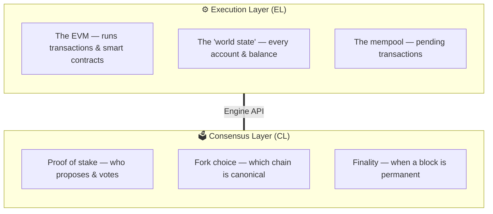
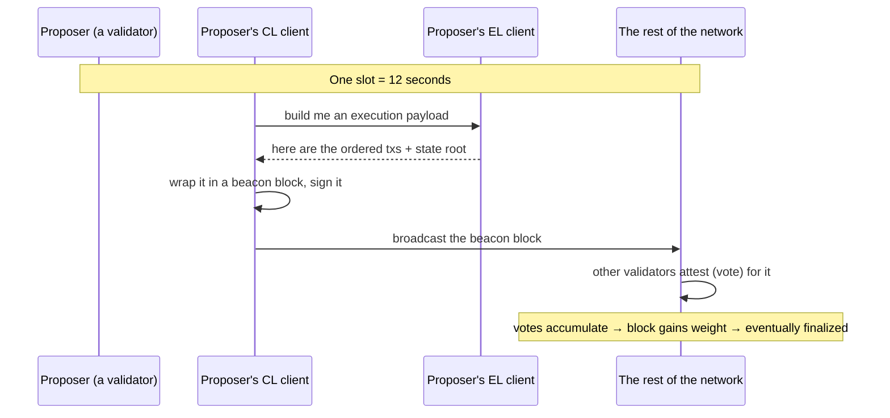

# Ethereum Internals

These docs cover how Ethereum works internally on a lower level. How consensus layer and execution layer works.

## Ethereum Node

An ethereum node is a computer running software (execution client and consensus client) that participates in the network. It validates transactions and blocks against protocol rules and relays data to other nodes over a peer-to-peer network.

- **Execution Layer:** This layer executes transactions and smart contracts.
- **Consensus Layer:** This layer decides which blocks are real and in what order.

## Execution Layer (EL)

This is the "what happened" engine. Most developers interact with the execution layer through the JSON RPC API (`eth_getBalance`, `eth_sendRawTransaction`, `eth_call`).

- **EVM (Ethereum Virtual Machine):** The sandboxed machined that executes transactions and smart contracts.
- **Blockchain World State:** Current balance and storage state of all smart contracts and accounts.
- **Mempool:** Waiting room for transactions that have been broadcast but not included in a block.

Some examples of execution layer clients: Geth, Nethermind, Besu, Reth, Erigon

## Consensus/Beacon Layer (CL)

This is the "everyone agrees" engine. This layer builds consensus among peers to reach a new state of the blockchain.

- **Proof of Stake (PoS):** The process of choosing who gets to propose the next block, weighted by how much ETH they have staked.
- **Fork Choice:** When there are multiple competing blocks, this layer decides which fork of the chain everyone should build on and use.
- **Finality:** This layer decides and declares after votes (consensus) from the peers when a block is permanent and cannot be reverted.

Some examples of consensus clients: Lighthouse, Prysm, Teku, Nimbus, Lodestar

### Validators

The consensus layer is run by validators. Validators are programs that run alongside an Ethereum node. Using staked ETH (proof of stake), they participate in proposing blocks and voting (attesting) on what they see.

## How the Two Layers Work Together

Execution and consensus layers communicate through the Engine API which is small, private and authenticated channel on localhost.

### Slot Process

Every slot (12 seconds), the following process takes place:

1. One validator is chosen as the proposer for the slot.
2. The validator's consensus layer (CL) asks the execution layer (EL) to assemble a new block of transactions (the payload).
3. The consensus layer (CL) wraps the payload, signs it and broadcasts the beacon block.
   1. Beacon block is created by consensus layer and it wraps the execution layer's block and adds the consensus information (votes, proposer's signature etc.) to it.
4. A committee of other validators attests and vote that the beacon block created is the correct head of the chain.
5. The votes pile up and after roughly two epochs (~13 mins), the block becomes finalized and permanent.

This loop, repeated forever, **is Ethereum**.

## In a nutshell

- A modern Ethereum node is **two cooperating programs**: an **execution layer** client and a **consensus layer** client.
- The **EL** runs transactions and holds the world state (the part you reach with JSON-RPC).
- The **CL** runs proof of stake — choosing proposers, collecting votes, and finalizing blocks.
- They talk over the private, authenticated **Engine API**; the CL wraps the EL's "execution payload" inside its beacon block.
- This split gives separation of concerns, client diversity, and was the engineering trick that made The Merge feasible.
