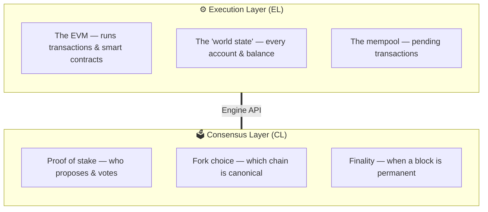
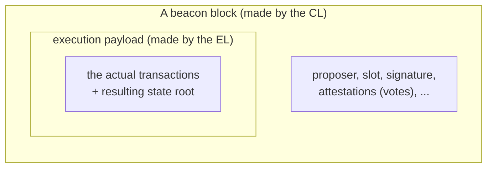
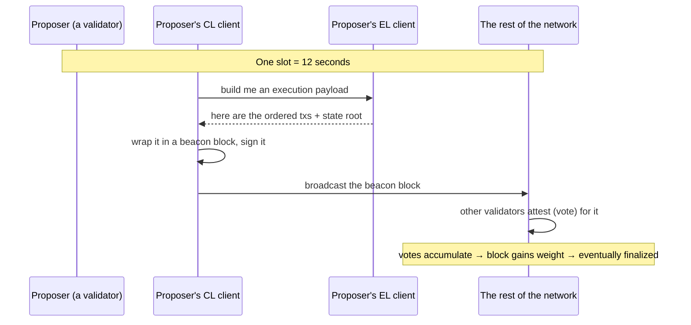

# 00 — The Big Picture: Two Layers, One Node

> **What you'll learn here:** why a modern Ethereum node is split into two programs, what each
> one is responsible for, and the mental model that makes the rest of these docs click.
>
> **What you should already know:** roughly what a block, a transaction, and a validator are.
>
> **Fork note:** this is the post-Merge architecture, unchanged in spirit since 2022 and still
> true on mainnet today (Fusaka era, mid-2026).

---

## Start with a question: who decides what "the truth" is?

A blockchain has to answer two very different questions, and it's easy to blur them together:

1. **"What happens when I run this transaction?"** — If Alice sends Bob 1 ETH, what are the
   new balances? If a contract is called, what does it compute and store? This is
   *deterministic bookkeeping*. Given the same starting point and the same transaction,
   everyone computes the same answer.

2. **"Which transactions count, and in what order?"** — Thousands of machines around the world
   are all proposing blocks. Which block is *the* next block? When is a block so settled that
   we'll never undo it? This is *agreement* — and it's hard, because the participants don't
   trust each other and messages arrive late or out of order.

These are genuinely different problems. The first is a calculator. The second is a
negotiation. Ethereum solves them with **two separate programs**.

---

## The two layers

### The Execution Layer (EL) — the "what happened" engine

The EL is the part most developers already know. It contains:

- **The EVM** (Ethereum Virtual Machine), the sandboxed computer that runs every transaction
  and smart contract.
- **The world state**: the current balance and storage of every account.
- **The mempool**: the waiting room of transactions that have been broadcast but not yet
  included in a block.

The EL speaks the **[JSON-RPC API](01-execution-layer/05-json-rpc-api.md)** — `eth_getBalance`,
`eth_sendRawTransaction`, `eth_call`, and friends. When you use MetaMask, Etherscan, or a web3
library, you're talking to an EL client. Examples:
[Geth, Nethermind, Besu, Reth, Erigon](01-execution-layer/04-el-clients.md).

> **Analogy:** the EL is a spreadsheet plus a scripting engine. It can compute any update you
> ask for — but on its own it has no opinion about *which* updates are official.

### The Consensus Layer (CL) — the "everyone agrees" engine

The CL is the part that came to the foreground with The Merge. It runs the **[Beacon
Chain](02-consensus-layer/02-beacon-chain-slots-epochs.md)** and is responsible for:

- **[Proof of stake](02-consensus-layer/01-pos-and-gasper.md):** choosing who gets to propose
  the next block, weighted by how much ETH they've staked.
- **[Fork choice](02-consensus-layer/06-finality-and-fork-choice.md):** when there are
  competing blocks, deciding which chain everyone should build on.
- **[Finality](02-consensus-layer/06-finality-and-fork-choice.md):** declaring, after enough
  votes, that a block is permanent and will never be reverted.

The CL is run by **[validators](glossary.md#validator)** — staked participants who propose
blocks and vote ("[attest](glossary.md#attestation)") on what they see. The CL speaks the
**[Beacon Node HTTP API](04-lighthouse/03-beacon-node-http-api.md)**. Examples of CL clients:
[Lighthouse, Prysm, Teku, Nimbus, Lodestar](02-consensus-layer/07-cl-clients.md).

> **Analogy:** the CL is a jury plus a clock. It schedules whose turn it is, collects votes,
> and announces verdicts that become final.

---

## How they fit together

The EL holds the *contents* of blocks; the CL decides the *order and validity* of blocks. The
CL wraps each EL block (called an **[execution payload](glossary.md#execution-payload)**)
inside its own **beacon block**, adds all the consensus information (votes, the proposer's
signature, etc.), and gossips it to the network.

They communicate over the **[Engine API](03-el-cl-interface/02-engine-api.md)** — a small,
private, authenticated channel on localhost. This is *not* the public JSON-RPC; it's an
internal control link with three core jobs:

- *"EL, build me a block"* (`engine_getPayload`)
- *"EL, here's a block — is it valid? execute it"* (`engine_newPayload`)
- *"EL, this is the head of the chain now"* (`engine_forkchoiceUpdated`)

We walk through that whole conversation, slot by slot, in
**[the Engine API doc](03-el-cl-interface/02-engine-api.md)**.

---

## A day in the life of a block (the 30-second version)

Every **[slot](glossary.md#slot)** (12 seconds), this happens:

1. One validator is chosen as **proposer** for this slot.
2. Its CL asks its EL to assemble a block of transactions (the payload).
3. The CL wraps that payload, signs it, and broadcasts the beacon block.
4. A **[committee](glossary.md#committee)** of other validators **attests** — they vote that
   this block is the correct head of the chain.
5. Those votes pile up. After roughly two **[epochs](glossary.md#epoch)** (~13 minutes), the
   block becomes **[finalized](glossary.md#finality)** — permanent.

That loop, repeated forever, *is* Ethereum.

---

## Why split it this way? (three good reasons)

- **Separation of concerns.** Execution and agreement are independent problems, so independent
  teams can build independent clients for each. A bug in one doesn't necessarily doom the other.
- **Client diversity.** Five-plus EL clients and five-plus CL clients exist. You mix and match
  (e.g. Lighthouse + Reth). If any single client has a bug, it can't take down the whole
  network, because the majority is running other software.
- **It made The Merge possible.** The Beacon Chain ran *alongside* the old proof-of-work chain
  for almost two years, proving itself, before the EL simply unplugged proof of work and
  plugged into the CL instead. See **[The Merge](03-el-cl-interface/01-the-merge.md)**.

---

## In a nutshell

- A modern Ethereum node is **two cooperating programs**: an **execution layer** client and a
  **consensus layer** client.
- The **EL** runs transactions and holds the world state (the part you reach with JSON-RPC).
- The **CL** runs proof of stake — choosing proposers, collecting votes, and finalizing blocks.
- They talk over the private, authenticated **Engine API**; the CL wraps the EL's "execution
  payload" inside its beacon block.
- This split gives separation of concerns, client diversity, and was the engineering trick
  that made The Merge feasible.

## Sources

- [ethereum.org — Nodes and clients](https://ethereum.org/en/developers/docs/nodes-and-clients/)
- [ethereum.org — The Merge](https://ethereum.org/en/roadmap/merge/)
- [ethereum.org — Proof of stake](https://ethereum.org/en/developers/docs/consensus-mechanisms/pos/)
- [Engine API specification (execution-apis)](https://github.com/ethereum/execution-apis/blob/main/src/engine/common.md)
