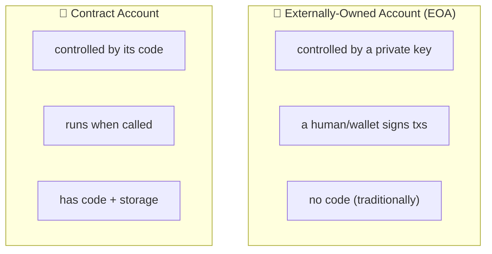
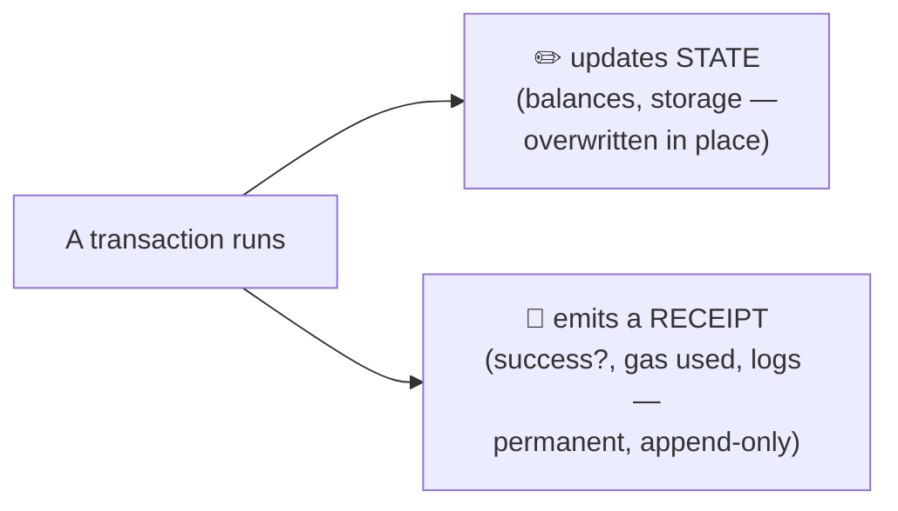
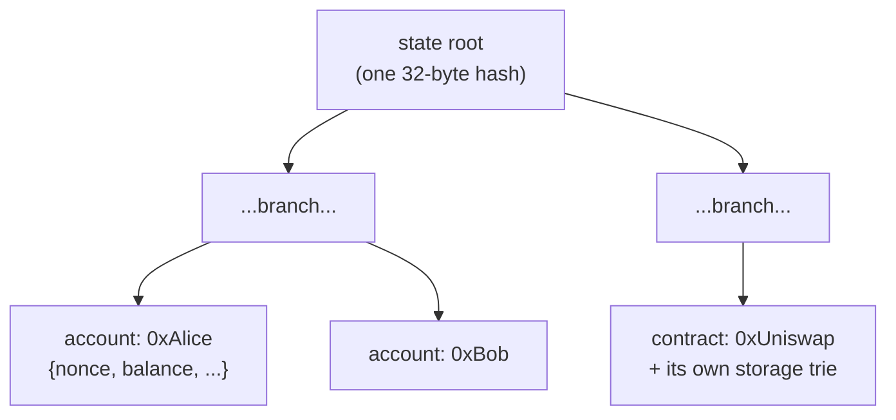

# 01.01 — The EVM and the World State

> **What you'll learn here:** what Ethereum actually *stores*, the two kinds of accounts, and
> the difference between "state" (what's true now) and "receipts" (what happened).
>
> **What you should already know:** you've sent a transaction and seen a balance change.
>
> **Fork note:** nothing here is fork-sensitive; it's been true since the early days. One
> recent twist — externally-owned accounts can temporarily run code ([EIP-7702](../05-network-upgrades.md),
> Pectra) — is flagged in a *Going deeper* box.

Part of the **[Execution Layer](../00-overview.md)**. Up next:
**[Transactions & Gas »](02-transactions-and-gas.md)**

---

## The mental model: Ethereum is one giant shared computer

Forget blocks and mining for a second. At its heart, the
[execution layer](../glossary.md#execution-layer-el) is a single computer that everyone in the
world shares. It has:

- **Memory** — the **[world state](../glossary.md#world-state)**: every account's balance,
  every contract's stored data.
- **A processor** — the **[EVM](../glossary.md#evm-ethereum-virtual-machine)**, which runs
  programs (smart contracts).
- **An instruction queue** — transactions, which are the only way to change the memory.

The crucial property: it's **deterministic**. Feed the same starting state and the same
transactions to any correct client, and you get *exactly* the same ending state. That's what
lets thousands of independent machines stay in agreement without trusting each other.

---

## Two kinds of accounts

Everything in Ethereum's state is an **account**, and there are exactly two flavors:

| | **EOA** (your wallet) | **Contract account** |
|---|---|---|
| Controlled by | a private key | its own code |
| Can start a transaction? | ✅ yes | ❌ no (only reacts when called) |
| Has code? | no (traditionally) | yes |
| Has storage? | no | yes |

Both kinds of account share the same four-field record:

| Field | What it means |
|---|---|
| `nonce` | For an EOA: how many txs it has sent (prevents replay). For a contract: how many contracts it has created. |
| `balance` | ETH held, in **wei** (1 ETH = 10¹⁸ wei). |
| `codeHash` | Hash of the contract's code (empty for a plain EOA). |
| `storageRoot` | Fingerprint of all the contract's stored data (empty for an EOA). |

> 🔍 **Going deeper (optional):** Since [EIP-7702](../05-network-upgrades.md) (Pectra, 2025),
> an EOA *can* point at code temporarily, letting wallets act like smart contracts ("account
> abstraction") for things like batching and gas sponsorship. The two-account model above is
> still the right mental picture; 7702 just blurs the "EOAs have no code" line for advanced
> wallets.

---

## State vs. receipts: "what's true now" vs. "what happened"

This distinction trips people up, so let's be precise.

- **State** = the *current* answer. "What is Alice's balance *right now*?" State is overwritten
  every time it changes — it doesn't remember its own history. It answers **"what is true?"**
- **Receipts** = the *record of an event*. Every transaction produces a receipt: did it
  succeed, how much gas it burned, and what **logs/events** it emitted. Receipts are written
  once and never change. They answer **"what happened?"**

**Why you care:** when you read a balance with `eth_getBalance`, you're reading *state*. When
an indexer or The Graph reconstructs "every Transfer that ever happened," it's replaying
*logs from receipts*. State is small and current; receipts/logs are the historical event feed.

---

## How state is stored: tries (the 60-second version)

You don't need the cryptographic details, just the shape of the idea.

Ethereum stores state in a **Merkle Patricia Trie** — a tree where every account hangs off a
path, and each node's hash depends on its children. Collapse the whole tree and you get one
32-byte number: the **state root**.

Two superpowers fall out of this:

1. **One hash summarizes everything.** Change any single balance and the state root changes.
   Each block header commits to a state root, so the entire world state is fingerprinted in 32
   bytes. (This root is the `stateRoot` inside the
   [execution payload](../glossary.md#execution-payload) the CL carries.)
2. **Proofs without the whole database.** A node can prove "Alice has 5 ETH" by handing you
   just the path from her account up to the root — not the entire state. This is how light
   clients and `eth_getProof` work.

> 🔍 **Going deeper (optional):** Each contract has its *own* storage trie (rooted at its
> `storageRoot`), nested inside the global account trie. There's a long-running effort to
> replace Merkle Patricia Tries with **Verkle trees** to make these proofs much smaller — it's
> on the roadmap but **not** live on mainnet as of mid-2026, so today's mainnet is still MPT.

---

## In a nutshell

- The EL is one **deterministic shared computer**: the [EVM](../glossary.md#evm-ethereum-virtual-machine)
  (processor) acting on the **[world state](../glossary.md#world-state)** (memory), driven by
  transactions (instructions).
- Everything is an **account**: EOAs (key-controlled) or contracts (code-controlled), each with
  `nonce`, `balance`, `codeHash`, `storageRoot`.
- **State** is the current truth (overwritten); **receipts/logs** are the permanent record of
  what happened (append-only).
- All state hashes down to a single **state root**, enabling compact proofs and a 32-byte
  fingerprint of the whole world.

## Sources

- [ethereum.org — Accounts](https://ethereum.org/en/developers/docs/accounts/)
- [ethereum.org — Ethereum state & the EVM](https://ethereum.org/en/developers/docs/evm/)
- [ethereum.org — Merkle Patricia Trie](https://ethereum.org/en/developers/docs/data-structures-and-encoding/patricia-merkle-trie/)
- [execution-specs (github.com/ethereum/execution-specs)](https://github.com/ethereum/execution-specs)
