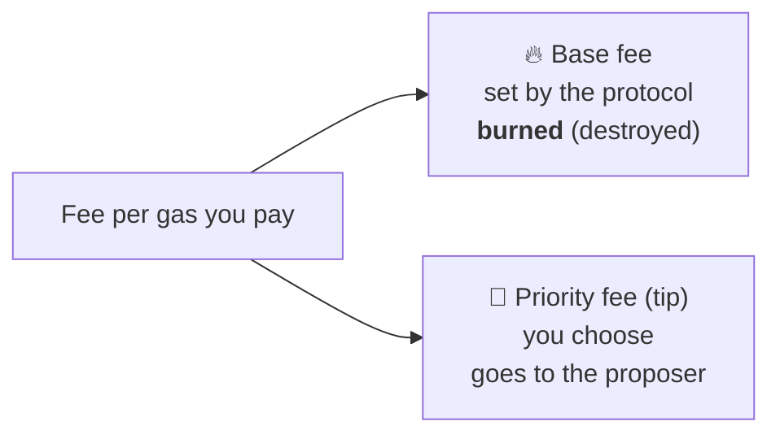
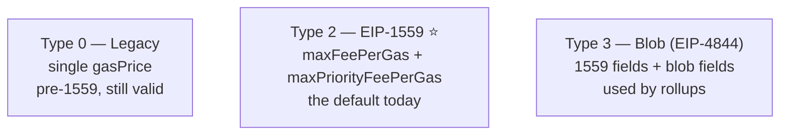

# 01.02 — Transactions, Gas, and the Fee Market

> **What you'll learn here:** the anatomy of a transaction, the three main transaction types
> you'll meet today, and how EIP-1559 fees actually work (base fee + tip).
>
> **What you should already know:** you've paid a gas fee and seen "max fee" / "priority fee"
> in a wallet.
>
> **Fork note:** EIP-1559 fees (since 2021) and blob transactions (since Dencun, 2024) are
> current. Fusaka (late 2025) added a per-transaction gas cap and raised blob counts —
> flagged below.

Part of the **[Execution Layer](01-evm-and-state.md)**. Up next:
**[Mempool & Block Building »](03-mempool-and-block-building.md)**

---

## What a transaction actually is

A transaction is a **signed instruction** to change the [world state](../glossary.md#world-state).
That's it. Strip away the encoding and every transaction carries:

| Field | Plain meaning |
|---|---|
| `nonce` | "This is my Nth transaction." Forces order, prevents replay. |
| `to` | Who you're calling (an address), or empty to deploy a contract. |
| `value` | How much ETH to send. |
| `data` | The payload — which contract function to call and its arguments. |
| `gasLimit` | The most [gas](../glossary.md#gas) you'll allow it to burn. |
| fee fields | How much you'll pay per unit of gas (see below). |
| signature | Proves *you* (the key holder) authorized it. |

The signature is what makes it trustworthy: anyone can verify it came from the owner of the
`from` address, without that owner revealing their private key.

---

## Gas: paying for computation

Every EVM operation costs **[gas](../glossary.md#gas)** — a fixed amount of "work units." A
plain ETH transfer costs 21,000 gas; a complex DeFi swap might cost 200,000+. Gas exists for
two reasons:

1. **To price computation.** Nothing is free, so nobody can spam the network with infinite
   loops — you'd run out of gas (and the tx reverts) the moment you exceed your `gasLimit`.
2. **To stay deterministic about cost.** Every node charges the same gas for the same work.

> **Analogy:** gas is fuel and `gasLimit` is the size of your tank. A trip (transaction) burns
> fuel based on distance (computation). If the tank runs dry mid-trip, you stop where you are —
> and you still paid for the fuel you burned (the tx reverts but the gas is *not* refunded).

The total ETH you pay ≈ `gas used × price per gas`. The interesting part is how "price per gas"
is set — that's the fee market.

---

## EIP-1559: base fee + tip

Before 2021, you blindly bid a gas price and hoped. EIP-1559 replaced that auction with a
predictable two-part fee:

- **Base fee** — a per-gas price *the protocol itself* computes for each block, based on how
  full recent blocks were. It is **burned** (permanently removed from supply), so the proposer
  can't game it. If blocks are over half full, the base fee rises next block; under half full,
  it falls. This makes fees responsive and roughly predictable.
- **Priority fee (tip)** — a small extra per-gas amount *you* offer to get included faster. It
  goes to the block [proposer](../glossary.md#proposer) as a reward.

In your wallet:
- **Max fee** = the ceiling you'll tolerate (covers base fee + tip).
- **Max priority fee** = the tip.
- You're refunded the difference if the base fee comes in lower than your max.

> **Worked example.** Base fee is 20 gwei, you set a 2 gwei tip and a 30 gwei max fee. A simple
> transfer (21,000 gas) costs `21,000 × (20 + 2) = 462,000 gwei ≈ 0.000462 ETH`. Of that, the
> 20-gwei base-fee portion is burned; the 2-gwei tip goes to the proposer. Because your max
> (30) exceeded what was needed (22), you pay only 22 gwei per gas.

---

## The transaction types you'll meet

Ethereum transactions are "typed." You'll encounter three in practice today:

| Type | Name | Fee fields | Who uses it |
|---|---|---|---|
| `0x0` | **Legacy** | one flat `gasPrice` | old tooling; still accepted |
| `0x2` | **EIP-1559** | `maxFeePerGas`, `maxPriorityFeePerGas` | almost everything today |
| `0x3` | **Blob (EIP-4844)** | 1559 fields **+** `maxFeePerBlobGas`, blob hashes | layer-2 rollups |

> 🔍 **Going deeper (optional):** There are two more types you'll rarely hand-craft: `0x1`
> (EIP-2930 access lists) and `0x4` (EIP-7702 "set code" txs from Pectra, used by smart-account
> wallets). For day-to-day app work, **type 2 is your default** and type 3 only matters if
> you're a rollup.

### Blob transactions in one breath

Blob txs (type 3) carry big side-bundles of data called **[blobs](../glossary.md#blob)** that
are stored only temporarily (~18 days) and priced in a **separate fee market** (their own base
fee). They exist so rollups can dump data cheaply without competing with normal transactions
for regular gas. Each blob is ~128 KB. The per-block count has grown over time — after Fusaka's
"BPO" tuning forks in late 2025/early 2026, the target is **14** and max is **21** blobs per
block. The full blob/rollup story lives in
**[Network Upgrades](../05-network-upgrades.md)**.

> 🔍 **Going deeper (optional):** Fusaka (2025) also added a **per-transaction gas cap** of
> ~16.78M gas (EIP-7825): no single transaction may consume more than that, even though a whole
> block's gas limit is much higher (tens of millions). It's a denial-of-service hardening
> measure and rarely affects normal transactions.

---

## Where a transaction goes from here

Once signed and broadcast, your transaction enters the **mempool** and waits to be picked up by
a proposer. That's the next doc:
**[Mempool & Block Building »](03-mempool-and-block-building.md)**.

---

## In a nutshell

- A transaction is a **signed instruction** with a `nonce`, `to`, `value`, `data`, a
  `gasLimit`, and fee fields.
- **Gas** prices computation; you pay `gas used × price per gas`, and running out mid-execution
  reverts the tx but still costs you.
- **EIP-1559** splits the per-gas price into a **burned base fee** (set by the protocol,
  responsive to congestion) and a **tip** (your choice, paid to the proposer).
- Today's default is the **type-2** transaction; **type-3 blob** transactions are how rollups
  post cheap data in a separate fee market.

## Sources

- [ethereum.org — Transactions](https://ethereum.org/en/developers/docs/transactions/)
- [ethereum.org — Gas and fees](https://ethereum.org/en/developers/docs/gas/)
- [EIP-1559 — Fee market change](https://eips.ethereum.org/EIPS/eip-1559)
- [EIP-4844 — Shard blob transactions](https://eips.ethereum.org/EIPS/eip-4844)
- [EIP-7825 — Transaction gas limit cap](https://eips.ethereum.org/EIPS/eip-7825)
