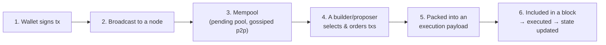
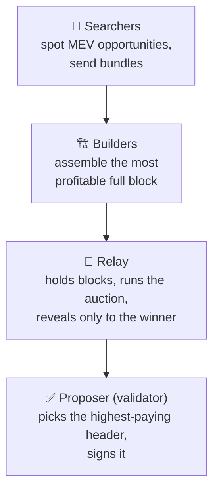
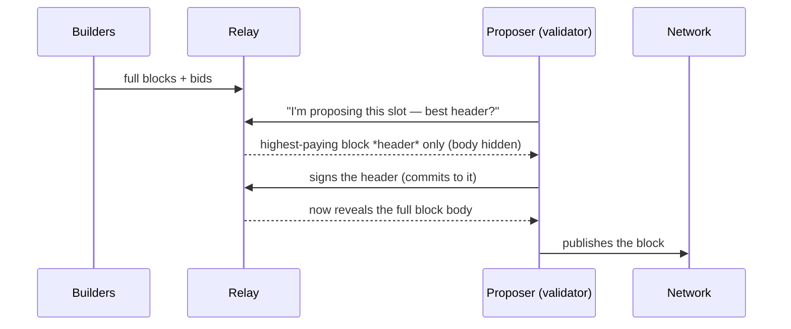

# 01.03 — From "Send" to "Included": Mempool, MEV, and Block Building

> **What you'll learn here:** the journey a transaction takes from your wallet into a block,
> what the "mempool" is, why block-building became a specialized market (MEV), and how
> proposers actually get their blocks today (PBS / MEV-Boost) — at a high level.
>
> **What you should already know:** what a transaction and a [proposer](../glossary.md#proposer)
> are.
>
> **Fork note:** the PBS/MEV-Boost setup described here is the off-protocol reality on mainnet
> today. A future fork (Glamsterdam, expected Q3 2026) plans to bake builder/proposer
> separation *into* the protocol ("ePBS") — noted at the end.

Part of the **[Execution Layer](01-evm-and-state.md)**. Up next:
**[EL Clients »](04-el-clients.md)**

---

## The journey of one transaction

Let's walk it.

### 1–3: Into the mempool

When you hit "send," your transaction is broadcast to an
[execution-layer node](04-el-clients.md), which checks it's valid (good signature, right nonce,
enough balance to cover the fee) and drops it into its **mempool** — the pool of pending,
not-yet-included transactions. Nodes gossip these to each other, so within seconds your tx is
sitting in mempools across the network, waiting.

> **Analogy:** the mempool is a departure lounge. Your transaction has a boarding pass (its
> fee), but it only gets on the next plane (block) if there's room and its fee is competitive.

> 🔍 **Going deeper (optional):** there isn't *one* mempool — every node keeps its own view,
> and they differ slightly. There are also **private mempools** (you send a tx directly to a
> builder, bypassing the public pool) used to avoid being front-run. So "the mempool" is a
> useful fiction for a loosely-synced, partly-private set of pools.

### 4–6: Selection and inclusion

Once per [slot](../glossary.md#slot) (12 seconds), one validator is the
[proposer](../glossary.md#proposer). Someone has to choose *which* pending transactions go in,
and *in what order*. Naively, you'd just take the highest-tip transactions. But ordering is
worth real money — which brings us to MEV.

---

## MEV: why ordering is a business

**[MEV](../glossary.md#mev)** (Maximal Extractable Value) is the extra profit you can squeeze
out of a block purely by *how you arrange it*. Examples:

- **Arbitrage:** two exchanges briefly disagree on a price; insert a trade that profits from
  the gap.
- **Liquidations:** be first to liquidate an underwater loan and collect the bonus.
- **Sandwiching:** place a trade right before and right after someone else's big swap.

Capturing MEV well requires sophisticated, fast software. Most validators are ordinary stakers
who can't build the most profitable block themselves. So a market formed to do it for them.

- **Searchers** find opportunities and submit transaction *bundles*.
- **Builders** assemble entire candidate blocks optimized for total value (tips + MEV).
- **Relays** run a sealed auction and act as trusted middlemen.
- The **proposer** just picks the highest bid.

---

## PBS and MEV-Boost (proposer-builder separation)

This division of labor has a name: **Proposer-Builder Separation (PBS)**. On mainnet today
it's *not* part of the core protocol — it's bolted on via software called **MEV-Boost**, run
alongside the consensus client by most validators.

The key trick is **commit-then-reveal**, so a proposer can sell the right to build its block
without a builder being able to steal the MEV or the proposer being able to peek and copy it:

The proposer signs a *header* (a promise) before seeing the contents, so it can't cheat; the
relay only reveals the body after the commitment, so the builder is paid. Most validators earn
meaningfully more with MEV-Boost than building blocks locally — but it does introduce reliance
on relays, which is one reason the ecosystem wants to move PBS into the protocol itself.

> **Why this matters for the rest of these docs:** the *consensus* layer doesn't care how the
> block was built — it just receives an [execution payload](../glossary.md#execution-payload)
> and runs the normal [duties](../02-consensus-layer/04-duties.md). PBS is entirely an
> execution-side / off-protocol concern. The handoff still happens through the
> [Engine API](../03-el-cl-interface/02-engine-api.md).

> 🔍 **Going deeper (optional):** **ePBS** (enshrined PBS, EIP-7732) aims to make
> builder/proposer separation a native protocol feature, removing the need to trust relays.
> It's a headliner of the **Glamsterdam** upgrade expected in Q3 2026 — see
> **[Network Upgrades](../05-network-upgrades.md)**. Not live on mainnet as of mid-2026.

---

## In a nutshell

- A broadcast transaction lands in the **mempool** (really many loosely-synced pools, some
  private) and waits to be picked up.
- Block **ordering is valuable** — that value is **MEV** (arbitrage, liquidations,
  sandwiching).
- A market of **searchers → builders → relays → proposer** specializes in capturing it, via
  **PBS**, implemented today by the off-protocol **MEV-Boost** software.
- A **commit-then-reveal** auction lets a proposer sell block-building rights without either
  side cheating.
- The consensus layer is oblivious to all this; it just receives a finished execution payload.

## Sources

- [ethereum.org — MEV](https://ethereum.org/en/developers/docs/mev/)
- [ethereum.org — Proposer-builder separation](https://ethereum.org/en/roadmap/pbs/)
- [Flashbots — MEV-Boost docs](https://docs.flashbots.net/flashbots-mev-boost/introduction)
- [EIP-7732 — Enshrined Proposer-Builder Separation](https://eips.ethereum.org/EIPS/eip-7732)
