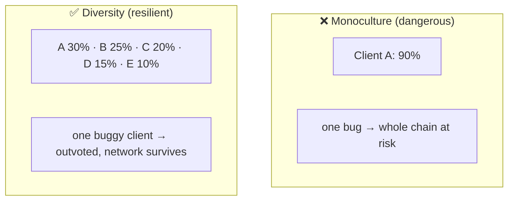

# 01.04 — Execution-Layer Clients: Geth, Nethermind, Besu, Reth, Erigon

> **What you'll learn here:** what an EL client is responsible for, why having several different
> ones matters so much, and a quick, honest sketch of the five you'll hear about.
>
> **What you should already know:** the [EL vs CL split](../00-overview.md).
>
> **Fork note:** the lineup below is the mainnet reality in mid-2026. Client market share shifts
> over time; treat exact percentages as approximate and check a live source like
> [clientdiversity.org](https://clientdiversity.org/) or [execution.supply](https://execution.supply/).

Part of the **[Execution Layer](01-evm-and-state.md)**. Up next:
**[JSON-RPC API »](05-json-rpc-api.md)**

---

## What does an EL client actually do?

An **[execution-layer](../glossary.md#execution-layer-el) client** is the program that:

- runs the [EVM](../glossary.md#evm-ethereum-virtual-machine) and executes transactions,
- keeps the [world state](../glossary.md#world-state) and the transaction
  [mempool](03-mempool-and-block-building.md),
- serves the public **[JSON-RPC API](05-json-rpc-api.md)** to wallets and dapps,
- and, when asked by its paired [consensus client](../02-consensus-layer/07-cl-clients.md) over
  the **[Engine API](../03-el-cl-interface/02-engine-api.md)**, builds and validates
  [execution payloads](../glossary.md#execution-payload).

It does **not** decide which block wins or when finality happens — that's the CL's job. Think of
the EL client as the engine and the CL client as the driver.

---

## Why client diversity is a big deal

This is the single most important idea in this doc, so it gets its own spotlight.

If **one** client had ~100% of the network and it shipped a bug that, say, computed a state
root incorrectly, that bug could get **finalized** — baked permanently into a broken chain — or
crash a supermajority of the network at once. Spreading the network across *multiple
independent implementations* means a bug in any one client is caught by disagreement with the
others, rather than becoming consensus.

The healthy target most operators cite: **no single client above ~33%** (so no single bug can
break finality), and ideally none above ~50%. This is why running a *minority* client is
considered a public good. (The same logic applies on the [CL side](../02-consensus-layer/07-cl-clients.md).)

---

## The five you'll hear about

All are full, spec-compliant EL clients — they interoperate and any of them pairs with any CL
client. They differ in language, performance profile, and design philosophy.

| Client | Language | Known for | One-line take |
|---|---|---|---|
| **Geth** | Go | the original; historically dominant | The reference implementation. Battle-tested, huge community — but its very popularity is a diversity risk, so consider a minority client instead. |
| **Nethermind** | C#/.NET | performance, rich plugins | Popular with staking operators and enterprises; fast sync, good tooling. |
| **Besu** | Java | enterprise & permissioned chains | Apache-licensed, big in enterprise/consortium settings; also runs on mainnet. |
| **Reth** | Rust | modern, modular, fast | A newer, performance-focused, highly modular client (by Paradigm); increasingly popular and a great pairing with Rust-based tooling and [Lighthouse](../04-lighthouse/01-architecture.md). |
| **Erigon** | Go | disk efficiency, archive nodes | Re-architected for compact storage; a favorite for **archive nodes** (full historical state) thanks to its efficient database. |

> **Picking one (rough guidance):** for a fresh staking setup that values diversity and Rust
> tooling, **Reth** is a strong, modern choice. **Nethermind** is a well-trodden operator
> favorite. **Erigon** shines if you need cheap archive data. **Geth** is the safest "it just
> works" pick but, precisely because it's so common, running it adds to monoculture risk.

> 🔍 **Going deeper (optional):** "Archive node" vs "full node": a *full* node keeps recent
> state and can verify everything, pruning old intermediate state. An *archive* node keeps
> **every** historical state so it can answer "what was Alice's balance at block 5,000,000?"
> Archive nodes need far more disk (multiple TB); Erigon and Reth are common choices for them.

---

## How this connects to the CL

Whatever EL client you run, it speaks the *same* [Engine API](../03-el-cl-interface/02-engine-api.md)
to whatever CL client you pair it with. That standardization is exactly what makes mix-and-match
diversity possible: **Lighthouse + Reth**, **Teku + Besu**, **Nimbus + Nethermind** — all valid.
The CL side of that pairing is **[CL clients](../02-consensus-layer/07-cl-clients.md)**.

---

## In a nutshell

- An EL client runs transactions, holds state and the mempool, serves JSON-RPC, and builds
  payloads on the CL's request.
- **Client diversity is a safety feature**: no single client should exceed ~33% of the network,
  so one bug can't break finality.
- Five mainstream clients: **Geth** (Go, original), **Nethermind** (C#), **Besu** (Java,
  enterprise), **Reth** (Rust, modern), **Erigon** (Go, archive-friendly).
- Any EL client pairs with any CL client over the standard Engine API — so running a *minority*
  client is a public good.

## Sources

- [ethereum.org — Execution clients](https://ethereum.org/en/developers/docs/nodes-and-clients/#execution-clients)
- [clientdiversity.org](https://clientdiversity.org/)
- [Reth book](https://reth.rs/) · [Geth docs](https://geth.ethereum.org/) · [Nethermind docs](https://docs.nethermind.io/) · [Besu docs](https://besu.hyperledger.org/) · [Erigon](https://github.com/erigontech/erigon)
