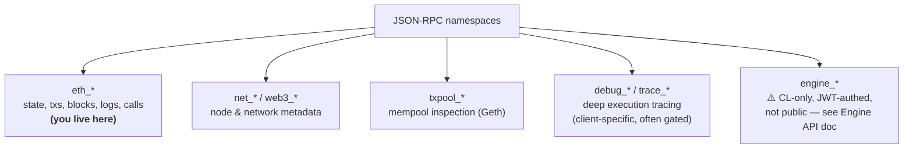

# 01.05 — The JSON-RPC API (the EL's Public Interface)

> **What you'll learn here:** how to actually *talk* to an execution-layer node — the request
> shape, the handful of `eth_*` calls you'll use 90% of the time, and copy-paste `curl`
> examples.
>
> **What you should already know:** [accounts and state](01-evm-and-state.md), and how to run a
> shell command.
>
> **Fork note:** these calls are stable and not fork-sensitive. This is the *execution*-layer
> API — distinct from the consensus-layer [Beacon API](../04-lighthouse/03-beacon-node-http-api.md)
> you'll meet later.

Part of the **[Execution Layer](01-evm-and-state.md)**. This wraps up the EL section; next is
the **[Consensus Layer »](../02-consensus-layer/01-pos-and-gasper.md)**.

---

## The request shape (learn it once)

Every JSON-RPC call is a POST with the same envelope. Only `method` and `params` change:

```json
{ "jsonrpc": "2.0", "method": "eth_blockNumber", "params": [], "id": 1 }
```

- `method` — the function name (namespaced, e.g. `eth_`, `net_`, `web3_`).
- `params` — an array of arguments (often `[]`).
- `id` — any number you choose; it's echoed back so you can match responses.

You send this to your node's RPC URL (default `http://localhost:8545` for a local node, or a
provider like Infura/Alchemy/QuickNode). Set the endpoint once:

```bash
export RPC=http://localhost:8545
```

> **Heads up on block tags.** Many calls take a block parameter. You can pass a hex block number
> (`"0x10d4f"`), or a *tag*: `"latest"` (most recent block), `"finalized"` (won't be reverted —
> this is the [CL's](../00-overview.md) finality showing through), `"safe"`, `"pending"`, or
> `"earliest"`. For "is this really settled?" money decisions, prefer **`finalized`**.

---

## The calls you'll actually use

### Check the chain tip

```bash
curl -s $RPC -X POST -H 'Content-Type: application/json' \
  -d '{"jsonrpc":"2.0","method":"eth_blockNumber","params":[],"id":1}'
```
```json
{ "jsonrpc": "2.0", "id": 1, "result": "0x14f1a3c" }   // current block height (hex)
```

### Read an account balance

`eth_getBalance` takes an address and a block tag. Result is **wei**, in hex.

```bash
curl -s $RPC -X POST -H 'Content-Type: application/json' -d '{
  "jsonrpc":"2.0","method":"eth_getBalance",
  "params":["0xd8dA6BF26964aF9D7eEd9e03E53415D37aA96045","latest"],
  "id":1}'
```
```json
{ "jsonrpc": "2.0", "id": 1, "result": "0x12345678..." }   // wei; ÷ 1e18 for ETH
```

### Get a transaction's outcome (the receipt)

After sending a tx, poll for its **receipt**. A `null` result means "not mined yet." Once
present, `status` is `"0x1"` (success) or `"0x0"` (reverted), and `logs` holds the emitted
[events](01-evm-and-state.md).

```bash
curl -s $RPC -X POST -H 'Content-Type: application/json' -d '{
  "jsonrpc":"2.0","method":"eth_getTransactionReceipt",
  "params":["0x<your-tx-hash>"],"id":1}'
```
```jsonc
{ "jsonrpc":"2.0","id":1,"result":{
    "status":"0x1",            // ✅ 1 = success, 0 = reverted
    "blockNumber":"0x14f1a3c",
    "gasUsed":"0x5208",        // 21000 = a plain transfer
    "logs":[ /* emitted events */ ]
}}
```

### Simulate a call without sending a transaction (`eth_call`)

`eth_call` runs a contract function **read-only** — no gas paid, no state changed, no signature
needed. This is how you read on-chain data (token balances, prices, etc.). The `data` field is
the ABI-encoded function selector + args (your web3 library builds it for you).

```bash
# Illustrative: read ERC-20 balanceOf — `data` is normally built by viem/ethers/web3.py
curl -s $RPC -X POST -H 'Content-Type: application/json' -d '{
  "jsonrpc":"2.0","method":"eth_call",
  "params":[{"to":"0x<token-contract>","data":"0x70a08231...<address>"},"latest"],
  "id":1}'
```

### Send a signed transaction

You sign locally (with your key, in a library), then submit the raw bytes. The node returns the
transaction hash; you then poll for the receipt above.

```bash
# Illustrative: rawTx comes from signing in viem/ethers, NOT hand-built
curl -s $RPC -X POST -H 'Content-Type: application/json' -d '{
  "jsonrpc":"2.0","method":"eth_sendRawTransaction",
  "params":["0x02f8..."],"id":1}'
```

### The other workhorses (one-liners)

| Method | What it gives you |
|---|---|
| `eth_getTransactionCount(addr, tag)` | the account **nonce** — needed to build the next tx |
| `eth_gasPrice` / `eth_feeHistory` | current gas pricing / recent [base-fee](02-transactions-and-gas.md) history |
| `eth_estimateGas(txObj)` | how much gas a tx will likely need |
| `eth_getLogs(filter)` | historical [events](01-evm-and-state.md) — the backbone of indexers |
| `eth_getBlockByNumber(tag, full)` | a whole block (headers + txs) |
| `eth_chainId` | the chain id (1 = mainnet) — guards against replay across chains |

---

## How the namespaces are organized



The `eth_*` namespace is the standardized, public one you'll use. `debug_*`/`trace_*` are
powerful but client-specific and usually disabled on public endpoints. The `engine_*` namespace
is *not* for you — it's the private CL↔EL link covered in
**[Engine API](../03-el-cl-interface/02-engine-api.md)**.

> 🔍 **Going deeper (optional):** hex everywhere. Quantities (balances, gas, block numbers) are
> hex *without* leading zeros (`0x41`, not `0x041`). Raw byte data (hashes, addresses, calldata)
> is hex *with* its full fixed width. Most libraries hide this; it bites you only when
> hand-crafting `curl`.

---

## In a nutshell

- JSON-RPC is a uniform POST: `{jsonrpc, method, params, id}` to your node's URL (default
  `:8545`).
- The everyday toolkit: `eth_blockNumber`, `eth_getBalance`, `eth_getTransactionReceipt`,
  `eth_call` (read-only), `eth_sendRawTransaction`, plus `eth_getLogs` for history.
- Block tags matter: use **`finalized`** when you need "this won't be reverted."
- The public surface is the `eth_*` namespace; `engine_*` is the separate, private
  [CL↔EL channel](../03-el-cl-interface/02-engine-api.md).

## Sources

- [ethereum.org — JSON-RPC API](https://ethereum.org/en/developers/docs/apis/json-rpc/)
- [Ethereum JSON-RPC specification (execution-apis)](https://ethereum.github.io/execution-apis/)
- [EIP-1474 — Remote procedure call specification](https://eips.ethereum.org/EIPS/eip-1474)
