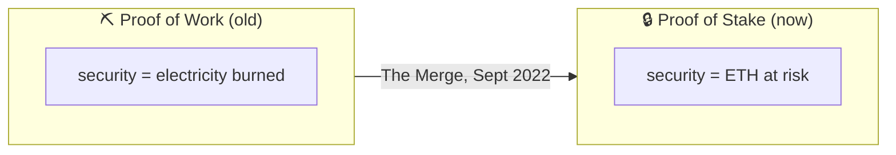
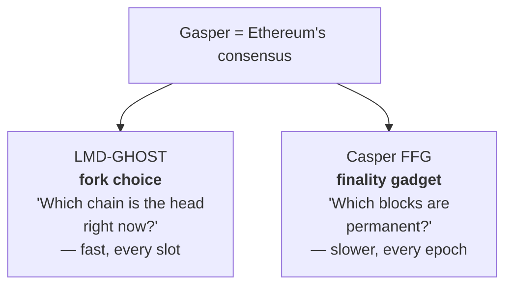
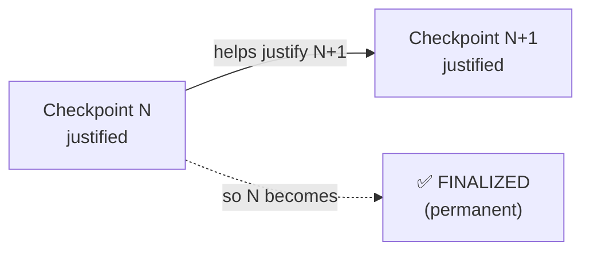
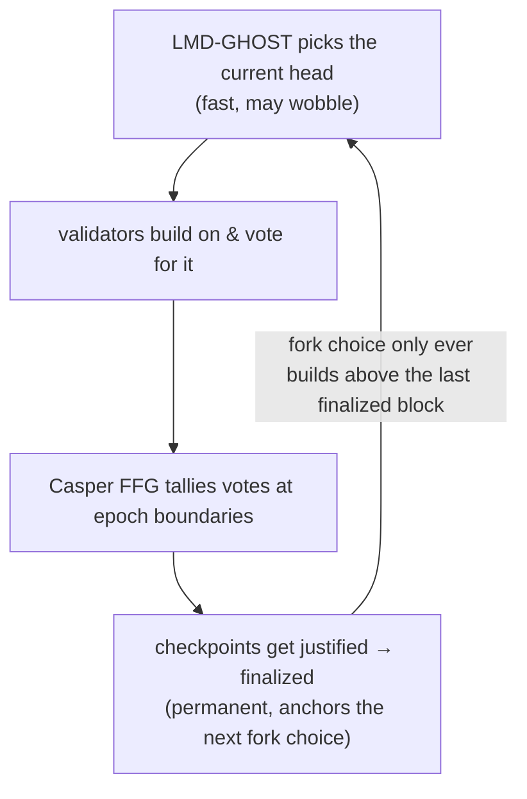

# 02.01 — Proof of Stake and Gasper (How Ethereum Agrees)

> **What you'll learn here:** why Ethereum switched to proof of stake, and the two-part
> consensus engine ("Gasper") that decides which chain is real and when a block becomes
> permanent — intuition first, names second.
>
> **What you should already know:** that [validators](../glossary.md#validator) stake ETH, and
> the [EL/CL split](../00-overview.md).
>
> **Fork note:** Gasper has been Ethereum's consensus since The Merge (2022) and is current.

Part of the **[Consensus Layer](../00-overview.md)**. Up next:
**[Beacon Chain, Slots & Epochs »](02-beacon-chain-slots-epochs.md)**

---

## The problem: agreeing without a boss

Thousands of computers, scattered worldwide, none trusting the others, with messages arriving
late and out of order — and they all have to agree on *one* shared history. There's no
referee. So how do you stop someone from rewriting the past or proposing two conflicting
versions of "now"?

The answer in any blockchain is the same shape: **make honesty cheap and dishonesty
expensive.** The two main ways to do that are proof of work and proof of stake.

### From proof of work to proof of stake

- **Proof of work (the old way, pre-2022):** you prove honesty by *burning electricity*.
  Miners race to solve a useless puzzle; the winner proposes the block. Attacking the chain
  means out-spending everyone on hardware and power. Secure, but enormously energy-hungry.
- **Proof of stake (today):** you prove honesty by *putting money at risk*. Validators lock up
  ETH ("stake"). They're chosen to propose and vote in proportion to their stake. Misbehave,
  and the protocol **destroys** part of your stake ([slashing](../glossary.md#slashing)).

> **Why the switch?** ~99.9% less energy, the ability to *financially punish* attackers
> (you can't "slash" a miner's electricity after the fact), and economic finality — a
> well-defined point where reversing the chain would cost an attacker billions in burned
> stake. The trade-off: PoS is more complex. That complexity is most of this section.

---

## Two jobs, two sub-protocols

Here's the key realization: "agreeing on the chain" is really **two** questions, and Ethereum
uses a *different mechanism for each*. Together they're nicknamed **[Gasper](../glossary.md#gasper)**.

### Job 1 — "Which chain right now?" → LMD-GHOST (fork choice)

At any moment there might be more than one candidate for the latest block (two proposers,
network lag, etc.). Nodes need a rule to pick one *immediately* so they can keep building.

**[LMD-GHOST](../glossary.md#lmd-ghost)** is that rule. Strip away the acronym and it says:

> **Follow the branch that the most staked validators are currently voting for.**

Each validator's most recent vote ([attestation](../glossary.md#attestation)) counts as weight,
sized by their stake. Starting from the last finalized block, you repeatedly walk toward
whichever child branch has accumulated the most vote-weight. The "heaviest" branch wins.

> **Analogy:** imagine a river delta. At each fork, the water (validators' votes) mostly flows
> down one channel. You follow the channel carrying the most water. That's the head of the
> chain.

This is *fast and provisional* — it gives every node a head to build on within the current
[slot](../glossary.md#slot), but it can still change in the next few slots (a small
[reorg](../glossary.md#reorg)).

### Job 2 — "Which blocks are permanent?" → Casper FFG (finality)

Fork choice alone never says "done." For irreversibility you need
**[Casper FFG](../glossary.md#casper-ffg)** ("Friendly Finality Gadget"). It works on
**[checkpoints](../glossary.md#checkpoint)** (epoch-boundary blocks) using a two-step vote:

1. When **⅔ of all staked ETH** votes for a checkpoint, it becomes **[justified](../glossary.md#justification)**
   — "very likely permanent."
2. When a justified checkpoint then helps justify the *next* one, the earlier checkpoint becomes
   **[finalized](../glossary.md#finality)** — permanent. Reverting it would require an attacker
   to get their own stake slashed to the tune of (at least) ⅓ of all staked ETH — billions of
   dollars, burned.

The full mechanics — justification, the two-link rule, what an "inactivity leak" is — get their
own doc: **[Finality & Fork Choice](06-finality-and-fork-choice.md)**.

---

## Putting it together

- **LMD-GHOST** answers *"where do I build right now?"* every slot — quick but tentative.
- **Casper FFG** answers *"what's locked in forever?"* every epoch or two — slower but absolute.
- They reinforce each other: fork choice never reconsiders anything below the last finalized
  block, and finality is computed from the votes fork choice collects.

That's the whole engine. The next docs zoom into the pieces: the
[timetable of slots and epochs](02-beacon-chain-slots-epochs.md), the
[validators](03-validator-lifecycle.md) doing the voting, the
[duties](04-duties.md) they perform, and the [finality math](06-finality-and-fork-choice.md).

---

## In a nutshell

- **Proof of stake** secures Ethereum by putting **ETH at risk** instead of burning
  electricity — cheaper, greener, and able to *punish* attackers by destroying stake.
- Consensus = **[Gasper](../glossary.md#gasper)**, which is two protocols working together.
- **[LMD-GHOST](../glossary.md#lmd-ghost)** (fork choice) picks the current head by following
  the branch with the most vote-weight — fast but provisional.
- **[Casper FFG](../glossary.md#casper-ffg)** (finality) turns ⅔-majority votes on checkpoints
  into **justification** and then permanent **finalization**.
- Finality is *economic*: reverting a finalized block would cost an attacker at least ⅓ of all
  staked ETH, burned.

## Sources

- [ethereum.org — Proof of stake](https://ethereum.org/en/developers/docs/consensus-mechanisms/pos/)
- [ethereum.org — Gasper](https://ethereum.org/en/developers/docs/consensus-mechanisms/pos/gasper/)
- [Combining GHOST and Casper (the Gasper paper)](https://arxiv.org/abs/2003.03052)
- [consensus-specs (github.com/ethereum/consensus-specs)](https://github.com/ethereum/consensus-specs)
