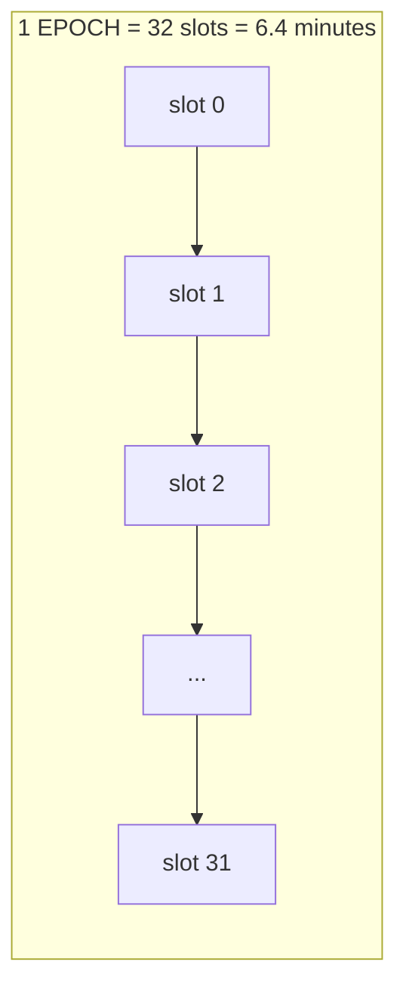
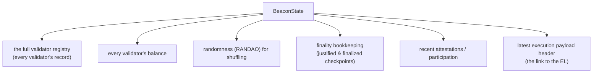
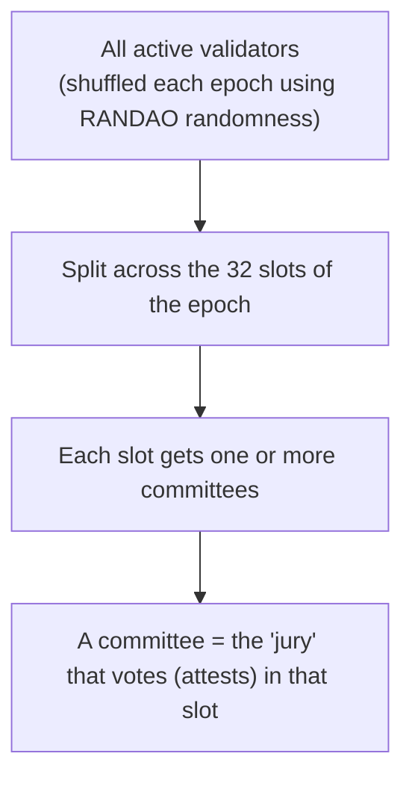

# 02.02 — The Beacon Chain: Slots, Epochs, and Committees

> **What you'll learn here:** the timetable the consensus layer runs on (slots and epochs),
> what the "beacon state" keeps track of, and how validators get sorted into committees.
>
> **What you should already know:** the [Gasper](01-pos-and-gasper.md) basics — fork choice and
> finality.
>
> **Fork note:** the 12-second slot / 32-slot epoch timetable has held since 2020. The
> constants below are current mainnet values.

Part of the **[Consensus Layer](01-pos-and-gasper.md)**. Up next:
**[Validator Lifecycle »](03-validator-lifecycle.md)**

---

## The Beacon Chain runs on a clock

The single most useful thing to internalize about the consensus layer is that it's driven by a
**fixed timetable**, not by "whenever a block is found." Time is sliced into **slots** and
**epochs**:

- **[Slot](../glossary.md#slot) = 12 seconds.** Each slot has exactly one validator assigned to
  *propose* a block. (A slot can be empty if that proposer is offline — then the slot just
  passes.)
- **[Epoch](../glossary.md#epoch) = 32 slots = 6.4 minutes.** Epochs are the accounting period:
  committees are reshuffled, rewards are tallied, and finality is evaluated at epoch
  boundaries.

> **Analogy:** think of a train timetable. Every 12 seconds a train is *scheduled* to depart
> (a slot). One specific driver (the proposer) is rostered for each departure. Every 32
> departures (an epoch) the schedule office does its bookkeeping and re-rosters everyone.

> **Why a fixed clock?** It lets every node know *exactly* whose turn it is and when votes are
> due, with no global "race." It also makes finality measurable in wall-clock time: ~2 epochs
> ≈ 13 minutes.

---

## What is "the beacon state"?

The consensus layer maintains its own big data structure called the **beacon state** — the CL's
equivalent of the EL's [world state](../glossary.md#world-state). It's the source of truth for
*everything about consensus*. At a high level it holds:

Most of these docs are really about reading slices of this state. When you later call
`GET /eth/v1/beacon/states/head/validators` in
**[Fetching Validator Info](../04-lighthouse/04-fetching-validator-info.md)**, you're reading
the *validator registry* portion of the beacon state at the latest slot.

> 🔍 **Going deeper (optional):** the beacon state is encoded with
> [SSZ](../glossary.md#ssz) and Merkleized into a single **state root**, just like the EL state.
> Post-[Pectra](../05-network-upgrades.md) it also carries queues for pending deposits, partial
> withdrawals, and validator consolidations (`pending_deposits`, `pending_partial_withdrawals`,
> `pending_consolidations`) — the plumbing behind the [validator lifecycle](03-validator-lifecycle.md).
> You rarely touch these directly.

---

## Committees: drawing a jury for each slot

There can be **a lot** of validators (over a million on mainnet). You can't have every
validator vote individually on every block — that'd be millions of messages per slot. So for
each epoch, validators are **randomly shuffled and split into committees**, and each committee
is assigned to vote in exactly one slot of that epoch.

- **[Committee](../glossary.md#committee) = a randomly chosen subset of validators** assigned to
  attest in one specific slot.
- The randomness comes from **RANDAO**, a value every proposer mixes into, so nobody can
  predict or rig who lands in which committee far ahead.
- Every active validator attests **once per epoch** — so over 32 slots, the whole active set
  gets to vote exactly once.

> **Analogy:** a court summons jurors at random and assigns each to a specific case on a
> specific day. You serve once per cycle, on a panel you couldn't have predicted, which makes
> it very hard to pack a jury.

> 🔍 **Going deeper (optional):** within a slot, attesters' votes are *aggregated* — combined
> into compact BLS signatures — so the network carries a few aggregate votes instead of
> thousands of individual ones. The [aggregation mechanics](04-duties.md) live in the Duties
> doc. Mainnet targets 64 committees per slot, each capped in size, so committees stay small
> enough to aggregate efficiently no matter how many validators exist.

---

## How to refer to a point in time (you'll need this for the API)

When you query a beacon node, you pick *which* version of the state you mean with a
**`state_id`**:

| `state_id` | Means |
|---|---|
| `head` | the latest slot this node thinks is the chain head (may still reorg) |
| `finalized` | the most recent **permanent** state — safest for "is this settled?" |
| `justified` | the most recent justified checkpoint |
| `genesis` | the very beginning |
| a slot number, e.g. `7100000` | the state at that specific slot |
| a state root, e.g. `0xabc...` | the state with that exact root |

This little vocabulary shows up constantly in the [Beacon API](../04-lighthouse/04-fetching-validator-info.md).
Picking `head` vs `finalized` is the consensus-layer version of the EL's `latest` vs
`finalized` [block tags](../01-execution-layer/05-json-rpc-api.md).

---

## In a nutshell

- The Beacon Chain runs on a **fixed clock**: a **slot** every 12 s, an **epoch** every 32
  slots (6.4 min).
- One validator **proposes** per slot; epochs are when **bookkeeping and finality** happen.
- The **beacon state** is the CL's source of truth — validator registry, balances, randomness,
  finality info, and the link to the latest execution payload.
- Validators are randomly shuffled into **committees** (juries) each epoch, voting once per
  epoch in an unpredictable slot.
- You address a moment in time with a **`state_id`** (`head`, `finalized`, a slot, …) — core
  vocabulary for the Beacon API.

## Sources

- [ethereum.org — Beacon Chain](https://ethereum.org/en/roadmap/beacon-chain/)
- [ethereum.org — Proof-of-stake rewards and penalties](https://ethereum.org/en/developers/docs/consensus-mechanisms/pos/rewards-and-penalties/)
- [consensus-specs — Beacon Chain (phase 0 + later forks)](https://github.com/ethereum/consensus-specs/blob/dev/specs/phase0/beacon-chain.md)
- [Beacon API spec](https://ethereum.github.io/beacon-APIs/)
