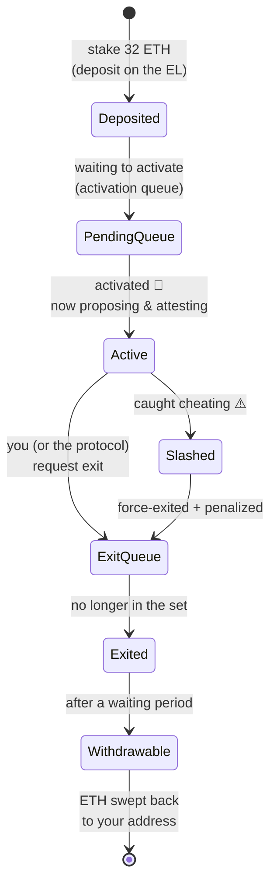

# 02.03 — The Validator Lifecycle: Deposit → Active → Exit → Withdraw

> **What you'll learn here:** the full journey of a validator, from staking 32 ETH to getting
> your money back — the queues, the states it passes through, and the record the protocol keeps
> for it.
>
> **What you should already know:** [slots & epochs](02-beacon-chain-slots-epochs.md) and what a
> [validator](../glossary.md#validator) is.
>
> **Fork note:** this reflects the **Pectra** (2025) world: max effective balance up to 2048
> ETH for "compounding" validators, and faster exits/withdrawals triggerable from the execution
> layer. Pre-Pectra rules differed; see [Network Upgrades](../05-network-upgrades.md).

Part of the **[Consensus Layer](01-pos-and-gasper.md)**. Up next:
**[Duties »](04-duties.md)**

---

## The big picture: a validator's life as a state machine

A validator isn't "on" the instant you deposit, and you can't grab your ETH the instant you
quit. There are deliberate **queues** at both ends to keep the validator set changing slowly
(rapid churn would weaken security). Here's the whole journey:

Let's walk each stage.

---

## 1. Deposit — putting up the stake

You become a validator by sending **at least 32 ETH** to the staking deposit contract on the
[execution layer](../00-overview.md), along with:

- your validator's **BLS public key** (its consensus-layer identity), and
- your **[withdrawal credentials](../glossary.md#withdrawal-credentials)** — *where the ETH
  goes later*.

> 🔍 **Going deeper (optional):** Since [Pectra](../05-network-upgrades.md), deposits are picked
> up by the consensus layer directly from the execution block (EIP-6110), removing the old
> ~12-hour "follow distance / ETH1 vote" delay. Your deposit is recognized within an epoch or
> so rather than hours.

### Withdrawal credentials decide your "type"

| Prefix | Nickname | Max effective balance | Behavior |
|---|---|---|---|
| `0x01` | regular | **32 ETH** | rewards above 32 ETH auto-swept to your address as income |
| `0x02` | **compounding** (Pectra) | **2048 ETH** | rewards stay staked and compound; consolidate many validators into one |
| `0x00` | legacy BLS | — | must be upgraded to `0x01`/`0x02` before any withdrawal |

This single choice (`0x01` vs `0x02`) is the most consequential setup decision — it sets your
cap and whether rewards compound. See [effective balance](../glossary.md#effective-balance).

---

## 2. The activation queue — waiting to start

You can't flood the validator set. New validators wait in an **activation queue**, which drains
at a controlled rate. When the network is calm the wait is short; after a surge of new stakers
it can be days.

> 🔍 **Going deeper (optional):** Pectra changed the throttle from "a fixed *number* of
> validators per epoch" to a "*total ETH* per epoch" (a churn limit measured in ETH, with a
> floor). This is why a single 2048-ETH compounding validator and 64 separate 32-ETH validators
> now enter at comparable *capital* speed.

Once activated, you're **active** — eligible (and obligated) to perform
[duties](04-duties.md): attesting every epoch, and occasionally proposing.

---

## 3. Active — doing the job

This is the productive phase. Your validator:

- **attests** once per epoch (votes on the head and on finality),
- **proposes** a block when it's randomly your turn (rare — roughly proportional to your share
  of stake),
- occasionally serves on a **[sync committee](../glossary.md#sync-committee)**.

All of these earn rewards; missing them costs small penalties. The full accounting is in
**[Rewards, Penalties & Slashing](05-rewards-penalties-slashing.md)**.

---

## 4. Exit — leaving the set

You leave in one of two ways:

- **Voluntary exit:** you sign a message saying "I'm done." Common when migrating or
  consolidating.
- **Forced exit:** the protocol ejects you — either because you were
  [slashed](../glossary.md#slashing) (cheating) or your balance dropped too low.

Either way you join an **exit queue** (again rate-limited, for the same churn-control reason),
then become **exited** — no longer attesting or earning.

> 🔍 **Going deeper (optional):** Pectra (EIP-7002) added **execution-layer triggerable exits
> and partial withdrawals**: the holder of the withdrawal address can trigger an exit or pull
> out part of the stake *from the EL side*, without needing the validator's signing keys online.
> Big quality-of-life and security win for staking operators.

---

## 5. Withdrawal — getting your ETH back

After exiting, there's one more wait (the **withdrawable** delay) before funds can move. Then
withdrawals happen **automatically**: the protocol periodically "sweeps" eligible validators and
sends their balance to the withdrawal address — no transaction or gas needed from you.

Two flavors of withdrawal:
- **Partial:** for an *active* validator whose balance exceeds its cap, the excess is swept out
  as income (above 32 ETH for `0x01`, above 2048 ETH for `0x02`).
- **Full:** for an *exited* validator, the entire remaining balance is swept out.

---

## The record itself: the `Validator` container

Everything above is bookkeeping over one small struct the beacon state stores **per validator**.
You'll see these exact fields when you query the
[Beacon API](../04-lighthouse/04-fetching-validator-info.md), so it's worth meeting them once:

| Field | Type (SSZ) | Plain meaning |
|---|---|---|
| `pubkey` | `Bytes48` | the validator's BLS public key (its identity) |
| `withdrawal_credentials` | `Bytes32` | where ETH goes + the `0x01`/`0x02` type prefix |
| `effective_balance` | `uint64` (gwei) | the rounded, capped balance used for consensus math |
| `slashed` | `boolean` | has it been slashed? |
| `activation_eligibility_epoch` | `uint64` | when it became eligible to join the queue |
| `activation_epoch` | `uint64` | when it became active |
| `exit_epoch` | `uint64` | when it exits (`far future` = not exiting) |
| `withdrawable_epoch` | `uint64` | when its funds can be withdrawn |

> **Reading tip:** an epoch field set to a huge number (`18446744073709551615`, i.e. 2⁶⁴−1,
> "far future") means *"not scheduled."* So `exit_epoch = far future` simply means "still
> active, no exit planned." This is the most common confusion when first reading validator JSON.

The Beacon API turns this raw record into a friendly **status string** (`active_ongoing`,
`exited_slashed`, …) so you usually don't compute it yourself — covered in
**[Fetching Validator Info](../04-lighthouse/04-fetching-validator-info.md)**.

---

## In a nutshell

- A validator moves through **deposit → activation queue → active → exit queue → exited →
  withdrawable**, with deliberate **queues** at both ends to keep the set changing slowly.
- You stake **≥32 ETH** and choose **withdrawal credentials**: `0x01` (cap 32 ETH, rewards paid
  out) or `0x02` (compounding, cap **2048 ETH**, post-Pectra).
- While **active** it attests, proposes, and may serve on sync committees — earning rewards.
- **Withdrawals are automatic sweeps**, not transactions: partial (excess over the cap) while
  active, full once exited.
- The per-validator **`Validator`** record (pubkey, effective balance, the epoch fields) is what
  the [Beacon API](../04-lighthouse/04-fetching-validator-info.md) exposes; "far future" epochs
  mean "not scheduled."

## Sources

- [ethereum.org — Staking & validator lifecycle](https://ethereum.org/en/staking/)
- [consensus-specs — `Validator` container & process](https://github.com/ethereum/consensus-specs/blob/dev/specs/phase0/beacon-chain.md#validator)
- [EIP-7251 — Increase MAX_EFFECTIVE_BALANCE](https://eips.ethereum.org/EIPS/eip-7251)
- [EIP-7002 — Execution-layer triggerable withdrawals](https://eips.ethereum.org/EIPS/eip-7002)
- [EIP-6110 — Supply validator deposits on chain](https://eips.ethereum.org/EIPS/eip-6110)
