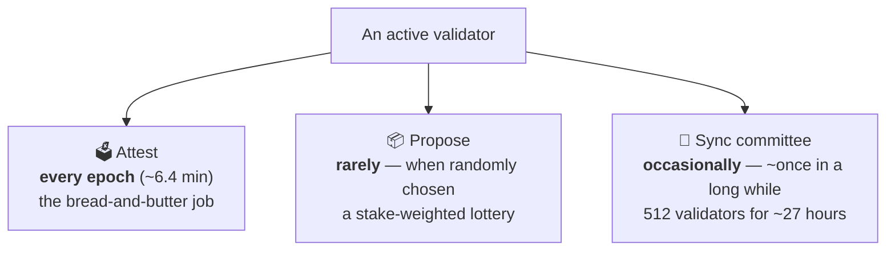
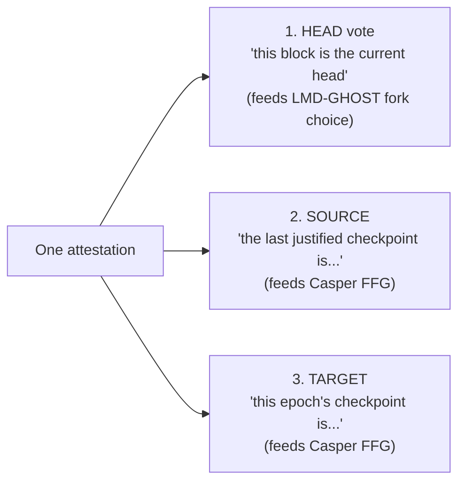
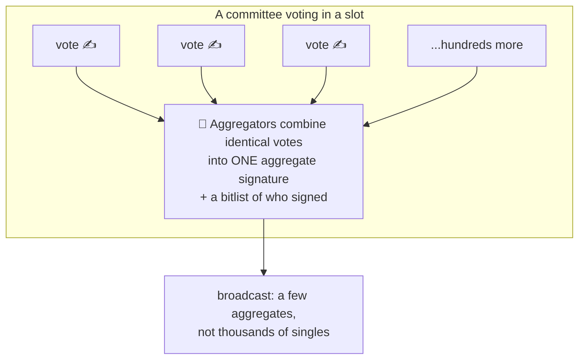
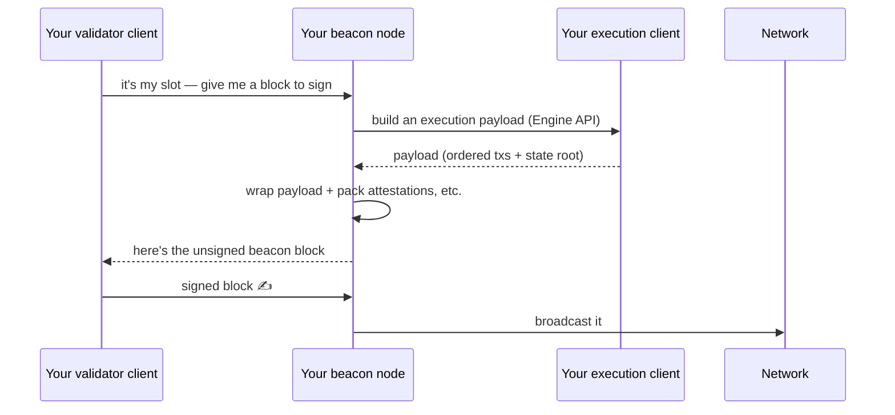
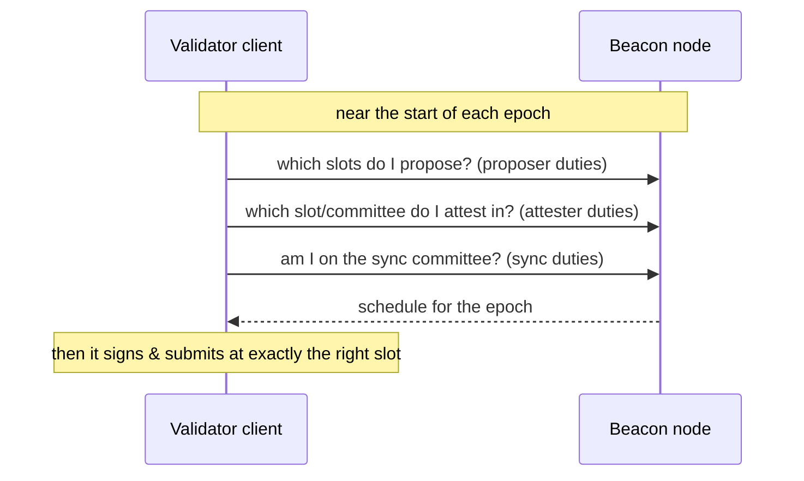

# 02.04 — What Validators Actually Do: Attesting, Proposing, Syncing

> **What you'll learn here:** the day-to-day work of a validator — the one job it does almost
> every epoch (attesting), the rare lottery job (proposing), and the occasional job (sync
> committee) — plus how votes get bundled so the network doesn't drown in messages.
>
> **What you should already know:** [slots, epochs, committees](02-beacon-chain-slots-epochs.md).
>
> **Fork note:** current mechanics. Pectra (2025) tweaked how attestations are packaged
> (EIP-7549) and Fusaka (2025) made proposer scheduling more predictable (EIP-7917) — both noted
> in *Going deeper* boxes; neither changes the day-to-day picture.

Part of the **[Consensus Layer](01-pos-and-gasper.md)**. Up next:
**[Rewards, Penalties & Slashing »](05-rewards-penalties-slashing.md)**

---

## Three jobs, three frequencies

Most of a validator's life is **attesting**. Proposing is a jackpot you hit roughly in
proportion to your stake. Sync-committee service comes around infrequently.

---

## Job 1: Attesting (the vote you cast every epoch)

Once per [epoch](../glossary.md#epoch), every active validator casts one
**[attestation](../glossary.md#attestation)** — a vote. An attestation actually answers three
questions at once:

- The **head** vote drives [fork choice](06-finality-and-fork-choice.md) — which chain is the
  head right now.
- The **source** and **target** votes drive [finality](06-finality-and-fork-choice.md) — they're
  the "⅔ majority" tallied to justify and finalize checkpoints.

So a single vote does double duty: it both points at the current head *and* contributes to
making old blocks permanent. Cast it on time and accurately → rewards. Miss it or vote for a
losing branch → small penalties (see [next doc](05-rewards-penalties-slashing.md)).

> 🔍 **Going deeper (optional):** before voting, the validator client must have its
> [EL verify the block's execution payload](../03-el-cl-interface/02-engine-api.md) — a vote
> implicitly asserts the *execution* is valid too, not just the consensus wrapper.

---

## Aggregation: why a million votes don't melt the network

If every validator broadcast its own vote individually, a slot would carry an unmanageable
flood of messages. The fix is **aggregation**, using a property of BLS signatures: *many
signatures over the same message can be mathematically merged into one*.

A few validators per committee are designated **aggregators**: they collect identical votes and
publish a single aggregate (one combined signature plus a bitfield marking who participated).
The proposer then packs these aggregates into the block. Net result: the chain records who voted
using a tiny fraction of the bandwidth.

---

## Job 2: Proposing (the rare, valuable turn)

For each [slot](../glossary.md#slot), exactly one validator is chosen as
**[proposer](../glossary.md#proposer)**. Being picked is a stake-weighted lottery — more stake,
more turns, but any single turn is rare. When it's your slot, your validator client:

The proposer is the one validator that gets to *add* to the chain that slot, so it also collects
the transaction tips (and any [MEV](../glossary.md#mev), often via
[MEV-Boost](../01-execution-layer/03-mempool-and-block-building.md)). That's why proposals,
though infrequent, are the most valuable single duty.

> 🔍 **Going deeper (optional):** Fusaka's EIP-7917 made the proposer schedule **deterministic
> and known a full epoch ahead** ("proposer lookahead"). Practically: a beacon node can tell you
> exactly who proposes each upcoming slot for the current and next epoch, which simplifies
> tooling and MEV workflows.

---

## Job 3: Sync committees (helping light clients)

A **[sync committee](../glossary.md#sync-committee)** is a group of **512** validators, rotated
about every **27 hours** (256 epochs), whose extra job is to continuously sign the chain head.
Why? So that **ultra-light clients** (think a phone or an embedded device) can follow Ethereum's
head by checking just 512 signatures, instead of tracking the entire validator set. It's a
service duty with its own small rewards.

---

## How a validator client *finds out* its duties

Validators don't guess — they **ask their beacon node** what they're scheduled to do, then act
at the right time. This is exactly what the duty endpoints in the
[Beacon API](../04-lighthouse/04-fetching-validator-info.md) are for:

The concrete endpoints — `GET /eth/v1/validator/duties/proposer/{epoch}`,
`POST /eth/v1/validator/duties/attester/{epoch}`, and the sync-committee one — are demonstrated
in **[Fetching Validator Info](../04-lighthouse/04-fetching-validator-info.md)**.

---

## In a nutshell

- A validator's core job is **attesting once per epoch** — a single vote covering **head**
  (fork choice) plus **source/target** (finality).
- **Aggregation** merges thousands of identical BLS votes into compact aggregates, so the
  network isn't flooded.
- **Proposing** is a rare, stake-weighted turn to build the slot's block — the most valuable
  duty because it captures tips and [MEV](../glossary.md#mev).
- **Sync committees** (512 validators, ~27 h) sign the head so light clients can follow cheaply.
- Validator clients **ask the beacon node** for their duties each epoch via the duty endpoints,
  then sign at the scheduled slot.

## Sources

- [ethereum.org — Attestations](https://ethereum.org/en/developers/docs/consensus-mechanisms/pos/attestations/)
- [ethereum.org — Block proposal & rewards](https://ethereum.org/en/developers/docs/consensus-mechanisms/pos/rewards-and-penalties/)
- [consensus-specs — Honest validator guide](https://github.com/ethereum/consensus-specs/blob/dev/specs/phase0/validator.md)
- [EIP-7549 — Move committee index outside Attestation](https://eips.ethereum.org/EIPS/eip-7549) · [EIP-7917 — Deterministic proposer lookahead](https://eips.ethereum.org/EIPS/eip-7917)
