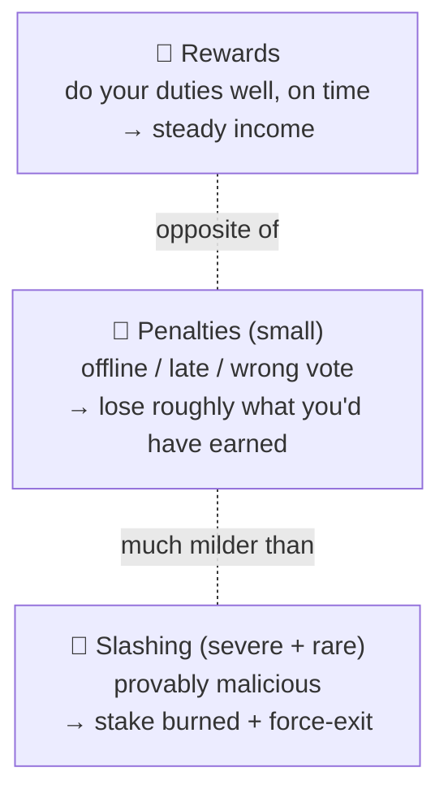
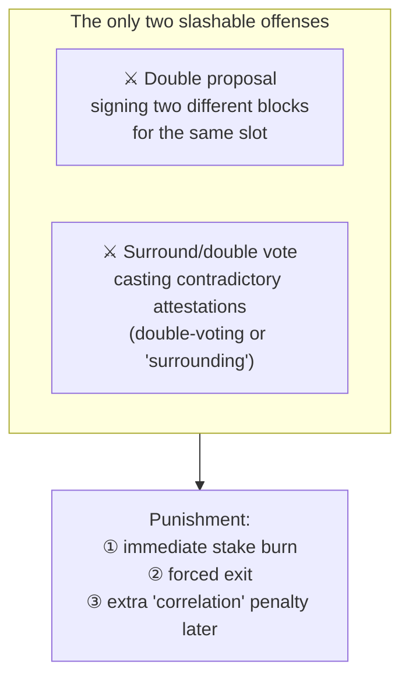
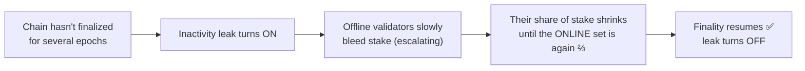

# 02.05 — Rewards, Penalties, and Slashing

> **What you'll learn here:** how a validator earns, the difference between a small "you were
> offline" penalty and the severe "you cheated" punishment (slashing), and what the dreaded
> "inactivity leak" is.
>
> **What you should already know:** the [duties](04-duties.md) (attest, propose, sync) and
> [finality](01-pos-and-gasper.md).
>
> **Fork note:** mechanics are current. Pectra (2025) adjusted slashing penalties for large
> compounding validators — noted below.

Part of the **[Consensus Layer](01-pos-and-gasper.md)**. Up next:
**[Finality & Fork Choice »](06-finality-and-fork-choice.md)**

---

## The core idea: small carrots, small sticks, one big hammer

Validator economics has exactly three intensities, and keeping them straight prevents a lot of
fear and confusion:

The crucial takeaway for anyone nervous about staking: **being offline is mild and symmetric**
(you miss out, roughly losing what you'd have earned), while **slashing is severe but only
triggers on cryptographic proof of double-signing** — something honest software simply never
does. They are completely different categories.

---

## Rewards: what you get paid for

A validator's income comes from doing its [duties](04-duties.md) correctly and promptly. The
rewards split into:

| Source | When earned | Rough share of income |
|---|---|---|
| **Attestation rewards** | every epoch, for correct & timely head/source/target votes | the majority |
| **Proposal rewards** | the rare slot you propose (includes tips + [MEV](../glossary.md#mev)) | spiky but big when it lands |
| **Sync-committee rewards** | while serving on a [sync committee](../glossary.md#sync-committee) | small, occasional |

Two things scale the reward:
- **Timeliness & correctness** — a late or wrong vote earns less (or nothing) for that
  component.
- **How much total ETH is staked network-wide** — the issuance curve pays a *lower* percentage
  yield as more ETH is staked (more validators sharing the pie).

> 🔍 **Going deeper (optional):** attestation rewards are split into weighted components — a
> source-vote reward, a target-vote reward, and a head-vote reward — each only paid if that
> specific vote was correct *and* included on time. The protocol also reserves a slice for
> proposers who include your attestation, aligning everyone's incentives toward fast inclusion.

---

## Penalties: the everyday small stuff

If your validator is **offline or votes late/incorrectly**, you receive a **penalty** roughly
equal to the reward you would have earned. So an hour offline costs you about an hour of income
— annoying, not catastrophic. Crucially, **penalties are symmetric with rewards**: the protocol
isn't trying to bankrupt an honest-but-flaky validator, just to stop paying it while it's not
contributing.

> **Reassurance:** there is **no slashing for simply being offline.** A validator that's down
> for a day loses about a day of rewards. Your stake is essentially safe from downtime alone —
> the only exception is the "inactivity leak" below, which only bites during a network-wide
> finality failure.

---

## Slashing: the big hammer (rare, severe, deserved)

**[Slashing](../glossary.md#slashing)** is reserved for **provably malicious** actions —
behaviors that could only come from trying to attack consensus or from a dangerously
misconfigured setup (e.g. running the *same keys on two machines at once*). There are exactly
two slashable offenses:

What happens when you're slashed:
1. **An immediate penalty** is burned from your stake.
2. You're **force-exited** from the validator set (over the exit queue).
3. A **correlation penalty** is applied around the midpoint of your exit period, sized by *how
   many other validators were slashed around the same time*. If you alone slip up, it's modest.
   If thousands are slashed together (a sign of a real coordinated attack), it can approach your
   entire stake. This cleverly makes *lone mistakes survivable* but *coordinated attacks
   ruinous*.

> 🔍 **Going deeper (optional):** Pectra (EIP-7251) softened the *initial* slashing penalty for
> the new large compounding (`0x02`) validators — scaling it down so that consolidating 64
> validators into one doesn't multiply your single-mistake risk 64×. The anti-correlation
> economics still punish genuine coordinated attacks hard.

> **Practical defense:** slashing comes almost entirely from **running duplicate signers**.
> Never run the same validator keys on two machines "for redundancy." Use your client's
> built-in **slashing protection database** and, if migrating, follow the
> [import/export procedure](../04-lighthouse/05-validator-client-and-cli.md) carefully.

---

## The inactivity leak: the emergency mechanism

Normally, downtime just costs you rewards. But what if the chain **can't finalize at all** —
say a third of validators go offline in a catastrophe? Finality stalls, and the chain would be
stuck forever. The **inactivity leak** is the escape hatch:

While the leak is active, *offline* validators lose stake at an accelerating rate, while online
ones roughly hold steady. This shrinks the offline cohort's weight until the remaining online
validators once again make up the ⅔ supermajority needed to
[finalize](06-finality-and-fork-choice.md) — at which point the leak switches off. It's a
self-healing mechanism that guarantees the chain *eventually* recovers finality even after a
massive outage. It only ever activates during a real finality emergency — it's not part of
normal operation.

---

## In a nutshell

- Three intensities: **rewards** (do your job), **small penalties** (offline/late — roughly
  symmetric with rewards), and **slashing** (severe, rare, for provable cheating).
- Most income is **attestation rewards** every epoch; **proposals** are spiky and lucrative;
  **sync committee** pays a little.
- **There is no slashing for downtime** — being offline just forfeits rewards.
- **Slashing** punishes only **double-proposing** or **contradictory voting**, with a
  **correlation penalty** that makes lone mistakes survivable but coordinated attacks ruinous.
  Its #1 real-world cause is **running duplicate signers** — don't.
- The **inactivity leak** is an emergency mechanism that drains *offline* validators during a
  finality stall so the chain can heal and finalize again.

## Sources

- [ethereum.org — Rewards and penalties](https://ethereum.org/en/developers/docs/consensus-mechanisms/pos/rewards-and-penalties/)
- [ethereum.org — Attack and defense (inactivity leak, slashing)](https://ethereum.org/en/developers/docs/consensus-mechanisms/pos/attack-and-defense/)
- [consensus-specs — Slashings & rewards processing](https://github.com/ethereum/consensus-specs/blob/dev/specs/phase0/beacon-chain.md)
- [EIP-7251 — MAX_EFFECTIVE_BALANCE / slashing changes](https://eips.ethereum.org/EIPS/eip-7251)
