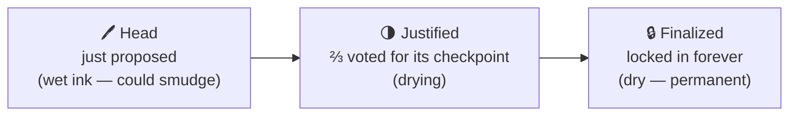
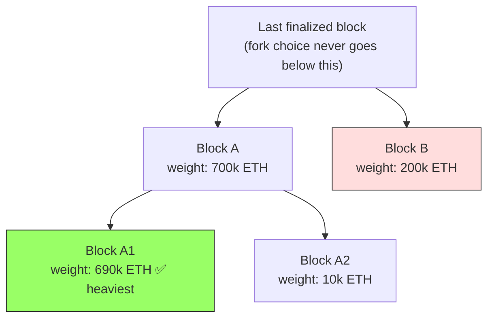
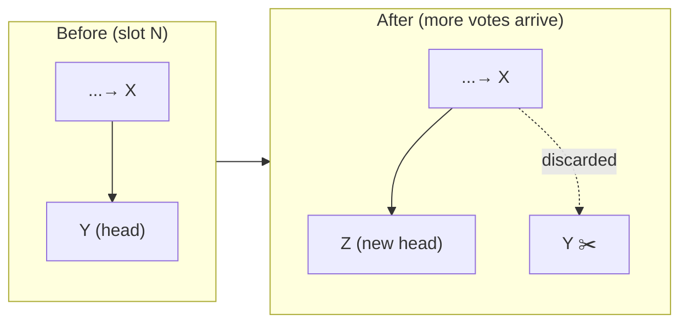
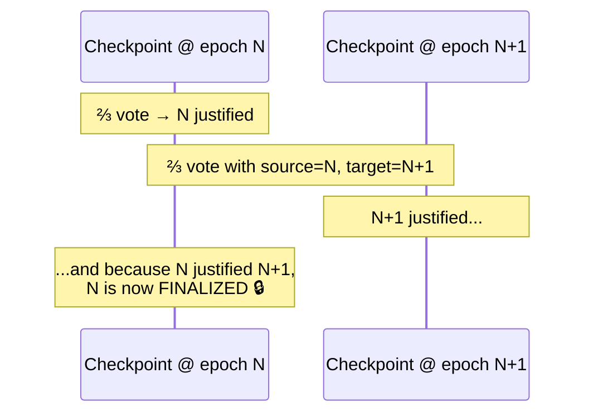

# 02.06 — Finality and Fork Choice (When Is a Block *Really* Final?)

> **What you'll learn here:** the difference between "the head right now" and "permanent," how
> justification and finalization actually work, what a reorg is, and why the magic number is ⅔.
>
> **What you should already know:** [Gasper](01-pos-and-gasper.md) (LMD-GHOST + Casper FFG),
> [checkpoints and epochs](02-beacon-chain-slots-epochs.md), and [attestations](04-duties.md).
>
> **Fork note:** current mechanics, stable since The Merge.

Part of the **[Consensus Layer](01-pos-and-gasper.md)**. Up next:
**[CL Clients »](07-cl-clients.md)**

---

## The big idea: confidence comes in stages

When a new block appears, it isn't instantly permanent. It earns trust in stages, like ink
drying on paper:

- **Head** — the latest block [fork choice](#fork-choice-picking-the-head-right-now) currently
  prefers. Real, usable, but could still be replaced in the next slot or two.
- **Justified** — a [checkpoint](../glossary.md#checkpoint) that ⅔ of staked ETH has voted for.
  Very likely permanent.
- **Finalized** — a justified checkpoint that's been *confirmed by the next* justification.
  Permanent: reverting it would cost an attacker ≥⅓ of all staked ETH, burned.

> **Analogy reminder:** finality is **ink drying**. The head is wet ink — a smudge (reorg) is
> still possible. Once finalized, it's dry; you'd have to tear up the whole notebook (and burn
> billions) to change it.

---

## Fork choice: picking the head *right now*

At any instant, a node might see more than one candidate for the latest block. It must choose
*one* head immediately so it can keep building and voting. That's the job of
**[LMD-GHOST](../glossary.md#lmd-ghost)**.

The rule, in plain words: **start at the last finalized checkpoint, and at every fork, walk
toward the child branch with the most accumulated [attestation](../glossary.md#attestation)
weight (vote-weight ∝ stake). Repeat until you reach a tip — that tip is the head.**

Here the node picks `A` over `B` (more weight), then `A1` over `A2`. `A1` is the head. Because
votes keep arriving, the head is **provisional** for a slot or two — which is exactly what makes
short reorgs possible.

---

## Reorgs: the head can change (briefly)

A **[reorg](../glossary.md#reorg)** is when the chosen head switches to a different recent block,
discarding one or more just-proposed blocks. Small reorgs (1 block) happen occasionally and
harmlessly — usually a block arrived late and the network had already moved on.

**The key safety property:** reorgs can only ever affect blocks **above the last finalized
checkpoint**. Anything finalized is untouchable. This is precisely why, for high-value
decisions, you wait for **finality** rather than trusting the head — the EL's
[`finalized` block tag](../01-execution-layer/05-json-rpc-api.md) and the CL's
[`finalized` state_id](02-beacon-chain-slots-epochs.md) both surface this.

---

## Justification and finalization: the ⅔ machine

Finality runs on [checkpoints](../glossary.md#checkpoint) — the first block of each epoch — using
the **source/target** votes inside every [attestation](04-duties.md). Two ingredients:

1. **A supermajority link.** When attestations worth **⅔ of all staked ETH** vote with source =
   checkpoint *X* and target = checkpoint *Y*, we say "*X* justifies *Y*."
2. **The two-link finalization rule.** A justified checkpoint becomes **finalized** when it
   *justifies the very next checkpoint*. In the common case: epoch *N*'s checkpoint becomes
   justified, then it helps justify epoch *N+1*'s checkpoint → epoch *N*'s checkpoint is now
   **finalized**.

This is why, in normal operation, **a block finalizes about two epochs (~13 minutes) after it's
proposed**: one epoch to get its checkpoint justified, a second to confirm it.

### Why exactly ⅔?

The ⅔ threshold is what lets the protocol tolerate up to ⅓ of stake being faulty or malicious
while still guaranteeing two finalized checkpoints can never conflict. To finalize two
*contradictory* checkpoints, an attacker would need ⅓ of all staked ETH to double-vote — which
is **provably slashable**, so they'd lose that entire ⅓. That burned stake (billions of dollars)
*is* the cost of breaking finality. This is what "economic finality" means.

> 🔍 **Going deeper (optional):** the beacon state tracks
> `previous_justified_checkpoint`, `current_justified_checkpoint`, and `finalized_checkpoint`.
> The Beacon API exposes these directly at
> `/eth/v1/beacon/states/{state_id}/finality_checkpoints` — you'll query it in
> **[Fetching Validator Info](../04-lighthouse/04-fetching-validator-info.md)**. A healthy
> mainnet shows the finalized epoch trailing the current epoch by ~2.

---

## When finality *stalls*

If fewer than ⅔ of stake is online and voting correctly, checkpoints stop finalizing. The chain
keeps producing blocks (fork choice still picks a head), but nothing becomes permanent. If this
persists, the **[inactivity leak](05-rewards-penalties-slashing.md)** kicks in to drain offline
validators until the online set is once again a ⅔ supermajority and finality resumes. So even a
major outage is self-correcting — it just costs the absent validators.

---

## In a nutshell

- Confidence is **staged**: **head** (provisional) → **justified** (⅔ voted) → **finalized**
  (permanent).
- **Fork choice (LMD-GHOST)** picks the head by following the heaviest branch of votes above the
  last finalized block — fast but provisional, which is why short **reorgs** happen.
- **Reorgs can never touch finalized blocks** — so wait for **`finalized`** for anything
  high-value.
- **Casper FFG** finalizes via a **two-link, ⅔-supermajority** rule on checkpoints: a block
  typically finalizes ~2 epochs (~13 min) after proposal.
- The **⅔ threshold** makes finality *economic*: breaking it requires ≥⅓ of stake to
  double-vote and get slashed — billions, burned.

## Sources

- [ethereum.org — Gasper (finality & fork choice)](https://ethereum.org/en/developers/docs/consensus-mechanisms/pos/gasper/)
- [consensus-specs — `process_justification_and_finalization`](https://github.com/ethereum/consensus-specs/blob/dev/specs/phase0/beacon-chain.md)
- [consensus-specs — Fork choice](https://github.com/ethereum/consensus-specs/blob/dev/specs/phase0/fork-choice.md)
- [Beacon API — finality_checkpoints](https://ethereum.github.io/beacon-APIs/)
