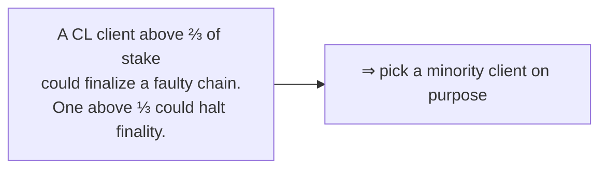

# 02.07 — Consensus-Layer Clients: Lighthouse, Prysm, Teku, Nimbus, Lodestar

> **What you'll learn here:** what a CL client does, why diversity matters here too, and a quick
> sketch of the five mainstream consensus clients — so you can place
> [Lighthouse](../04-lighthouse/01-architecture.md) (the focus of these docs) in context.
>
> **What you should already know:** the [duties](04-duties.md) and [finality](06-finality-and-fork-choice.md).
>
> **Fork note:** the lineup is current as of mid-2026. Market share shifts; check a live source
> like [clientdiversity.org](https://clientdiversity.org/).

Part of the **[Consensus Layer](01-pos-and-gasper.md)**. This wraps the CL section; next is
**[The EL↔CL Interface »](../03-el-cl-interface/01-the-merge.md)**.

---

## What a CL client does

A **[consensus-layer](../glossary.md#consensus-layer-cl) client** runs the
[Beacon Chain](../glossary.md#beacon-chain): it follows the p2p gossip network, runs
[fork choice](06-finality-and-fork-choice.md), tracks [finality](06-finality-and-fork-choice.md),
and — paired with a [validator client](../glossary.md#validator-client) — performs validator
[duties](04-duties.md). It talks to its [EL client](../01-execution-layer/04-el-clients.md) over
the [Engine API](../03-el-cl-interface/02-engine-api.md) and serves the standard
[Beacon API](../04-lighthouse/03-beacon-node-http-api.md) to you.

Just like on the EL side, a CL client is usually split into a **beacon node** (follows the
chain) and a **validator client** (holds keys, signs). [Lighthouse's architecture](../04-lighthouse/01-architecture.md)
walks through that split in detail.

---

## Diversity matters here too — arguably more

The [same diversity logic as the EL](../01-execution-layer/04-el-clients.md#why-client-diversity-is-a-big-deal)
applies, with an extra sharp edge: on the consensus layer, a supermajority client bug doesn't
just risk a bad chain — combined with the slashing rules, a buggy client controlling >⅓ of stake
could **halt finality**, and one controlling >⅔ could **finalize a wrong chain**. Worse, if a
single client is so dominant that *its* bug gets a supermajority to attest to an invalid state,
those validators could even be **slashed en masse**.

The practical guidance is the same and worth repeating: **don't run a client that's over ~33%
of the network.** Running a healthy minority client is one of the most useful things a solo
staker can do for Ethereum.

---

## The five mainstream clients

All five are full, spec-compliant consensus clients; any of them pairs with any
[EL client](../01-execution-layer/04-el-clients.md). They differ mainly in language and design
emphasis.

| Client | Team | Language | Known for |
|---|---|---|---|
| **Lighthouse** ⭐ | Sigma Prime | **Rust** | Speed, safety, and a strong production track record; very popular with solo and institutional stakers. **The focus of these docs.** |
| **Prysm** | Offchain Labs | Go | Long-dominant, very approachable UX and docs; historically the largest, which makes choosing a *different* client the diversity-friendly move. |
| **Teku** | ConsenSys | Java | Enterprise-grade, runs beacon node + validator in one JVM process; popular with staking businesses. |
| **Nimbus** | Status | Nim | Extremely lightweight — designed to run on resource-constrained hardware (even a Raspberry Pi). |
| **Lodestar** | ChainSafe | TypeScript | The JavaScript/TS-ecosystem client; great for web tooling, research, and light-client work. |

> **Why these docs use Lighthouse:** it's written in **Rust** (a natural pairing for the
> Rust-based tooling and example in the [Lighthouse section](../04-lighthouse/04-fetching-validator-info.md)),
> it's widely deployed, and its [Beacon API](../04-lighthouse/03-beacon-node-http-api.md)
> implementation closely tracks the standard spec — so what you learn here transfers to any
> compliant client.

> 🔍 **Going deeper (optional):** because every client implements the **same**
> [Beacon API](https://ethereum.github.io/beacon-APIs/), the queries in
> [Fetching Validator Info](../04-lighthouse/04-fetching-validator-info.md) work against Prysm,
> Teku, Nimbus, or Lodestar too (modulo a few client-specific extension endpoints). Mixing
> layers — e.g. **Lighthouse + Reth** or **Nimbus + Nethermind** — is normal and encouraged for
> diversity.

---

## In a nutshell

- A CL client runs the Beacon Chain (fork choice + finality), performs [duties](04-duties.md)
  with a validator client, talks to the EL over the [Engine API](../03-el-cl-interface/02-engine-api.md),
  and serves the [Beacon API](../04-lighthouse/03-beacon-node-http-api.md).
- **Diversity is even more safety-critical here**: a supermajority client bug could halt or
  corrupt finality — so deliberately run a **minority** client.
- Five mainstream clients: **Lighthouse** (Rust), **Prysm** (Go), **Teku** (Java), **Nimbus**
  (Nim), **Lodestar** (TS).
- These docs use **Lighthouse**, but the standard Beacon API makes the skills portable to any
  client.

## Sources

- [ethereum.org — Consensus clients](https://ethereum.org/en/developers/docs/nodes-and-clients/#consensus-clients)
- [clientdiversity.org](https://clientdiversity.org/)
- [Lighthouse Book](https://lighthouse-book.sigmaprime.io/) · [Prysm docs](https://docs.prylabs.network/) · [Teku docs](https://docs.teku.consensys.io/) · [Nimbus guide](https://nimbus.guide/) · [Lodestar docs](https://chainsafe.github.io/lodestar/)
