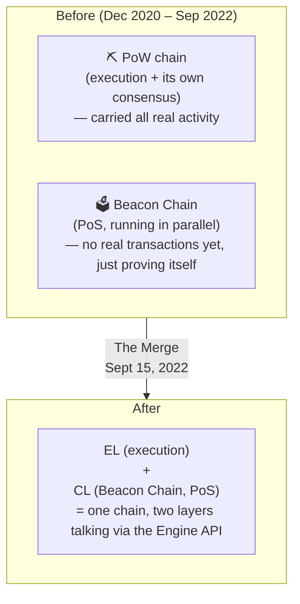
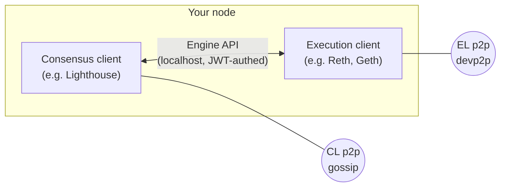

# 03.01 — The Merge: What Actually Changed

> **What you'll learn here:** what The Merge really did (and, just as importantly, what it
> *didn't*), how proof of work was unplugged, and how the two layers paired up afterward.
>
> **What you should already know:** the [EL/CL split](../00-overview.md) and [proof of
> stake](../02-consensus-layer/01-pos-and-gasper.md).
>
> **Fork note:** The Merge happened in September 2022. This doc is historical context plus the
> post-Merge wiring that's still how mainnet works today.

Part of the **[EL↔CL Interface](../00-overview.md)**. Up next:
**[The Engine API »](02-engine-api.md)**

---

## The one-sentence summary

**The Merge swapped out Ethereum's engine of agreement — from
[proof of work](../02-consensus-layer/01-pos-and-gasper.md) to
[proof of stake](../02-consensus-layer/01-pos-and-gasper.md) — without changing the cars,
roads, or your account.** Same accounts, same balances, same smart contracts, same app
experience. Only *how new blocks get agreed on* changed.

---

## What it changed vs. what it didn't

People often expect The Merge to have lowered fees or sped up the chain. It didn't — that wasn't
its job. Here's the honest breakdown:

| ✅ The Merge **did** change | ❌ The Merge did **not** change |
|---|---|
| Consensus: PoW → PoS (miners → validators) | Gas fees (those come from demand + [EIP-1559](../01-execution-layer/02-transactions-and-gas.md)) |
| Energy use: dropped ~99.9% | Transaction throughput / speed |
| Block timing: now a fixed 12s [slot](../glossary.md#slot) | Your accounts, balances, or contracts |
| ETH issuance: dropped sharply (no mining rewards) | The [JSON-RPC API](../01-execution-layer/05-json-rpc-api.md) apps use |

> **The cleanest mental model:** the
> [execution layer](../glossary.md#execution-layer-el) (the EVM + your state) was already
> running. The Merge just **replaced the part underneath it** that decides block order — ripping
> out the proof-of-work miner and plugging in the proof-of-stake
> [Beacon Chain](../glossary.md#beacon-chain) that had been running in parallel since December
> 2020.

---

## How two chains became one

The genius of the rollout was that the new consensus engine was tested *live, in parallel*, for
nearly two years before it took over:

On Merge day, the execution layer simply **stopped listening to proof-of-work** and **started
taking its ordering from the Beacon Chain** instead. From that moment, the Beacon Chain's blocks
began carrying real [execution payloads](../glossary.md#execution-payload), and the old PoW
consensus was gone for good.

> 🔍 **Going deeper (optional):** the switch was triggered by **Terminal Total Difficulty
> (TTD)** — a target for the *cumulative mining difficulty* of the PoW chain. The last PoW block
> was the one that pushed total difficulty past the TTD; the very next block was produced under
> PoS. Using difficulty (not a block number or timestamp) made the exact switch point robust to
> the unpredictable pace of mining.

---

## The post-Merge pairing (how it works now)

After The Merge, *running a node means running two programs that you pair together*:

- You pick one [EL client](../01-execution-layer/04-el-clients.md) and one
  [CL client](../02-consensus-layer/07-cl-clients.md) (any combination — diversity encouraged).
- They run side by side and connect over the **[Engine API](02-engine-api.md)** on localhost,
  authenticated with a shared **[JWT](../glossary.md#jwt-for-the-engine-api)** secret.
- The CL drives; the EL executes. That conversation — which now happens every single slot — is
  the subject of the **[next doc](02-engine-api.md)**.

This pairing is also what unlocked later upgrades: **withdrawals** (Shapella, 2023),
**cheap rollup data via blobs** (Dencun, 2024), and the **staking improvements** of Pectra
(2025) and Fusaka (2025). See the **[Network Upgrades timeline](../05-network-upgrades.md)**.

---

## In a nutshell

- The Merge (Sept 2022) **replaced proof of work with proof of stake** — and *only* that. It
  didn't change fees, speed, your accounts, or the app-facing APIs.
- It cut Ethereum's energy use ~99.9% and sharply reduced ETH issuance.
- The PoS [Beacon Chain](../glossary.md#beacon-chain) had run in parallel since 2020; on Merge
  day the EL stopped using PoW and started taking block ordering from the CL (triggered by
  **Terminal Total Difficulty**).
- Today a node is an **EL client + CL client** paired over the **[Engine API](02-engine-api.md)**
  — the wiring that everything since has built on.

## Sources

- [ethereum.org — The Merge](https://ethereum.org/en/roadmap/merge/)
- [ethereum.org — Merge readiness & TTD](https://ethereum.org/en/developers/docs/consensus-mechanisms/pos/)
- [EIP-3675 — Upgrade consensus to proof of stake](https://eips.ethereum.org/EIPS/eip-3675)
- [Engine API specification (execution-apis)](https://github.com/ethereum/execution-apis/blob/main/src/engine/paris.md)
