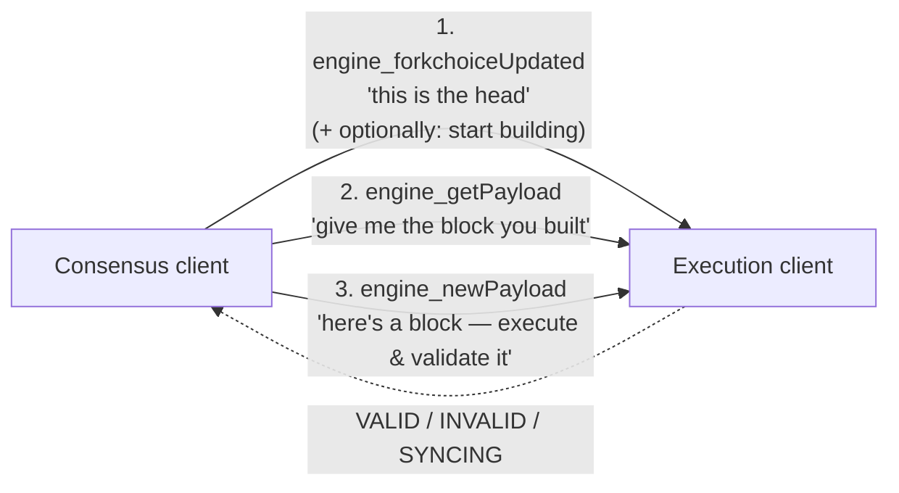
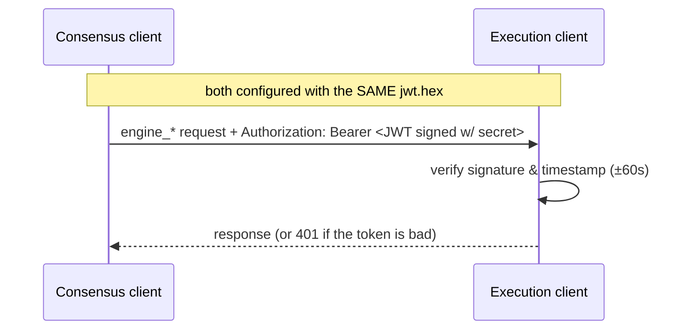
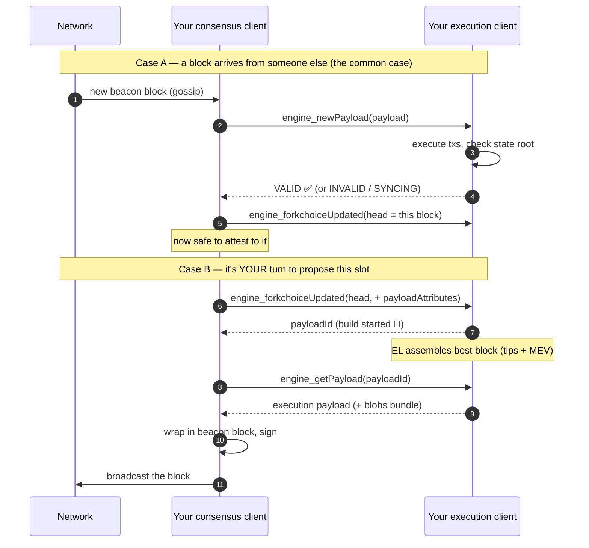

# 03.02 — The Engine API: How the Two Clients Talk

> **What you'll learn here:** the small private channel the consensus and execution clients use
> to cooperate, its three core jobs, how it's secured with a JWT, and a step-by-step walk
> through one slot.
>
> **What you should already know:** the [EL/CL split](../00-overview.md),
> [execution payloads](../glossary.md#execution-payload), and the [slot clock](../02-consensus-layer/02-beacon-chain-slots-epochs.md).
>
> **Fork note:** method *version suffixes* climb with each hard fork. The current mainnet
> versions (Fusaka era, mid-2026) are named below; the **concepts** are stable.

Part of the **[EL↔CL Interface](01-the-merge.md)**. This wraps the interface section; next is
**[Lighthouse »](../04-lighthouse/01-architecture.md)**.

---

## What it is (and what it isn't)

After [The Merge](01-the-merge.md), the consensus client (CL) is the "driver" and the execution
client (EL) is the "engine." The **Engine API** is the wiring between them:

- a **private, local** JSON-RPC channel (default `http://localhost:8551`),
- **authenticated** with a shared **[JWT](../glossary.md#jwt-for-the-engine-api)** secret so
  nothing else on the machine can impersonate either side,
- using the `engine_*` method namespace — **separate** from the public
  [`eth_*` JSON-RPC](../01-execution-layer/05-json-rpc-api.md) that apps use.

> **Don't confuse the three APIs:** the public [JSON-RPC](../01-execution-layer/05-json-rpc-api.md)
> (for apps), the public [Beacon API](../04-lighthouse/03-beacon-node-http-api.md) (for reading
> the CL), and this private **Engine API** (CL↔EL only). The first two are for *you*; the
> Engine API is the clients' internal control link.

---

## The three core jobs

Strip away versions and the Engine API does exactly three things:

| Method (current version) | Plain meaning | When |
|---|---|---|
| `engine_forkchoiceUpdated` (`V3`) | "The head/safe/finalized blocks are now these." Optionally: "and start building a block for the next slot." | every slot, and on every head change |
| `engine_getPayload` (`V5`) | "Hand over the block you've been building." Returns the [execution payload](../glossary.md#execution-payload) (+ a blobs bundle). | when *this* node is the [proposer](../glossary.md#proposer) |
| `engine_newPayload` (`V4`) | "Here's a block from the network — execute it and tell me if it's valid." | whenever a block arrives to be verified |

> 🔍 **Going deeper (optional):** version suffixes track forks: Cancun used `…V3`, Pectra
> bumped `newPayload` to `V4` (it carries execution-layer "requests" like deposits/withdrawals),
> and Fusaka bumped `getPayload` to `V5` and added `engine_getBlobsV2` for the
> [PeerDAS](../05-network-upgrades.md) blob workflow. On connect, the clients call
> `engine_exchangeCapabilities` to agree on which methods each supports — so the exact suffix in
> use is negotiated, not hard-coded.

---

## Security: the JWT secret

Because the Engine API can make the EL build and accept blocks, it must be locked down. Both
clients are pointed at the **same secret file** (often `jwt.hex` — 32 random bytes as hex).
Every Engine API request carries a short-lived JWT signed with that secret:

The token embeds an issued-at timestamp (`iat`) and is only valid for ~60 seconds, so a captured
token can't be replayed later. In practice you generate the secret once and pass its path to
*both* clients — see
**[Lighthouse Installation & Setup](../04-lighthouse/02-installation-and-setup.md)**.

---

## One slot, end to end

Here's the whole conversation for a single 12-second slot, covering both roles a node plays:
**verifying** others' blocks, and (occasionally) **proposing** its own.

**Reading it:**
- **Case A (every slot):** a block shows up → CL asks EL to *execute and validate* it
  (`newPayload`) → if VALID, CL sets it as head (`forkchoiceUpdated`) and can
  [attest](../02-consensus-layer/04-duties.md) to it.
- **Case B (rare):** when it's your slot, the CL tells the EL to *start building*
  (`forkchoiceUpdated` **with** `payloadAttributes`, which returns a `payloadId`), waits while
  the EL optimizes, then *collects* the block (`getPayload`), wraps and signs it, and broadcasts.

That's the entire dance — repeated every 12 seconds, forever. The
[MEV/PBS machinery](../01-execution-layer/03-mempool-and-block-building.md) slots into Case B
(the EL, or an external builder via MEV-Boost, produces the payload), but the Engine API
contract above doesn't change.

> 🔍 **Going deeper (optional):** `engine_newPayload` can answer **`SYNCING`** or **`ACCEPTED`**,
> not just VALID/INVALID — meaning "I can't fully verify this yet because I'm still catching up."
> The CL uses these states to drive **optimistic sync**: it can follow the chain head before the
> EL has finished verifying history, then retroactively confirm validity. This is why a freshly
> started node shows an "optimistic" head until the EL catches up — something you'll see in the
> [`/eth/v1/node/syncing`](../04-lighthouse/04-fetching-validator-info.md) response.

---

## In a nutshell

- The **Engine API** is the **private, JWT-authenticated, localhost** channel (port 8551, the
  `engine_*` namespace) between the CL and EL — distinct from the public JSON-RPC and Beacon
  APIs.
- It has **three core jobs**: `forkchoiceUpdated` (set head / start a build), `getPayload`
  (collect a built block), and `newPayload` (execute & validate an incoming block).
- A shared **JWT secret** with short-lived tokens prevents anything else from impersonating the
  clients.
- **Every slot:** incoming blocks are validated via `newPayload` then set as head; when it's
  your turn, you trigger a build, collect, sign, and broadcast.
- Method **version suffixes climb with each fork** (`newPayloadV4`, `getPayloadV5` in the Fusaka
  era) and are negotiated via `engine_exchangeCapabilities`.

## Sources

- [Engine API specification (execution-apis)](https://github.com/ethereum/execution-apis/blob/main/src/engine/common.md)
- [Engine API — JWT authentication](https://github.com/ethereum/execution-apis/blob/main/src/engine/authentication.md)
- [Engine API: A Visual Guide (community)](https://hackmd.io/@danielrachi/engine_api)
- [ethereum.org — Nodes and clients (post-Merge architecture)](https://ethereum.org/en/developers/docs/nodes-and-clients/)
