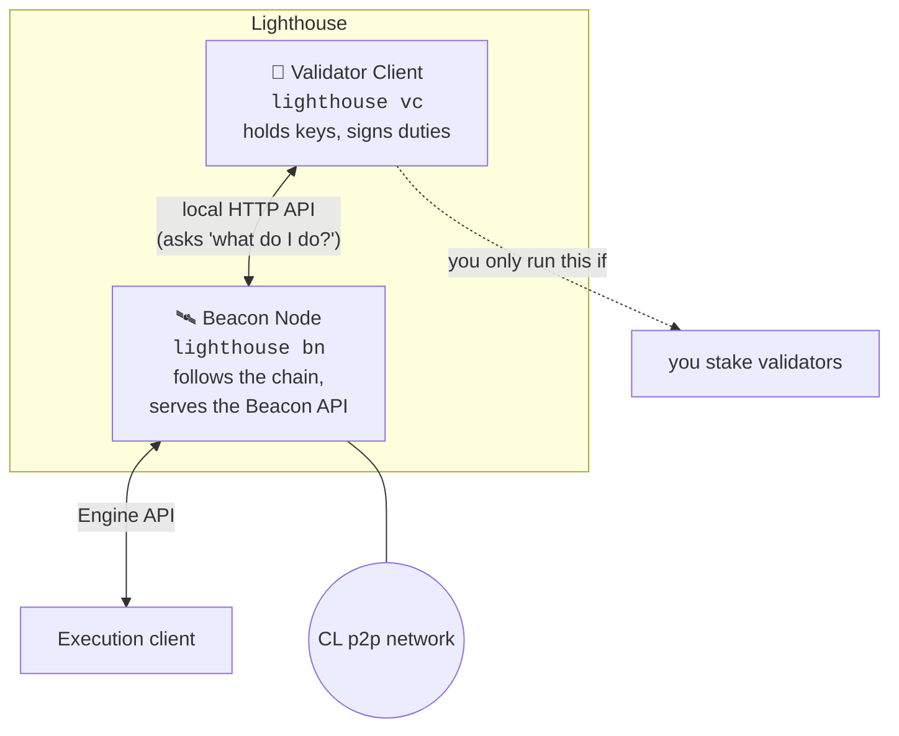
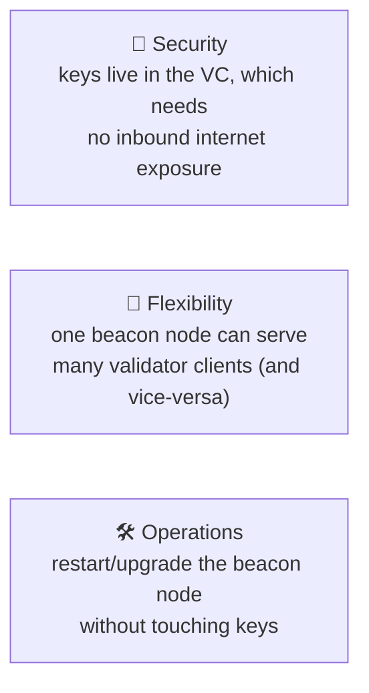
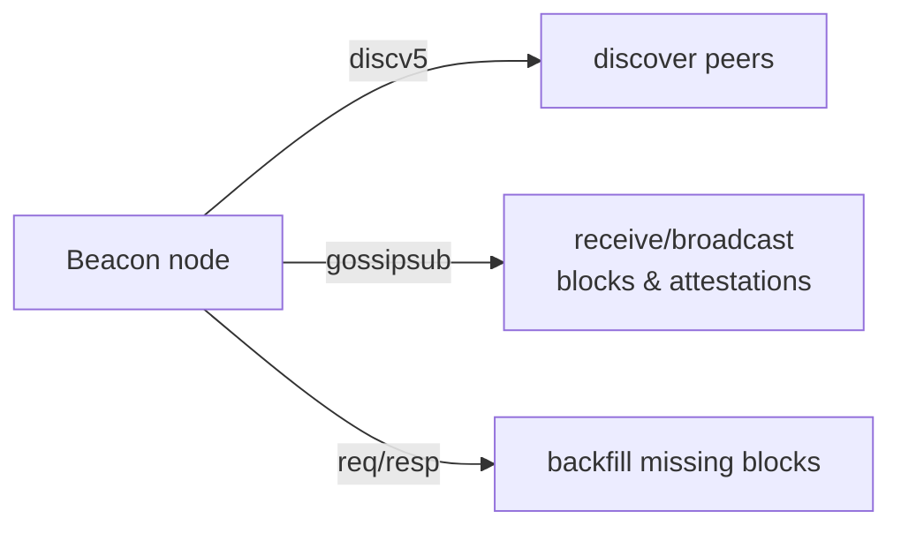

# 04.01 — Lighthouse Architecture: Beacon Node vs. Validator Client

> **What you'll learn here:** how Lighthouse is structured — the two separate programs it ships,
> why they're split, and how its database and networking fit in.
>
> **What you should already know:** what a [CL client](../02-consensus-layer/07-cl-clients.md)
> does and the [duties](../02-consensus-layer/04-duties.md) it performs.
>
> **Fork note:** describes Lighthouse **v8.x** (latest mainnet release as of mid-2026). The
> architecture has been stable across many versions.

Part of **[Lighthouse](../README.md)**. Up next:
**[Installation & Setup »](02-installation-and-setup.md)**

---

## What Lighthouse is

[Lighthouse](https://github.com/sigp/lighthouse) is a [consensus-layer](../glossary.md#consensus-layer-cl)
client written in **Rust** by Sigma Prime. It's one of the most widely used CL clients on
mainnet, valued for speed, memory safety, and a solid security track record. It pairs with any
[execution client](../01-execution-layer/04-el-clients.md) over the
[Engine API](../03-el-cl-interface/02-engine-api.md).

The single most important structural fact: **Lighthouse is two programs, not one.**

---

## The two halves, and why they're split

### 🛰️ The Beacon Node (`lighthouse bn`)

The beacon node is the part that *follows Ethereum*. It:

- connects to the CL [p2p gossip network](#networking-how-it-finds-the-world) and downloads
  beacon blocks,
- runs [fork choice](../02-consensus-layer/06-finality-and-fork-choice.md) and tracks
  [finality](../02-consensus-layer/06-finality-and-fork-choice.md),
- talks to your [execution client](../01-execution-layer/04-el-clients.md) over the
  [Engine API](../03-el-cl-interface/02-engine-api.md) to validate/build payloads,
- and serves the standard **[Beacon Node HTTP API](03-beacon-node-http-api.md)** — the thing
  you'll query in **[Fetching Validator Info](04-fetching-validator-info.md)**.

Crucially, **the beacon node holds no signing keys.** You can run one purely to *read* the chain
(an "API node") without staking anything.

### 🔑 The Validator Client (`lighthouse vc`)

The validator client is the part that *acts as your validators*. It:

- holds the validator **signing keys** (encrypted keystores),
- asks the beacon node what [duties](../02-consensus-layer/04-duties.md) are coming up,
- signs [attestations](../glossary.md#attestation) and blocks at the right time,
- and maintains a **slashing-protection database** so it never double-signs.

### Why separate them?

- **Security:** the beacon node faces the public p2p network; the key-holding validator client
  does not need any inbound exposure. Compromising the beacon node doesn't hand over your keys.
- **Flexibility:** one beacon node can back many validator clients, and a validator client can
  fail over between beacon nodes. Big operators exploit this heavily.
- **Operations:** you can upgrade or restart the chain-following half without risking the
  signing half.

> **If you only want to read chain data** (the goal of these docs' practical section), you run
> **just the beacon node** — no keys, no staking, no validator client. The
> [validator client doc](05-validator-client-and-cli.md) covers the signing side separately.

---

## The database

The beacon node stores the chain and states on disk (default under `~/.lighthouse/<network>/`).
Two ideas worth knowing:

- **Hot vs. cold / freezer DB:** recent, frequently-accessed states are kept "hot"; older
  history is compacted into a "freezer" to save space.
- **State reconstruction:** rather than storing every historical state (huge), Lighthouse stores
  periodic snapshots plus the blocks, and *replays* to reconstruct an old state on demand. This
  is why querying very old slots can be slower than querying `head`.

> 🔍 **Going deeper (optional):** disk footprint depends on your history settings. A typical
> mainnet beacon node is on the order of low-hundreds of GB; keeping full historical states
> (an archival CL node) is much larger. Most people use [checkpoint sync](02-installation-and-setup.md)
> and default pruning, which keeps it manageable. Use a fast **NVMe SSD** — the DB is
> latency-sensitive.

---

## Networking: how it finds the world

The beacon node speaks the consensus-layer p2p stack (libp2p): it **discovers** peers via a
discovery protocol (discv5), **gossips** blocks and [attestations](../glossary.md#attestation)
over gossipsub, and fetches missing history via request/response. You generally just open one
TCP/UDP port for it and let discovery do the rest.

> 🔍 **Going deeper (optional):** since Fusaka, the network also uses
> [PeerDAS](../05-network-upgrades.md) — nodes sample small random columns of blob data over the
> p2p network instead of downloading every blob, which is how blob capacity scaled up. You don't
> configure this directly; it's handled by the client.

---

## In a nutshell

- **Lighthouse = two programs:** a **beacon node** (`lighthouse bn`, follows the chain, serves
  the API, holds no keys) and a **validator client** (`lighthouse vc`, holds keys, signs
  duties).
- They're split for **security, flexibility, and clean operations** — and you can run the
  beacon node **alone** just to read chain data.
- The beacon node talks to your EL over the [Engine API](../03-el-cl-interface/02-engine-api.md)
  and to the world over libp2p (discv5 + gossipsub).
- Its **database** uses hot/freezer storage and state reconstruction; put it on a fast SSD and
  use [checkpoint sync](02-installation-and-setup.md).

## Sources

- [Lighthouse Book — Introduction](https://lighthouse-book.sigmaprime.io/)
- [Lighthouse Book — Become a validator / VC ↔ BN](https://lighthouse-book.sigmaprime.io/mainnet-validator.html)
- [Lighthouse Book — Database configuration](https://lighthouse-book.sigmaprime.io/advanced_database.html)
- [sigp/lighthouse on GitHub](https://github.com/sigp/lighthouse)
