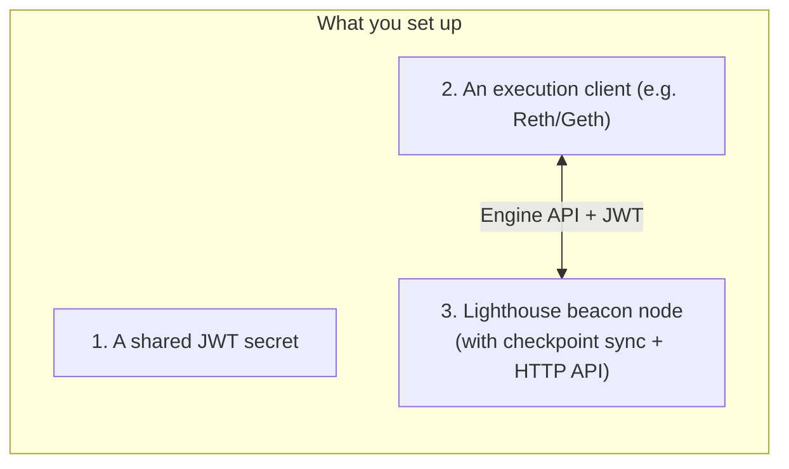
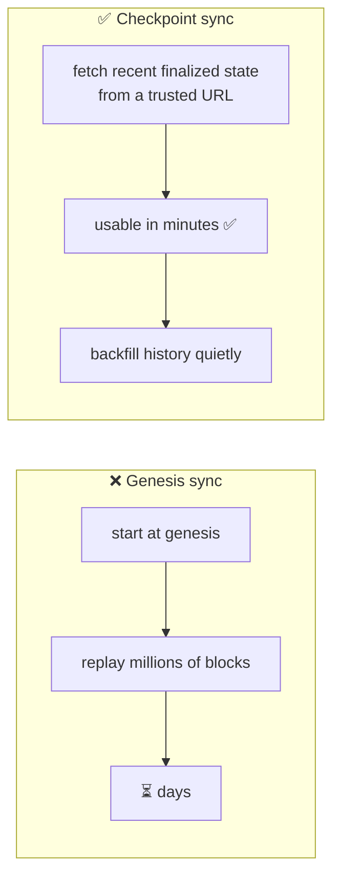

# 04.02 — Installing and Running a Lighthouse Beacon Node

> **What you'll learn here:** how to get a Lighthouse beacon node running and synced — including
> **checkpoint sync** (which makes it ready in minutes, not days) — and the handful of flags
> that actually matter.
>
> **What you should already know:** the [beacon node vs. validator client](01-architecture.md)
> split and the [Engine API / JWT](../03-el-cl-interface/02-engine-api.md).
>
> **Fork note:** commands target Lighthouse **v8.x** (mid-2026). Flags are stable, but always
> sanity-check against `lighthouse bn --help` and the
> [Lighthouse Book](https://lighthouse-book.sigmaprime.io/) for your exact version.

Part of **[Lighthouse](01-architecture.md)**. Up next:
**[Beacon Node HTTP API »](03-beacon-node-http-api.md)**

---

## The goal and the big picture

We want a **beacon node** that's synced to mainnet and exposing its
[HTTP API](03-beacon-node-http-api.md) so we can query it. Remember a beacon node never works
alone — it needs an [execution client](../01-execution-layer/04-el-clients.md) beside it:



Three pieces: a **JWT secret** both clients share, an **EL client**, and the **Lighthouse
beacon node**. Let's do them in order.

---

## Step 0: Install Lighthouse

The quickest paths (pick one):

```bash
# Option A — prebuilt binary (Linux/macOS): grab the latest release
#   https://github.com/sigp/lighthouse/releases/latest
# download, verify, then:
tar -xzf lighthouse-*.tar.gz && sudo mv lighthouse /usr/local/bin/

# Option B — Docker
docker pull sigp/lighthouse:latest

# Option C — build from source (needs the Rust toolchain)
git clone https://github.com/sigp/lighthouse.git
cd lighthouse && make    # installs `lighthouse` into ~/.cargo/bin

# verify
lighthouse --version
```

---

## Step 1: Create the JWT secret

The CL and EL authenticate their [Engine API](../03-el-cl-interface/02-engine-api.md) link with
a shared 32-byte secret. Create it once:

```bash
mkdir -p ~/.ethereum
openssl rand -hex 32 | tr -d "\n" > ~/.ethereum/jwt.hex
```

You'll pass this *same* file path to **both** clients.

---

## Step 2: Run an execution client

Any [EL client](../01-execution-layer/04-el-clients.md) works. Here's Reth (Rust, a natural
Lighthouse pairing) as an illustration — the key parts are enabling the **Engine API on 8551**
and pointing it at the JWT:

```bash
# Illustrative — see your EL client's own docs for exact flags
reth node \
  --authrpc.addr 127.0.0.1 \
  --authrpc.port 8551 \
  --authrpc.jwtsecret ~/.ethereum/jwt.hex
```

Geth equivalent: `geth --authrpc.jwtsecret ~/.ethereum/jwt.hex --authrpc.port 8551`. Either way,
the EL exposes the Engine API on `localhost:8551`, JWT-protected.

---

## Step 3: Run the Lighthouse beacon node (with checkpoint sync)

This is the important command. The star flag is `--checkpoint-sync-url`:

```bash
lighthouse bn \
  --network mainnet \
  --execution-endpoint http://localhost:8551 \
  --execution-jwt ~/.ethereum/jwt.hex \
  --checkpoint-sync-url https://mainnet.checkpoint.sigp.io \
  --http
```

What each flag does:

| Flag | Why it matters |
|---|---|
| `--network mainnet` | which network to join (also `hoodi`, `sepolia`, …) |
| `--execution-endpoint` | where the [Engine API](../03-el-cl-interface/02-engine-api.md) lives (the EL from Step 2) |
| `--execution-jwt` | the shared [JWT](../glossary.md#jwt-for-the-engine-api) from Step 1 |
| `--checkpoint-sync-url` | **sync in minutes** instead of days (see below) |
| `--http` | turn on the [Beacon HTTP API](03-beacon-node-http-api.md) so you can query it |

---

## Why checkpoint sync is the only sane way to start

Without it, a new node would **replay the entire chain from [genesis](../glossary.md#genesis)** —
days of work. **Checkpoint sync** instead grabs a recent *finalized* state from a trusted URL and
starts from there, backfilling older history in the background.



**Is trusting a URL safe?** It's a *weak* trust assumption: you're trusting that a recent
[finalized](../02-consensus-layer/06-finality-and-fork-choice.md) checkpoint is the real one —
something you can cross-check against multiple public sources, block explorers, or a friend's
node in seconds. After that initial bootstrap, your node verifies everything itself. This is the
universally recommended way to start. (Lists of public checkpoint endpoints:
[eth-clients/checkpoint-sync-endpoints](https://eth-clients.github.io/checkpoint-sync-endpoints/).)

---

## Watching it sync

Lighthouse logs its progress, and you can ask the API directly (covered fully in
[Fetching Validator Info](04-fetching-validator-info.md)):

```bash
curl -s http://localhost:5052/eth/v1/node/syncing | jq
```
```jsonc
{ "data": {
    "head_slot": "11034112",
    "sync_distance": "0",       // 0 = fully caught up
    "is_syncing": false,
    "is_optimistic": false      // false = EL has verified the head too
}}
```

When `is_syncing` is `false` and `is_optimistic` is `false`, you're fully synced and your EL has
verified the head. (`is_optimistic: true` means the CL is following the head but the EL is still
catching up — see [optimistic sync](../03-el-cl-interface/02-engine-api.md).)

---

## A few flags worth knowing (not exhaustive)

| Flag | When you want it |
|---|---|
| `--http-address 0.0.0.0` + `--http-port 5052` | expose the API beyond localhost (⚠️ firewall it!) |
| `--datadir <path>` | put the [database](01-architecture.md) somewhere with fast, roomy NVMe |
| `--metrics` | expose Prometheus metrics for monitoring |
| `--checkpoint-sync-url-timeout <secs>` | if your checkpoint provider is slow |
| `--disable-deposit-contract-sync` | for read-only API nodes that don't need deposit tracking |

There are *many* more — see `lighthouse bn --help`. Don't try to learn them all; the Step 3
command above is enough to get a working, queryable node.

> ⚠️ **Security note:** the Beacon HTTP API has **no built-in authentication** and is meant for
> trusted/local access. If you bind it to `0.0.0.0`, put it behind a firewall, VPN, or
> authenticating reverse proxy. More in
> [Beacon Node HTTP API](03-beacon-node-http-api.md#a-word-on-security).

---

## In a nutshell

- A beacon node needs three things set up: a shared **JWT secret**, an **execution client** on
  `:8551`, and the **Lighthouse beacon node** itself.
- The minimal working command is `lighthouse bn --network mainnet --execution-endpoint … 
  --execution-jwt … --checkpoint-sync-url … --http`.
- **Always use `--checkpoint-sync-url`** — it makes the node usable in minutes (a weak,
  easily-verified trust assumption) instead of days of genesis replay.
- Confirm readiness with `/eth/v1/node/syncing` (`is_syncing: false`, `is_optimistic: false`).
- Put the DB on **fast NVMe**, and **never expose the HTTP API unprotected** to the internet.

## Sources

- [Lighthouse Book — Installation](https://lighthouse-book.sigmaprime.io/installation.html)
- [Lighthouse Book — Checkpoint sync](https://lighthouse-book.sigmaprime.io/checkpoint-sync.html)
- [Lighthouse Book — Beacon node CLI (`lighthouse bn`)](https://lighthouse-book.sigmaprime.io/help_bn.html)
- [Public checkpoint-sync endpoints](https://eth-clients.github.io/checkpoint-sync-endpoints/)
