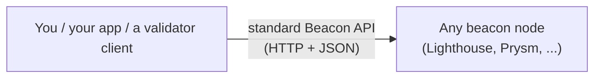
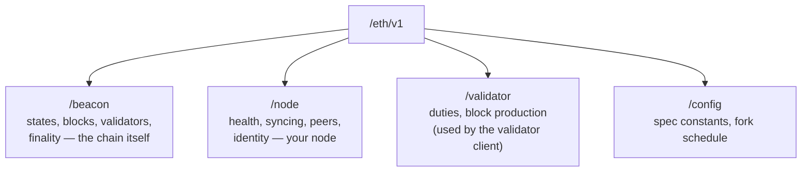
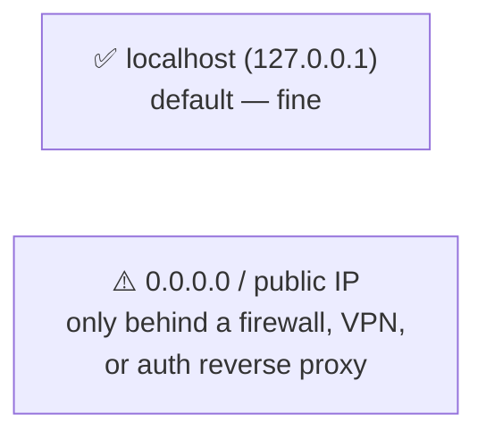

# 04.03 — The Beacon Node HTTP API: Your First Request

> **What you'll learn here:** how to turn on Lighthouse's HTTP API, where it lives, how its URLs
> are shaped, and how to make your very first successful request.
>
> **What you should already know:** you have a [beacon node running](02-installation-and-setup.md),
> and the idea of a [`state_id`](../02-consensus-layer/02-beacon-chain-slots-epochs.md).
>
> **Fork note:** the API follows the standard [`ethereum/beacon-APIs`](https://github.com/ethereum/beacon-APIs)
> spec. Endpoint shapes are stable across forks.

Part of **[Lighthouse](01-architecture.md)**. Up next — the practical centerpiece:
**[Fetching Validator Info »](04-fetching-validator-info.md)**

---

## The Beacon API is a *standard*, not a Lighthouse thing

This is the best part: every consensus client — Lighthouse, Prysm, Teku, Nimbus, Lodestar —
implements the **same** [Beacon Node API spec](https://github.com/ethereum/beacon-APIs). So
everything you learn here works against any compliant client. Lighthouse just happens to be our
vehicle.



---

## Turning it on

You enable it with one flag when starting the [beacon node](02-installation-and-setup.md):

```bash
lighthouse bn --network mainnet --http \
  --execution-endpoint http://localhost:8551 --execution-jwt ~/.ethereum/jwt.hex \
  --checkpoint-sync-url https://mainnet.checkpoint.sigp.io
```

- `--http` — enable the API. By default it binds to **`127.0.0.1:5052`** (localhost only).
- `--http-address 0.0.0.0` `--http-port 5052` — change the bind address/port (⚠️ see security
  below before exposing it).

So your **base URL** is:

```bash
export BN=http://localhost:5052
```

---

## How the URLs are shaped

Every Beacon API path follows a consistent pattern:

```
/eth/{version}/{namespace}/{resource}
        │           │           │
        │           │           └── e.g. states/head/validators
        │           └────────────── beacon │ node │ validator │ config │ debug
        └────────────────────────── v1 (most), v2 (a few that changed shape)
```



The four namespaces you'll use:
- **`/beacon`** — the chain and its contents: states, blocks, **validators**, balances,
  finality. *Most of [the next doc](04-fetching-validator-info.md) lives here.*
- **`/node`** — your node's own status: health, sync, peers, identity.
- **`/validator`** — duty schedules and block production (what a
  [validator client](05-validator-client-and-cli.md) calls).
- **`/config`** — network constants and the fork schedule.

---

## Your first request

The simplest possible win — *"is this thing alive?"*:

```bash
curl -s $BN/eth/v1/node/health -o /dev/null -w "%{http_code}\n"
# 200 = ready and synced
# 206 = up but still syncing
# 503 = not ready
```

Now ask *what node am I even talking to?* (Lighthouse will tell you its version):

```bash
curl -s $BN/eth/v1/node/version | jq
```
```json
{ "data": { "version": "Lighthouse/v8.1.3-..." } }
```

Two things to notice that hold for **almost every** Beacon API response:

1. **Everything is wrapped in a `data` field.** Your real payload is under `.data`. (Some
   endpoints add siblings like `execution_optimistic` and `finalized` flags — handy for knowing
   whether the answer is from an unverified head.)
2. **JSON by default.** Pass `Accept: application/octet-stream` on supported endpoints to get
   compact [SSZ](../glossary.md#ssz) bytes instead — useful for performance-sensitive tooling,
   ignorable otherwise.

```jsonc
// the general shape:
{
  "execution_optimistic": false,  // was this from an EL-unverified head?
  "finalized": true,              // is this data from a finalized state?
  "data": { /* ... the thing you asked for ... */ }
}
```

> **`jq` tip:** pipe responses through [`jq`](https://jqlang.github.io/jq/) to pretty-print and
> drill in, e.g. `… | jq '.data.version'`. All examples here assume it's installed.

---

## A word on security

The Beacon HTTP API has **no authentication**. Anyone who can reach the port can read everything
it serves (and hit a few state-changing validator endpoints). It is designed for **trusted,
local** access.



- Default (`127.0.0.1`) is safe — only programs on the same machine can reach it.
- If you bind it to `0.0.0.0` (e.g. to query from another box), **firewall it** or front it with
  an authenticating reverse proxy (nginx/Caddy with an API key, or a VPN/SSH tunnel).
- Never put a raw beacon node API on the public internet.

> 🔍 **Going deeper (optional):** Lighthouse also exposes a small set of **non-standard**
> endpoints under `/lighthouse/*` (e.g. health, validator performance, database info). They're
> handy for ops dashboards but aren't part of the cross-client spec — prefer the standard
> `/eth/*` paths for anything you want to be portable.

---

## In a nutshell

- The Beacon API is a **cross-client standard** — what you learn on Lighthouse works on Prysm,
  Teku, etc.
- Enable it with `--http`; it serves on **`127.0.0.1:5052`** by default.
- URLs follow `/eth/{version}/{namespace}/…`, with **`/beacon`**, **`/node`**, **`/validator`**,
  and **`/config`** namespaces.
- **Every response wraps its payload in `data`** (often with `execution_optimistic` /
  `finalized` flags).
- The API is **unauthenticated** — keep it local, or firewall/proxy it. Never expose it raw.

## Sources

- [Beacon Node API specification (ethereum/beacon-APIs)](https://ethereum.github.io/beacon-APIs/)
- [Lighthouse Book — Beacon Node API](https://lighthouse-book.sigmaprime.io/api-bn.html)
- [Lighthouse Book — Non-standard `/lighthouse` API](https://lighthouse-book.sigmaprime.io/api-lighthouse.html)
