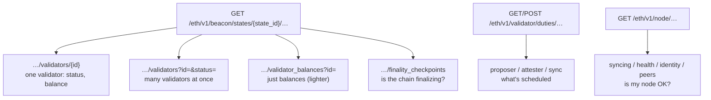
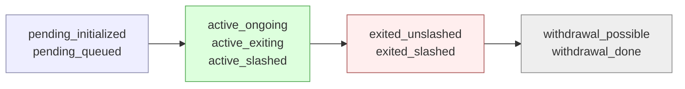
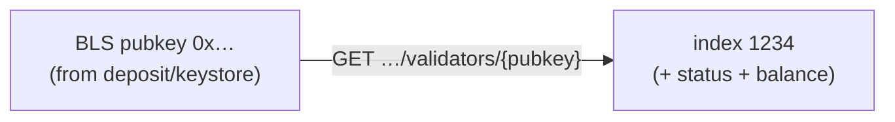

# 04.04 — Fetching Validator & Chain Data (The Practical Core)

> **What you'll learn here:** how to actually *query* a Lighthouse beacon node for validator and
> chain data — starting from one tiny `curl` and building up to a small runnable program.
> This is the hands-on heart of these docs.
>
> **What you should already know:** you have a [synced beacon node](02-installation-and-setup.md)
> with the [HTTP API enabled](03-beacon-node-http-api.md), the idea of a
> [`state_id`](../02-consensus-layer/02-beacon-chain-slots-epochs.md), and the
> [validator record](../02-consensus-layer/03-validator-lifecycle.md).
>
> **Fork note:** uses the standard [`ethereum/beacon-APIs`](https://ethereum.github.io/beacon-APIs/)
> spec, current as of the Fusaka era (mid-2026). All paths work on any compliant client.

Part of **[Lighthouse](01-architecture.md)**. Up next:
**[Validator Client & CLI »](05-validator-client-and-cli.md)**

---

## Setup: two variables and a one-line win

Set your base URL and a sample validator index, and we're off:

```bash
export BN=http://localhost:5052     # your beacon node
export V=1234                       # any validator index you like
```

**The simplest possible win** — one validator's status in one line:

```bash
curl -s "$BN/eth/v1/beacon/states/head/validators/$V" | jq '.data.status'
```
```json
"active_ongoing"
```

That's the whole game in miniature: pick a **[state](../02-consensus-layer/02-beacon-chain-slots-epochs.md)**
(`head`), pick a **validator** (`$V`), read a field (`status`). Everything below is variations
on that theme.

> **Reminder:** every response wraps its payload in `.data` (see
> [the API intro](03-beacon-node-http-api.md)). The examples lean on
> [`jq`](https://jqlang.github.io/jq/) to drill in.

Here's the menu of what we'll hit:



---

## 1. Look up a single validator

> **What it's for:** everything about one validator — its index, current balance, lifecycle
> status, and full on-chain record.

- **Method & path:** `GET /eth/v1/beacon/states/{state_id}/validators/{validator_id}`
- **Params that matter:**
  - `state_id` — *when*: `head` (latest), `finalized` (safe/permanent), `genesis`, a slot
    number, or a state root. Use `finalized` for "this is settled."
  - `validator_id` — *who*: either the numeric **index** (`1234`) **or** the **BLS pubkey**
    (`0x…`). Both work — that's your [pubkey→index resolution](#6-go-from-a-pubkey-to-an-index),
    for free.

```bash
curl -s "$BN/eth/v1/beacon/states/head/validators/$V" | jq
```
```jsonc
{
  "execution_optimistic": false,
  "finalized": false,
  "data": {
    "index": "1234",                 // the validator's number
    "balance": "32008500000",        // ACTUAL balance, in gwei (÷1e9 = ETH)
    "status": "active_ongoing",      // lifecycle status (see enum below)
    "validator": {                   // the on-chain record (see lifecycle doc)
      "pubkey": "0xa1b2…",
      "withdrawal_credentials": "0x01…",   // 0x01 = regular, 0x02 = compounding
      "effective_balance": "32000000000",  // ROUNDED balance used for consensus math
      "slashed": false,
      "activation_eligibility_epoch": "0",
      "activation_epoch": "0",
      "exit_epoch": "18446744073709551615",      // 2^64-1 = "far future" = not exiting
      "withdrawable_epoch": "18446744073709551615"
    }
  }
}
```

**The two fields people mix up:** `balance` is the **real, live** balance; `effective_balance`
is the **rounded, capped** value the protocol uses for [reward/vote math](../02-consensus-layer/03-validator-lifecycle.md#the-record-itself-the-validator-container)
(moves in 1-ETH steps, capped at 32 or 2048 ETH). For "how much ETH does this validator have?"
use `balance`.

### The status enum, in plain words

The `status` string is the API doing the lifecycle bookkeeping *for* you. The nine values map
onto the [validator lifecycle](../02-consensus-layer/03-validator-lifecycle.md) like this:



| Status | Plain meaning |
|---|---|
| `pending_initialized` | deposit seen, not yet eligible (e.g. awaiting more deposit) |
| `pending_queued` | in the [activation queue](../02-consensus-layer/03-validator-lifecycle.md), waiting its turn |
| `active_ongoing` | **the normal, healthy state** — attesting & eligible to propose |
| `active_exiting` | still active, but has requested a voluntary exit |
| `active_slashed` | slashed, force-exit scheduled, but still technically in the set |
| `exited_unslashed` | left cleanly; no longer active |
| `exited_slashed` | left because it was [slashed](../02-consensus-layer/05-rewards-penalties-slashing.md) |
| `withdrawal_possible` | exited and funds are eligible to be swept |
| `withdrawal_done` | balance has been fully withdrawn |

> **Shortcut:** you usually only need the prefix. Anything starting with **`active`** is in the
> active set; **`pending`** hasn't started; **`exited`/`withdrawal`** is done. (The API also lets
> you *filter* by these coarse groups — next section.)

> 🔍 **Going deeper (optional):** the full per-field breakdown of the inner `validator` object
> (the `Validator` SSZ container — `pubkey`, `withdrawal_credentials`, `effective_balance`,
> `slashed`, and the four epoch fields) lives in the
> [Validator Lifecycle doc](../02-consensus-layer/03-validator-lifecycle.md#the-record-itself-the-validator-container).
> Remember: an epoch field of `18446744073709551615` (2⁶⁴−1) means **"not scheduled."**

---

## 2. Look up many validators at once

> **What it's for:** the same data, but for a whole set of validators — and/or filtered by
> status. Far better than looping the single-validator call.

- **Method & path:** `GET /eth/v1/beacon/states/{state_id}/validators`
- **Params that matter:**
  - `id` — repeatable: `?id=1&id=2&id=3` (indices or pubkeys). Omit to get *all* validators
    (huge — over a million on mainnet; prefer filtering).
  - `status` — repeatable: filter by status, accepting either fine-grained values
    (`active_ongoing`) or coarse groups (`active`, `pending`, `exited`, `withdrawal`).

```bash
# three specific validators
curl -s "$BN/eth/v1/beacon/states/head/validators?id=1&id=2&id=3" | jq '.data[].status'

# of these candidates, which are still in the activation queue?
curl -s "$BN/eth/v1/beacon/states/head/validators?id=900000&id=900001&status=pending" | jq '.data'
```
```jsonc
{ "data": [
    { "index": "1", "balance": "34000000000", "status": "active_ongoing",  "validator": { … } },
    { "index": "2", "balance": "32000000000", "status": "active_exiting",   "validator": { … } }
] }
```

> 🔍 **Going deeper (optional):** for *large* lists, use the **`POST`** form of the same path
> with a JSON body `{"ids": ["1","2",…], "statuses": ["active"]}` — it avoids hitting URL-length
> limits when you query thousands of validators at once. The response shape is identical.

---

## 3. Just the balances

> **What it's for:** when you only need balances (e.g. a dashboard), this is lighter than
> pulling the full validator records.

- **Method & path:** `GET /eth/v1/beacon/states/{state_id}/validator_balances`
- **Params that matter:** `id` — repeatable (indices or pubkeys); omit for all.

```bash
curl -s "$BN/eth/v1/beacon/states/head/validator_balances?id=$V&id=2" | jq '.data'
```
```jsonc
{ "data": [
    { "index": "1234", "balance": "32008500000" },   // gwei
    { "index": "2",    "balance": "32000000000" }
] }
```

To read a balance at a *specific* point in time, swap `head` for a slot, e.g.
`/eth/v1/beacon/states/7100000/validator_balances?id=$V` — handy for computing rewards between
two slots.

---

## 4. Is the chain finalizing? (finality checkpoints)

> **What it's for:** a one-call health check on [finality](../02-consensus-layer/06-finality-and-fork-choice.md)
> — the single best signal that consensus is healthy.

- **Method & path:** `GET /eth/v1/beacon/states/{state_id}/finality_checkpoints`

```bash
curl -s "$BN/eth/v1/beacon/states/head/finality_checkpoints" | jq '.data'
```
```jsonc
{ "data": {
    "previous_justified": { "epoch": "245678", "root": "0x…" },
    "current_justified":  { "epoch": "245679", "root": "0x…" },  // ⅔ voted for this
    "finalized":          { "epoch": "245678", "root": "0x…" }   // permanent ✅
} }
```

**How to read it:** compare `finalized.epoch` to the *current* epoch. In a healthy network the
finalized epoch trails the current one by only **~2 epochs** (~13 minutes). If that gap keeps
growing, finality is stalling — see [when finality stalls](../02-consensus-layer/06-finality-and-fork-choice.md#when-finality-stalls).

> **Tip:** find the current epoch from the head slot ÷ 32. Get the head slot from
> [`/eth/v1/node/syncing`](#5-is-my-node-healthy-and-synced) (`head_slot`) or from
> `GET /eth/v1/beacon/headers/head`.

---

## 5. Is my node healthy and synced?

> **What it's for:** confirming your node is actually ready to give trustworthy answers.

**Sync status** — `GET /eth/v1/node/syncing`:

```bash
curl -s "$BN/eth/v1/node/syncing" | jq '.data'
```
```jsonc
{ "data": {
    "head_slot": "11034112",
    "sync_distance": "0",     // slots behind the network; 0 = caught up
    "is_syncing": false,
    "is_optimistic": false,   // true = EL hasn't verified the head yet (don't fully trust it)
    "el_offline": false       // true = execution client is unreachable!
} }
```
Trust answers only when `is_syncing: false` **and** `is_optimistic: false` **and**
`el_offline: false`. ([Why "optimistic" matters.](../03-el-cl-interface/02-engine-api.md))

**Health** — `GET /eth/v1/node/health` (no body; read the HTTP status code):

```bash
curl -s -o /dev/null -w "%{http_code}\n" "$BN/eth/v1/node/health"
# 200 = healthy & synced · 206 = syncing · 503 = not ready
```
This is the endpoint to wire into a load balancer or uptime check.

**Identity & peers** (quick connectivity sanity check):

```bash
curl -s "$BN/eth/v1/node/identity" | jq '.data.peer_id'      # who am I on the p2p network
curl -s "$BN/eth/v1/node/peer_count" | jq '.data'            # how many peers (want > a handful)
```

---

## 6. Go from a pubkey to an index

> **What it's for:** you have a validator's **public key** (from a deposit, a keystore, a
> staking UI) and need its on-chain **index** — the number everything else is keyed by.

Good news: there's no special endpoint — **the single-validator call accepts a pubkey directly**
as the `validator_id`, and the response hands you the index.

```bash
PUBKEY=0xa1b2c3...   # 48-byte BLS pubkey, 0x-prefixed
curl -s "$BN/eth/v1/beacon/states/head/validators/$PUBKEY" | jq '.data.index'
```
```json
"1234"
```



That one call gives you the index, status, **and** balance together — which is exactly what the
example program below does. (If the pubkey isn't found, you get `404`/`400`, usually meaning the
deposit hasn't been processed yet or the key was mistyped.)

---

## 7. What is a validator scheduled to do? (duties — briefly)

> **What it's for:** the schedule of upcoming work. This is what a
> [validator client](05-validator-client-and-cli.md) polls every epoch so it knows when to
> sign — see [Duties](../02-consensus-layer/04-duties.md).

| Duty | Method & path | Body |
|---|---|---|
| **Proposer** | `GET /eth/v1/validator/duties/proposer/{epoch}` | — (returns the whole epoch's proposers) |
| **Attester** | `POST /eth/v1/validator/duties/attester/{epoch}` | JSON array of validator indices |
| **Sync committee** | `POST /eth/v1/validator/duties/sync/{epoch}` | JSON array of validator indices |

```bash
# Who proposes each slot in epoch 245680? (no body needed)
curl -s "$BN/eth/v1/validator/duties/proposer/245680" | jq '.data[0]'
# { "pubkey": "0x…", "validator_index": "1234", "slot": "7861760" }

# When does validator 1234 attest in epoch 245680? (POST the indices)
curl -s -X POST "$BN/eth/v1/validator/duties/attester/245680" \
  -H 'Content-Type: application/json' -d '["1234"]' | jq '.data[0]'
# { "pubkey":"0x…", "validator_index":"1234", "committee_index":"3",
#   "slot":"7861744", "committee_length":"452", "validator_committee_index":"17", … }
```

The attester response tells the validator client *exactly* which slot and committee position to
sign in. You rarely call these by hand — the [validator client](05-validator-client-and-cli.md)
does — but it's clarifying to see the schedule the protocol hands out.

> 🔍 **Going deeper (optional):** committee membership for a state is also available directly via
> `GET /eth/v1/beacon/states/{state_id}/committees?epoch={e}` (returns every committee's validator
> list). And since [Fusaka's EIP-7917](../05-network-upgrades.md), the proposer schedule is
> deterministic a full epoch ahead, so proposer duties for the next epoch are reliable, not
> tentative.

---

## Putting it together: a tiny Rust program

Goal: **take a pubkey (or index), resolve it, fetch its status + balance at `head`, and say
whether it's active.** As we saw, a single Beacon API call does all of that — so the program is
small. Rust pairs naturally with Lighthouse, and this needs no async runtime.

**`Cargo.toml`:**
```toml
[package]
name = "validator-status"
version = "0.1.0"
edition = "2021"

[dependencies]
reqwest = { version = "0.12", features = ["blocking", "json"] }
serde   = { version = "1", features = ["derive"] }
```

**`src/main.rs`:**
```rust
use serde::Deserialize;
use std::env;

// The Beacon API wraps everything in a `data` field.
#[derive(Deserialize)]
struct Response { data: ValidatorEntry }

// One entry from GET /eth/v1/beacon/states/{state_id}/validators/{id}
#[derive(Deserialize)]
struct ValidatorEntry {
    index: String,    // numbers come back as JSON *strings* in the Beacon API
    balance: String,  // gwei
    status: String,   // e.g. "active_ongoing"
}

fn main() -> Result<(), Box<dyn std::error::Error>> {
    // Beacon node base URL (override with the BN env var).
    let bn = env::var("BN").unwrap_or_else(|_| "http://localhost:5052".into());
    // A pubkey (0x…) OR an index, taken from the first CLI argument.
    let id = env::args().nth(1)
        .expect("usage: validator-status <pubkey-or-index>");

    // ONE request does it all: passing a pubkey as {validator_id} resolves it to an
    // index, and the response also carries status + live balance at the head state.
    let url = format!("{bn}/eth/v1/beacon/states/head/validators/{id}");
    let resp = reqwest::blocking::get(&url)?;

    if !resp.status().is_success() {
        eprintln!("request failed: HTTP {} — is the node synced and the id valid?",
                  resp.status());
        std::process::exit(1);
    }

    let v: Response = resp.json()?;
    let gwei: u64 = v.data.balance.parse()?;     // string -> number
    let eth = gwei as f64 / 1e9;                 // gwei -> ETH

    println!("index   : {}", v.data.index);
    println!("status  : {}", v.data.status);
    println!("balance : {:.4} ETH", eth);

    // Any status starting with "active" means it's in the active validator set.
    if v.data.status.starts_with("active") {
        println!("=> ✅ ACTIVE");
    } else {
        println!("=> ⚠️ NOT active (status: {})", v.data.status);
    }
    Ok(())
}
```

**Run it:**
```bash
# against a local node, by index:
cargo run -- 1234

# or by pubkey, against a remote node:
BN=http://my-node:5052 cargo run -- 0xa1b2c3...
```
```text
index   : 1234
status  : active_ongoing
balance : 32.0085 ETH
=> ✅ ACTIVE
```

> **Why everything is a string:** the Beacon API encodes 64-bit integers as JSON **strings**
> (`"32000000000"`), because numbers that big lose precision in some JSON parsers (notably
> JavaScript). So you parse them yourself — hence `.parse()` above. This bites Node.js users
> especially; in JS, use `BigInt(x)` rather than `Number(x)` for balances and indices.

---

## In a nutshell

- The pattern is always **state → validator → field**: pick a `state_id` (`head` or
  `finalized`), a `validator_id` (index *or* pubkey), read what you need.
- **One validator:** `…/validators/{id}` gives index, **live `balance`**, `status`, and the full
  record. Use the **`status` prefix** (`active`/`pending`/`exited`) for quick checks; don't
  confuse `balance` (real) with `effective_balance` (rounded/capped).
- **Many at once:** `…/validators?id=&status=` (GET, or POST for big lists);
  **balances only:** `…/validator_balances`.
- **Finality health:** `…/finality_checkpoints` — the finalized epoch should trail the current
  one by ~2.
- **Node health:** `/eth/v1/node/syncing` (+ `health`, `identity`, `peers`); trust answers only
  when synced, non-optimistic, and the EL is online.
- **Pubkey → index** is free: pass the pubkey as the `validator_id`. The Rust program above does
  exactly that in one call. Remember: **Beacon API integers are JSON strings.**

## Sources

- [Beacon Node API specification (ethereum/beacon-APIs)](https://ethereum.github.io/beacon-APIs/)
- [Lighthouse Book — Beacon Node API](https://lighthouse-book.sigmaprime.io/api-bn.html)
- [Beacon API — `ValidatorStatus` definitions (beacon-APIs `types/api.md`)](https://github.com/ethereum/beacon-APIs/blob/master/types/api.md)
- [consensus-specs — `Validator` container](https://github.com/ethereum/consensus-specs/blob/dev/specs/phase0/beacon-chain.md#validator)
