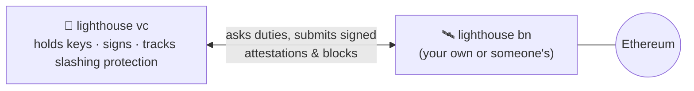
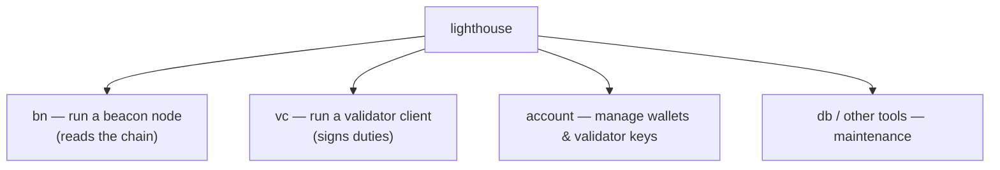
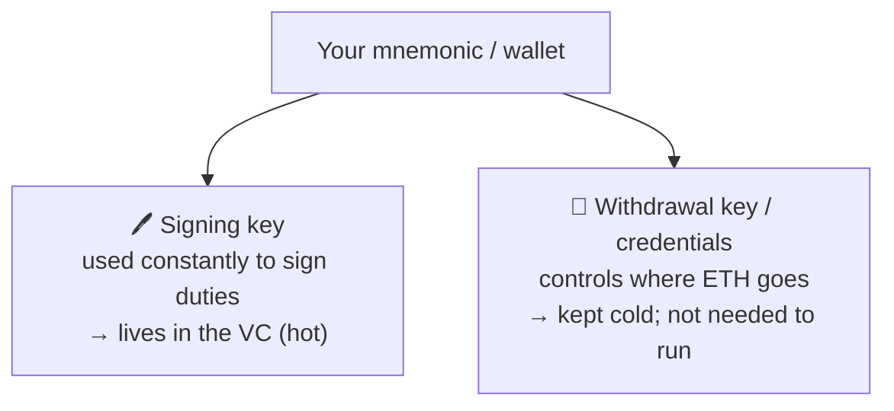
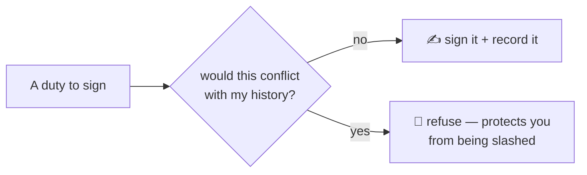
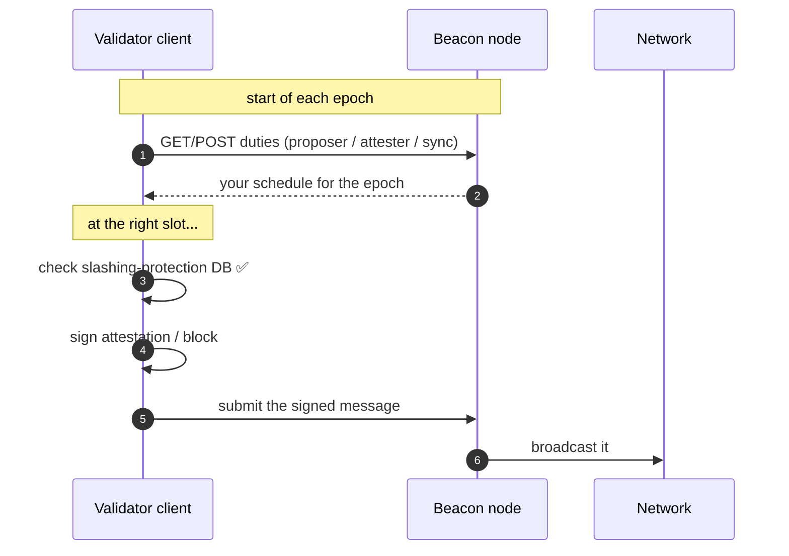

# 04.05 — The Validator Client and the Lighthouse CLI

> **What you'll learn here:** what the *other* half of Lighthouse (the validator client) is for,
> the main `lighthouse` subcommands, how keys are managed, and how the VC turns duties into
> signatures — without double-signing.
>
> **What you should already know:** the [beacon node vs. VC split](01-architecture.md), the
> [duties](../02-consensus-layer/04-duties.md), and [slashing](../02-consensus-layer/05-rewards-penalties-slashing.md).
>
> **Fork note:** Lighthouse **v8.x** (mid-2026). Always confirm flags with
> `lighthouse vc --help` / `lighthouse account --help`.

Part of **[Lighthouse](01-architecture.md)**. This wraps the Lighthouse section; see also the
**[Network Upgrades timeline »](../05-network-upgrades.md)**.

---

## Where the validator client fits

The [beacon node](04-fetching-validator-info.md) *reads* the chain. The **validator client (VC)**
is the half that *acts*: it holds your signing keys and performs
[duties](../02-consensus-layer/04-duties.md). You only run it if you're **staking**.



The VC never touches the p2p network directly — it only talks to a beacon node. That's the
security boundary: keys live behind the VC, the BN faces the world.

---

## The main `lighthouse` subcommands

The single `lighthouse` binary has a few "modes." The ones that matter:



| Command | What it's for |
|---|---|
| `lighthouse bn` | the [beacon node](02-installation-and-setup.md) (chain following + API) |
| `lighthouse vc` | the validator client (signing duties) |
| `lighthouse account` | create/import/inspect validator keys and wallets |
| `lighthouse db` | beacon-node database inspection & maintenance |

---

## Keys: what the VC actually holds

A validator has **two** keypairs, and the distinction is a frequent source of confusion:



- **Signing (validator) key** — used every epoch to sign [attestations](../glossary.md#attestation)
  and blocks. The VC needs it online. Stored as an encrypted **EIP-2335 keystore** (a JSON file
  protected by a password).
- **Withdrawal credentials** — control where staked ETH is sent ([`0x01`/`0x02`](../02-consensus-layer/03-validator-lifecycle.md#withdrawal-credentials-decide-your-type)).
  *Not* needed to run the validator; keep it cold/offline.

> **Security takeaway:** the machine running the VC only ever needs the *signing* key. Your
> withdrawal key can stay completely offline — so even a fully compromised VC host can't steal
> your principal, only disrupt duties.

### Importing keys (the common path)

Most people generate keys with the official [staking-deposit-cli](https://github.com/ethereum/staking-deposit-cli)
(or a tool like Wagyu), which produces `keystore-*.json` files, then **import** them into
Lighthouse:

```bash
lighthouse account validator import \
  --directory /path/to/validator_keys \
  --network mainnet
# prompts for each keystore password, then stores them under ~/.lighthouse/<network>/validators
```

Inspect what's imported:
```bash
lighthouse account validator list --network mainnet
```

---

## Running the validator client

Point the VC at a beacon node and start it:

```bash
lighthouse vc \
  --network mainnet \
  --beacon-nodes http://localhost:5052 \
  --suggested-fee-recipient 0xYourFeeRecipientAddress
```

| Flag | Why it matters |
|---|---|
| `--beacon-nodes` | one *or more* BN URLs (comma-separated for redundancy/failover) |
| `--suggested-fee-recipient` | the address that receives [tips/MEV](../01-execution-layer/03-mempool-and-block-building.md) when **you** propose — **set this**, or you may forfeit proposal income |
| `--network` | must match your beacon node's network |

> 🔍 **Going deeper (optional):** to capture [MEV](../glossary.md#mev) you also run **MEV-Boost**
> alongside and point the *beacon node* at it (`--builder` on `lighthouse bn`), plus
> `--builder-proposals` on the VC. The VC can also use a remote signer (Web3Signer) via
> `--web3-signer` instead of holding local keystores — common for institutional setups.

---

## Slashing protection: the seatbelt you must not unbuckle

The #1 cause of real-world [slashing](../02-consensus-layer/05-rewards-penalties-slashing.md) is
**running the same keys in two places at once**, causing a double-sign. The VC defends against
this with a local **slashing-protection database** that records everything it has ever signed
and refuses to sign anything conflicting.



**The golden rules:**
- **Never** run the same validator keys on two machines/VCs simultaneously — not even "for
  redundancy." That's the trap that gets people slashed.
- When **migrating** a validator to a new machine, *cleanly stop* the old VC, then **export** and
  **import** the slashing-protection history so the new VC knows what was already signed:

```bash
# on the OLD machine (VC stopped):
lighthouse account validator slashing-protection export slashing.json --network mainnet
# move slashing.json across, then on the NEW machine:
lighthouse account validator slashing-protection import slashing.json --network mainnet
```

The file format is the standardized [EIP-3076](https://eips.ethereum.org/EIPS/eip-3076)
interchange format, so it works across clients too.

---

## How a duty becomes a signature (the loop)

Tying it back to [Duties](../02-consensus-layer/04-duties.md) and the
[Beacon API](04-fetching-validator-info.md#7-what-is-a-validator-scheduled-to-do-duties--briefly):



That loop — *fetch duties → check it's safe → sign → submit* — repeated every epoch, is the
entire job of the validator client.

---

## In a nutshell

- The **validator client** (`lighthouse vc`) is the key-holding, signing half — run it only if
  you stake; it talks **only** to a beacon node, never the p2p network.
- Key subcommands: `lighthouse bn`, `lighthouse vc`, `lighthouse account` (key management).
- A validator has a hot **signing key** (lives in the VC) and a cold **withdrawal key** (stays
  offline) — so a compromised VC host can't steal your principal.
- **Set `--suggested-fee-recipient`**, and point the VC at one or more beacon nodes.
- **Slashing protection** is non-negotiable: never run duplicate signers, and use the
  [EIP-3076](https://eips.ethereum.org/EIPS/eip-3076) export/import when migrating.
- The VC's whole life is the loop: **fetch duties → safety-check → sign → submit**, every epoch.

## Sources

- [Lighthouse Book — Validator management](https://lighthouse-book.sigmaprime.io/validator-management.html)
- [Lighthouse Book — Importing keys & slashing protection](https://lighthouse-book.sigmaprime.io/slashing-protection.html)
- [Lighthouse Book — Validator client CLI (`lighthouse vc`)](https://lighthouse-book.sigmaprime.io/help_vc.html)
- [EIP-2335 (keystores)](https://eips.ethereum.org/EIPS/eip-2335) · [EIP-3076 (slashing-protection interchange)](https://eips.ethereum.org/EIPS/eip-3076)
