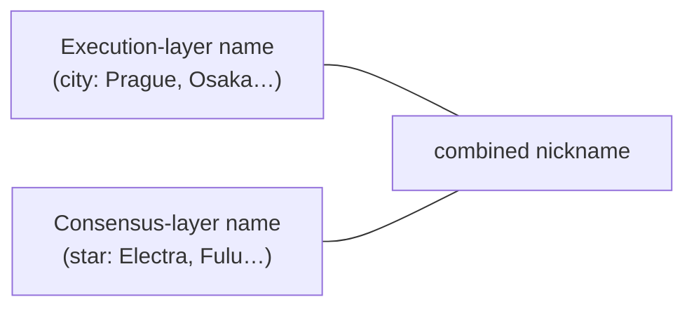
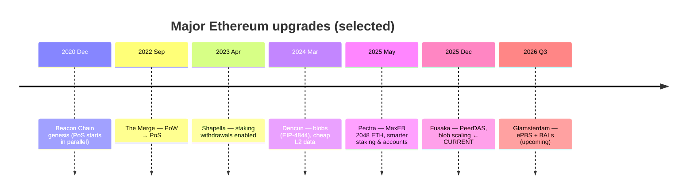

# 05 — Network Upgrades: A Friendly Timeline

> **What you'll learn here:** the major Ethereum upgrades that got us to today, what each one
> actually changed for users and stakers, and where the network is right now.
>
> **What you should already know:** the [EL/CL split](00-overview.md) and roughly what
> [validators](glossary.md#validator), [blobs](glossary.md#blob), and
> [finality](glossary.md#finality) are.
>
> **Fork note (the important one):** as of **mid-2026**, the latest live mainnet upgrade is
> **Fusaka** (December 2025). The next, **Glamsterdam**, is expected **Q3 2026** and is *not*
> live yet. These docs are written against the **Fusaka** reality.

Part of **[Ethereum Internals](README.md)**. This is the capstone — it ties the whole timeline
together.

---

## How Ethereum upgrades

Ethereum changes via scheduled **[hard forks](glossary.md#fork-network-upgrade--hard-fork)**:
all clients agree, in advance, to switch to new rules at a specific
[slot](glossary.md#slot)/epoch. Since [The Merge](03-el-cl-interface/01-the-merge.md), most
upgrades have **two names** — one for the execution-layer changes and one for the
consensus-layer changes — and the combined nickname mashes them together:

> **Pectra** = **Pra**gue (EL) + **Electra** (CL).  **Fusaka** = **Fu**lu (CL) + O**saka** (EL).

---

## The timeline at a glance

---

## What each upgrade actually did

### 🟣 The Merge — *Sept 2022* (Paris + Bellatrix)
Swapped consensus from [proof of work to proof of stake](02-consensus-layer/01-pos-and-gasper.md).
Energy use dropped ~99.9%; issuance dropped sharply. **Didn't** change fees or speed. This is the
moment the [two-layer architecture](00-overview.md) we've described took over. Full story:
**[The Merge](03-el-cl-interface/01-the-merge.md)**.

### 🟢 Shapella — *April 2023* (Shanghai + Capella)
**Enabled staking withdrawals.** Before this, staked ETH (and rewards) were locked with no way
out — you could deposit but never withdraw. Shapella turned on the automatic
[withdrawal sweeps](02-consensus-layer/03-validator-lifecycle.md#5-withdrawal--getting-your-eth-back),
completing the staking round-trip and making staking far less risky to enter.

### 🔵 Dencun — *March 2024* (Cancun + Deneb)
Introduced **[blobs](glossary.md#blob)** ([EIP-4844](https://eips.ethereum.org/EIPS/eip-4844),
"proto-danksharding") — a cheap, temporary data lane for **layer-2 rollups**. This is the single
biggest reason L2 transaction fees fell dramatically in 2024. Blobs are priced in their own
[fee market](01-execution-layer/02-transactions-and-gas.md#blob-transactions-in-one-breath) and
auto-expire after ~18 days.

### 🟠 Pectra — *May 2025* (Prague + Electra)
A big staking-and-accounts upgrade. The headliners:

| Change | What it means |
|---|---|
| **EIP-7251 — MaxEB ↑ to 2048 ETH** | one [validator](02-consensus-layer/03-validator-lifecycle.md) can now hold up to 2048 ETH (with [`0x02`](glossary.md#withdrawal-credentials) creds) and **compound rewards**, instead of being capped at 32 — big operators can consolidate 64 validators into 1 |
| **EIP-7002 — EL-triggerable exits/withdrawals** | the withdrawal-address holder can exit or partially withdraw from the [execution side](03-el-cl-interface/01-the-merge.md), no signing keys required |
| **EIP-6110 — deposits on-chain** | new-validator deposits are recognized in ~minutes instead of ~12 hours |
| **EIP-7702 — "set code" for EOAs** | wallets can temporarily act like [smart contracts](01-execution-layer/01-evm-and-state.md) (batching, gas sponsorship) |

Most of the [validator-lifecycle](02-consensus-layer/03-validator-lifecycle.md) rules these docs
describe are the *Pectra* versions.

### 🔴 Fusaka — *December 2025* (Fulu + Osaka) ← **current mainnet**
Activated Dec 3, 2025. The headliner is **PeerDAS** ([EIP-7594](https://eips.ethereum.org/EIPS/eip-7594)):
nodes verify [blob](glossary.md#blob) availability by **sampling small random pieces** instead of
downloading every blob, which lets the network safely carry **many more blobs** — scaling L2 data
capacity further. Other notable bits:

| Change | What it means |
|---|---|
| **EIP-7594 — PeerDAS** | data-availability sampling → room for far more blobs per block |
| **EIP-7892 — BPO forks** | lightweight "blob-parameter-only" forks to raise blob limits without a full upgrade |
| **EIP-7917 — deterministic proposer lookahead** | the [proposer](02-consensus-layer/04-duties.md) schedule is known a full epoch ahead, reliably |
| **EIP-7825 — per-tx gas cap** | no single [transaction](01-execution-layer/02-transactions-and-gas.md) may exceed ~16.78M gas (DoS hardening) |
| **EIP-7951 — secp256r1 precompile** | native support for passkey/WebAuthn-style signatures |

> **Blob counts today:** Fusaka shipped with two follow-up **BPO** tuning forks. After **BPO1**
> (Dec 9, 2025) and **BPO2** (Jan 7, 2026), the per-block blob **target is 14** and the
> **max is 21** — up from 6/9 in the Pectra era. So "how many blobs per block?" in mid-2026 is
> *target 14, max 21*.

### ⚪ Glamsterdam — *expected Q3 2026* (upcoming, **not live**)
The next upgrade. Planned headliners:
- **EIP-7732 — ePBS (enshrined proposer-builder separation):** bake the
  [PBS/MEV-Boost](01-execution-layer/03-mempool-and-block-building.md) roles *into* the protocol,
  removing the need to trust off-protocol relays.
- **EIP-7928 — Block-Level Access Lists (BALs):** declare upfront which state a block touches, to
  enable faster/parallel execution.

(Note: a proposal to halve slot times to 6 seconds, EIP-7782, was considered but **dropped** from
Glamsterdam's scope — slots remain **12 seconds**.) Treat all of this as *roadmap*, not current
behavior.

---

## "So what's true *right now*?" (the cheat sheet)

For anyone reading these docs in the Fusaka era, the load-bearing current facts:

- **Consensus:** proof of stake; [slots](glossary.md#slot) are **12 s**,
  [epochs](glossary.md#epoch) are **32 slots / 6.4 min**; finality ~2 epochs.
- **Staking:** min **32 ETH** to activate; max effective balance **32 ETH** (`0x01`) or **2048
  ETH** (`0x02`, compounding); withdrawals are automatic sweeps; exits can be triggered from the
  EL.
- **Blobs:** target **14**, max **21** per block; verified via PeerDAS sampling.
- **Clients:** mix any [EL](01-execution-layer/04-el-clients.md) with any
  [CL](02-consensus-layer/07-cl-clients.md); [Lighthouse](04-lighthouse/01-architecture.md) is on
  the **v8.x** series.
- **Engine API:** `engine_newPayloadV4`, `engine_forkchoiceUpdatedV3`, `engine_getPayloadV5`
  (see [Engine API](03-el-cl-interface/02-engine-api.md)).

> ⚠️ **Honesty note on dates & versions:** fork *contents* were verified against Ethereum
> Foundation and spec sources; exact mainnet activation *timestamps* and the precise BPO blob
> numbers can drift as the network evolves. Re-check
> [ethereum.org/history](https://ethereum.org/en/history/) and the
> [consensus-specs](https://github.com/ethereum/consensus-specs)/[execution-specs](https://github.com/ethereum/execution-specs)
> repos before relying on a specific constant or date.

---

## In a nutshell

- Ethereum upgrades via scheduled **hard forks**, usually named for both an EL city and a CL
  star (e.g. **Pectra** = Prague + Electra).
- The path here: **Merge** (PoS, 2022) → **Shapella** (withdrawals, 2023) → **Dencun** (blobs,
  2024) → **Pectra** (2048-ETH validators & smarter staking, 2025) → **Fusaka** (PeerDAS blob
  scaling, **current**, 2025).
- **Right now (Fusaka era):** 12 s slots, 32–2048 ETH validators, blob target 14 / max 21,
  Lighthouse v8.x.
- Next up: **Glamsterdam** (~Q3 2026) with **ePBS** and **BALs** — roadmap, not yet live.

## Sources

- [ethereum.org — History of Ethereum upgrades](https://ethereum.org/en/history/)
- [Ethereum Foundation Blog — Fusaka mainnet announcement](https://blog.ethereum.org/2025/11/06/fusaka-mainnet-announcement)
- [Consensys — Pectra upgrade overview](https://consensys.io/ethereum-pectra-upgrade)
- [EIP index — 4844, 7251, 7002, 6110, 7702, 7594, 7892, 7917, 7825, 7732, 7928](https://eips.ethereum.org/)
- [ethereum/consensus-specs](https://github.com/ethereum/consensus-specs) · [ethereum/execution-specs](https://github.com/ethereum/execution-specs)
