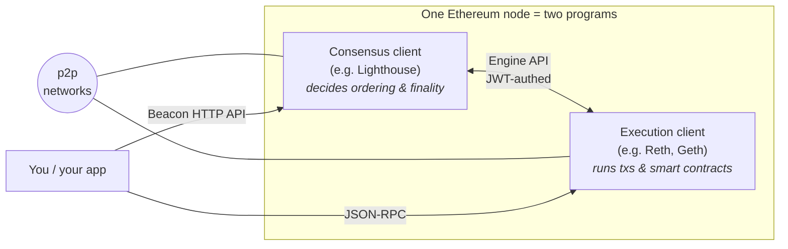
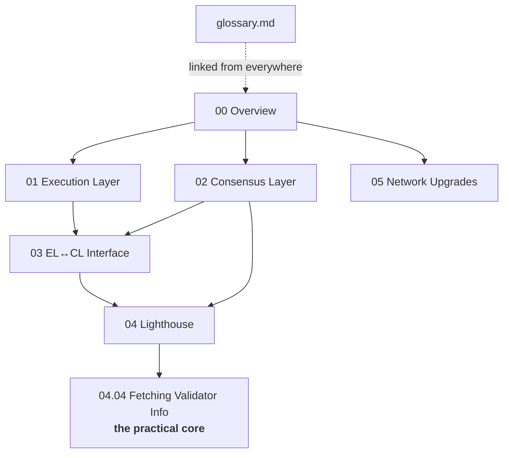

# Ethereum Internals — A Friendly Field Guide

> **What this is:** a hands-on, plain-language tour of how Ethereum actually works under the
> hood after The Merge — the two "halves" of an Ethereum node, how they cooperate, and how to
> query a real node yourself using [Lighthouse](04-lighthouse/01-architecture.md).
>
> **Who it's for:** you already know what a wallet, a transaction, gas, and a smart contract
> are, and you've heard of "The Merge" and "validators" — but you want a real mental model of
> what's happening beneath that.
>
> **What it's *not*:** a beginner's "what is a blockchain" guide, and not an exhaustive spec
> reference. When something gets deep, we tuck the gory details into clearly-marked
> *🔍 Going deeper* boxes you can skip.

---

## The one-paragraph version

Since **The Merge** (September 2022), every Ethereum node is really *two programs running
side by side*: an **execution layer (EL)** client that runs transactions and smart contracts,
and a **consensus layer (CL)** client that decides which blocks are real and in what order.
They talk to each other over a small private channel called the **Engine API**. The EL is the
"what happened" engine; the CL is the "everyone agrees it happened" engine. Understanding that
split is the key that unlocks everything else here.

---

## Suggested reading order

You can jump around, but this order builds the ideas up gradually:

1. **[00 — Overview](00-overview.md)** — the big picture and the mental model. *Start here.*
2. **[Execution Layer](01-execution-layer/01-evm-and-state.md)** — accounts, state, transactions, gas, how blocks get built, the clients, and the JSON-RPC API.
3. **[Consensus Layer](02-consensus-layer/01-pos-and-gasper.md)** — proof of stake, slots & epochs, the validator journey, what validators do, rewards & slashing, finality, and the clients.
4. **[The EL ↔ CL Interface](03-el-cl-interface/01-the-merge.md)** — what The Merge actually changed, and the Engine API handshake that happens every 12 seconds.
5. **[Lighthouse](04-lighthouse/01-architecture.md)** — a real consensus client: how it's built, how to run it, and **[how to query validator data from it](04-lighthouse/04-fetching-validator-info.md)** (the practical centerpiece).
6. **[Network Upgrades](05-network-upgrades.md)** — a timeline of the major forks and what each one changed.

A standalone **[Glossary](glossary.md)** defines every jargon term; first uses are linked to it.

---

## How the docs connect

---

## Conventions used throughout

- **🔍 Going deeper (optional):** boxes hold exact field names, constants, and edge cases. Skip them on a first read — the main text stands on its own.
- **In a nutshell** ends each doc with a 3–5 bullet recap.
- **Sources** ends each doc with the authoritative pages it leans on.
- Code and `curl` blocks are real and runnable unless explicitly marked *illustrative*.

## Fork assumptions

Everything here is written for **mainnet as of mid-2026**, where the latest live upgrade is
**Fusaka** (December 2025), which followed **Pectra** (May 2025). The next upgrade,
**Glamsterdam**, is expected in **Q3 2026** and is *not* assumed here. Where a fork changed a
rule that matters (like the maximum a validator can stake), the doc says so at the top. See
**[05 — Network Upgrades](05-network-upgrades.md)** for the full timeline.
